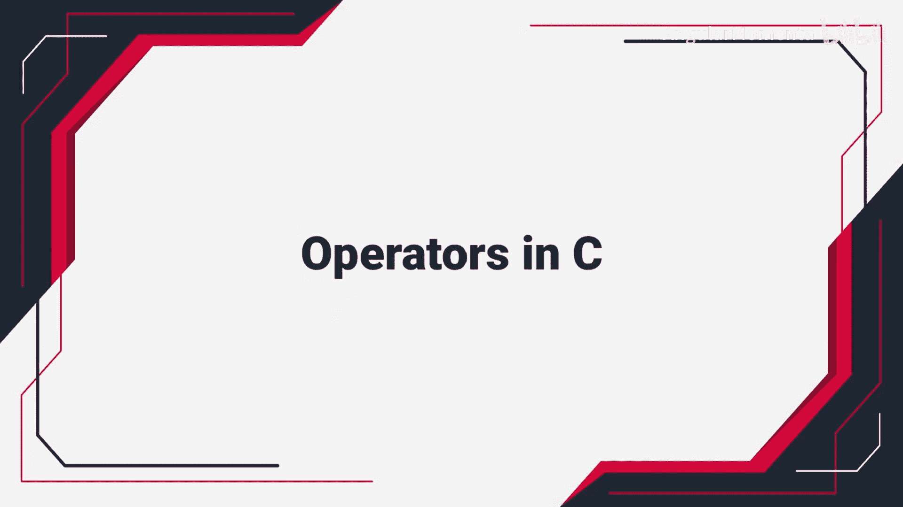
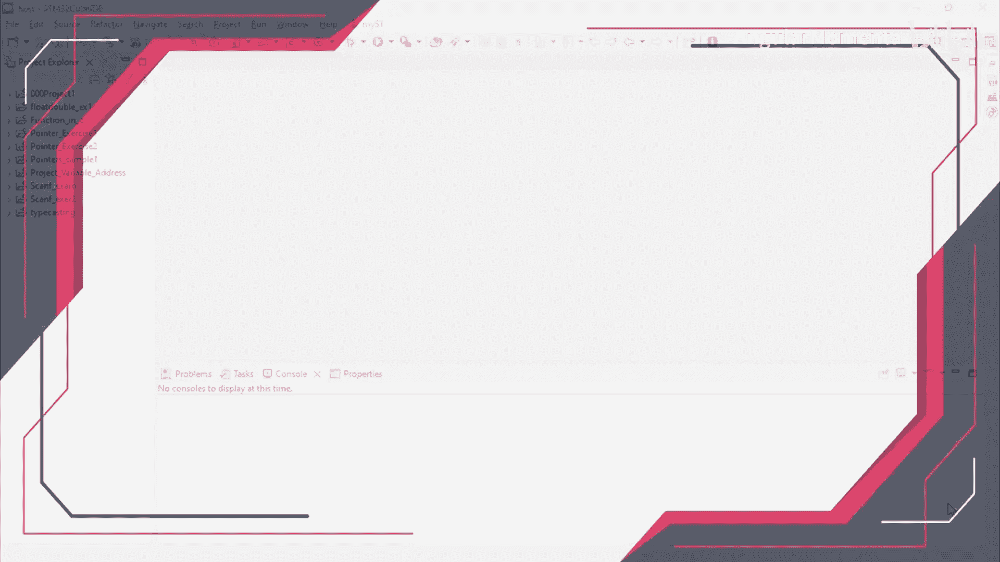
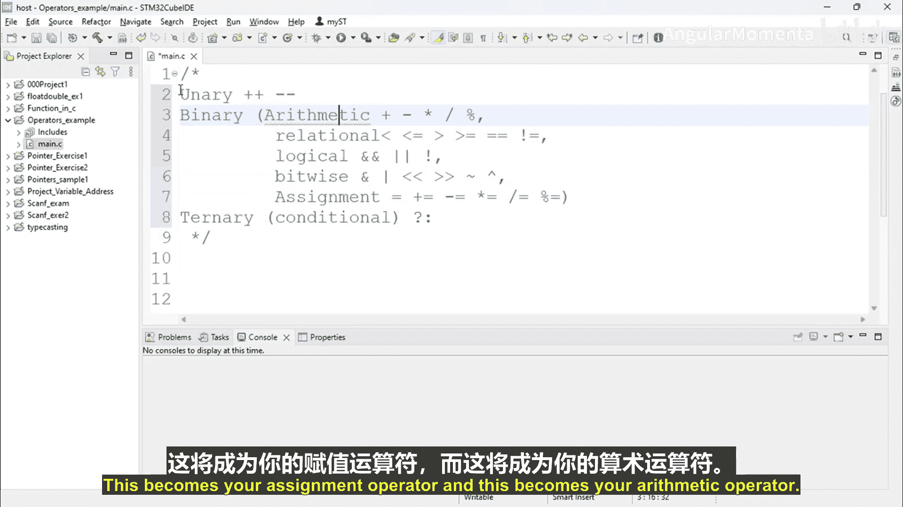
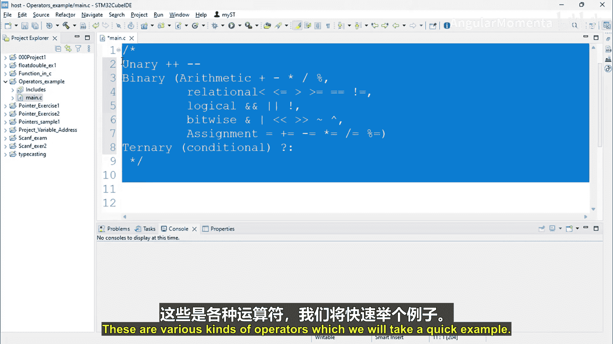
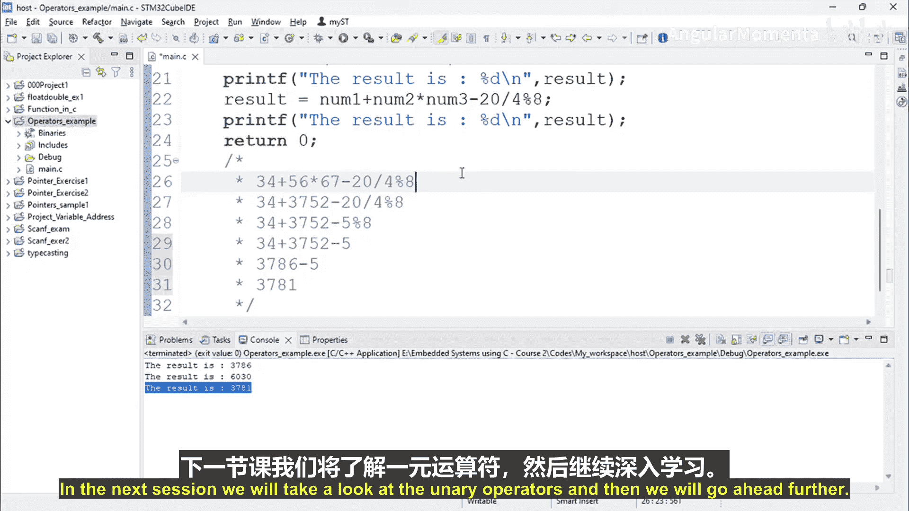
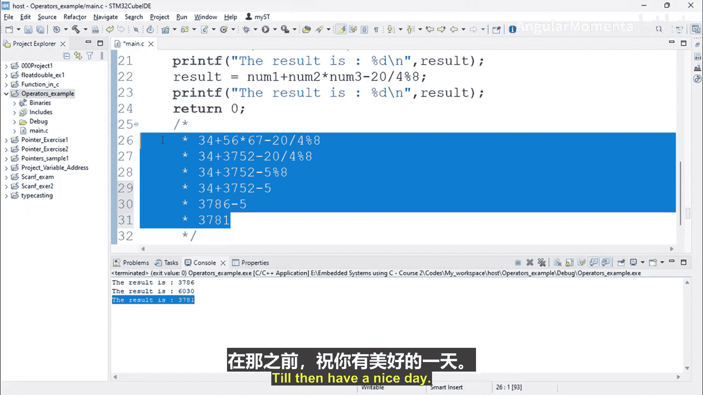

构建嵌入式系统：ARM Cortex (STM32) 基础：第 02 章：第 02 节：C语言中的运算符






## 概述

在本节中，我们将学习C语言中的运算符。运算符是告诉编译器执行特定数学或逻辑操作的符号。理解运算符及其优先级对于编写正确的C语言程序至关重要。

## 运算符类型

C语言中的运算符主要分为三类：一元运算符、二元运算符和三元运算符。

上一节我们介绍了C语言的基础知识，本节中我们来看看具体的运算符。

以下是主要的运算符分类：

*   **一元运算符**：作用于单个操作数。例如：
    *   `++`：自增运算符
    *   `--`：自减运算符
*   **二元运算符**：作用于两个操作数。它包含多个子类：
    *   **算术运算符**：`+`（加）， `-`（减）， `*`（乘）， `/`（除）， `%`（取模）
    *   **关系运算符**：`<`（小于）， `<=`（小于等于）， `>`（大于）， `>=`（大于等于）， `==`（等于）， `!=`（不等于）
    *   **逻辑运算符**：`&&`（逻辑与）， `||`（逻辑或）， `!`（逻辑非）
    *   **位运算符**：`&`（按位与）， `|`（按位或）， `^`（按位异或）， `~`（按位取反）， `<<`（左移）， `>>`（右移）
    *   **赋值运算符**：`=`（基本赋值）， `+=`， `-=`， `*=`， `/=`， `%=`
*   **三元运算符**：作用于三个操作数。只有一个：
    *   `? :`：条件运算符



## 运算符优先级



当表达式中包含多个运算符时，编译器需要决定运算的先后顺序，这个规则就是运算符优先级。

为了理解优先级，我们来看一个例子。首先，我们创建一个简单的C程序。

```c
#include <stdio.h>

int main(void) {
    int num1 = 34;
    int num2 = 56;
    int num3 = 67;
    int result;

    result = num1 + num2 * num3;
    printf("The result is: %d\n", result);

    return 0;
}
```

运行这段代码，输出结果是 `3786`。这是因为乘法运算符 `*` 的优先级高于加法运算符 `+`。所以表达式 `num1 + num2 * num3` 等价于 `num1 + (num2 * num3)`。

如果我们想改变运算顺序，可以先计算加法，可以使用圆括号 `()`。

```c
result = (num1 + num2) * num3;
printf("The result is: %d\n", result);
```

此时，输出结果会变为 `(34 + 56) * 67 = 6030`。圆括号拥有最高的优先级。

## 复杂表达式计算

现在，我们来看一个包含更多运算符的复杂表达式，以深入理解优先级规则。

```c
result = 34 + 56 * 67 - 20 / 4 % 8;
printf("The result is: %d\n", result);
```

计算这个表达式 `34 + 56 * 67 - 20 / 4 % 8` 的步骤如下：

1.  **处理乘、除、取模**：在 `+` 和 `-` 之前，先计算 `*`， `/`， `%`。并且 `/` 和 `%` 的优先级相同，按从左到右的顺序结合。
    *   先计算 `56 * 67 = 3752`。表达式变为 `34 + 3752 - 20 / 4 % 8`。
    *   接着计算 `20 / 4 = 5`。表达式变为 `34 + 3752 - 5 % 8`。
    *   最后计算 `5 % 8 = 5`。表达式变为 `34 + 3752 - 5`。

2.  **处理加法和减法**：`+` 和 `-` 的优先级相同，按从左到右的顺序结合。
    *   先计算 `34 + 3752 = 3786`。
    *   再计算 `3786 - 5 = 3781`。

因此，最终结果是 `3781`。运行程序验证，输出结果正是 `3781`。

> **提示**：你不需要死记硬背所有运算符的优先级顺序。在实际编程中，如果对运算顺序不确定，最清晰、最安全的方法是使用圆括号 `()` 来明确指定计算顺序。你也可以随时查阅C语言标准或参考资料来确认优先级。

## 总结





本节课中我们一起学习了C语言中的运算符。我们首先了解了运算符的主要类型：一元、二元和三元运算符。然后，通过具体的代码示例，重点讲解了**运算符优先级**的概念，即当表达式中存在多个运算符时，编译器决定运算先后次序的规则。我们通过计算 `34 + 56 * 67 - 20 / 4 % 8` 这个表达式，演示了乘法、除法、取模运算符优先于加法和减法，以及同优先级运算符从左到右结合的规则。记住，使用圆括号可以灵活地控制运算顺序，这是编写清晰、无误代码的好习惯。在下一节，我们将探讨一元运算符的具体用法。