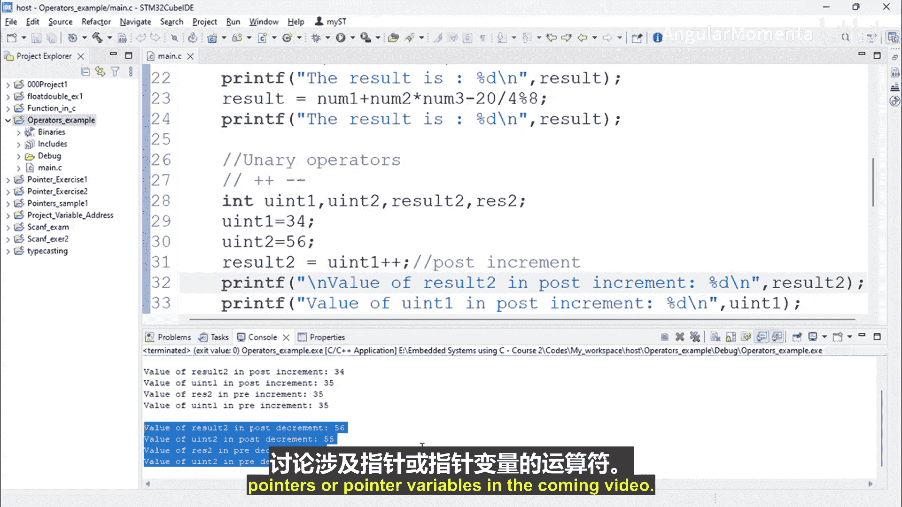

# 021：C语言中的一元运算符


在本节课程中，我们将学习C语言中的一元运算符。我们将通过具体的例子，详细探讨一元递增和递减运算符的工作原理，包括它们的前置与后置形式。

## 概述

一元运算符是仅需要一个操作数的运算符。在C语言中，最常见的两种一元运算符是递增运算符 `++` 和递减运算符 `--`。它们分别用于将变量的值增加1或减少1。理解这些运算符的前置与后置形式对于编写正确的程序逻辑至关重要。

## 一元递增运算符

一元递增运算符 `++` 用于将变量的值增加1。根据运算符相对于操作数的位置，它分为**后置递增**和**前置递增**两种形式。

以下是两种形式的定义和区别：

*   **后置递增**：运算符位于操作数之后，格式为 `变量++`。其执行顺序是：**先使用变量的当前值，然后再将变量的值增加1**。
*   **前置递增**：运算符位于操作数之前，格式为 `++变量`。其执行顺序是：**先将变量的值增加1，然后再使用这个新值**。

为了清晰地展示这一区别，我们来看一个代码示例。

```c
#include <stdio.h>

int main() {
    int u_in1 = 34; // 定义并初始化变量 u_in1
    int result2, rs2; // 定义结果变量

    // 后置递增示例
    result2 = u_in1++; // 先将 u_in1 的值 (34) 赋给 result2，然后 u_in1 自增为 35
    printf("后置递增 - result2 的值: %d\n", result2);
    printf("后置递增 - u_in1 的值: %d\n", u_in1);

    // 前置递增示例
    rs2 = ++u_in1; // 先将 u_in1 的值 (35) 自增为 36，然后将新值 (36) 赋给 rs2
    printf("前置递增 - rs2 的值: %d\n", rs2);
    printf("前置递增 - u_in1 的值: %d\n", u_in1);
}
```

运行上述代码，输出结果将验证我们的分析：
*   后置递增后，`result2` 的值为 `34`，而 `u_in1` 的值变为 `35`。
*   前置递增后，`rs2` 的值为 `36`，`u_in1` 的值也变为 `36`。

## 一元递减运算符

理解了递增运算符后，递减运算符 `--` 就很容易掌握了。它的逻辑与递增运算符完全一致，只是作用是将变量的值减少1。

同样，递减运算符也分为两种形式：

*   **后置递减**：格式为 `变量--`。执行顺序是：**先使用变量的当前值，然后再将变量的值减少1**。
*   **前置递减**：格式为 `--变量`。执行顺序是：**先将变量的值减少1，然后再使用这个新值**。

让我们通过另一个代码示例来巩固理解。

```c
#include <stdio.h>

int main() {
    int u_in2 = 56; // 定义并初始化变量 u_in2
    int result2_dec, rs2_dec; // 定义结果变量

    // 后置递减示例
    result2_dec = u_in2--; // 先将 u_in2 的值 (56) 赋给 result2_dec，然后 u_in2 自减为 55
    printf("后置递减 - result2_dec 的值: %d\n", result2_dec);
    printf("后置递减 - u_in2 的值: %d\n", u_in2);

    // 前置递减示例
    rs2_dec = --u_in2; // 先将 u_in2 的值 (55) 自减为 54，然后将新值 (54) 赋给 rs2_dec
    printf("前置递减 - rs2_dec 的值: %d\n", rs2_dec);
    printf("前置递减 - u_in2 的值: %d\n", u_in2);
}
```

这段代码的输出将清晰地展示：
*   后置递减后，`result2_dec` 的值为 `56`，而 `u_in2` 的值变为 `55`。
*   前置递减后，`rs2_dec` 的值为 `54`，`u_in2` 的值也变为 `54`。

## 总结

本节课我们一起学习了C语言中的一元运算符。我们重点探讨了：
1.  **一元递增运算符 (`++`)**：用于将操作数的值加1。分为**后置递增**（先取值，后自增）和**前置递增**（先自增，后取值）。
2.  **一元递减运算符 (`--`)**：用于将操作数的值减1。同样分为**后置递减**（先取值，后自减）和**前置递减**（先自减，后取值）。



掌握这些运算符的前置与后置区别，对于避免程序中的逻辑错误和编写高效的嵌入式C代码非常重要。在接下来的课程中，我们将继续学习其他类型的运算符，例如与指针变量相关的运算符。