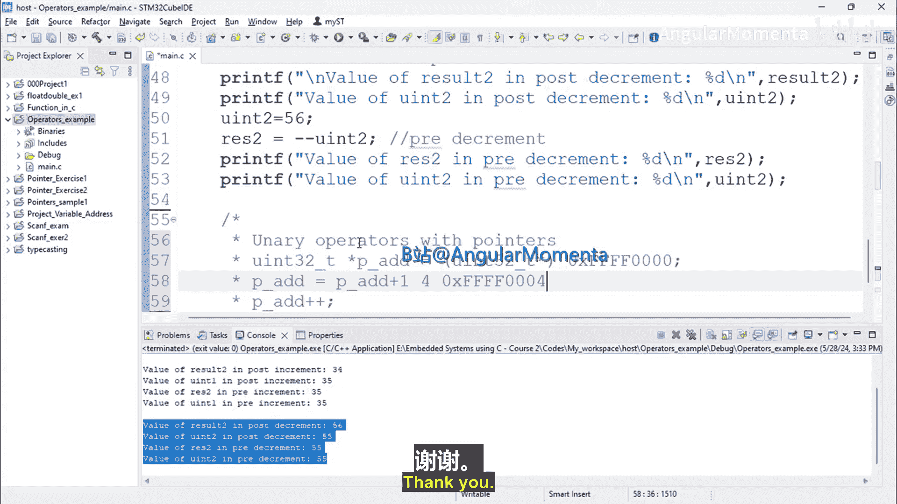

**嵌入式系统构建：ARM Cortex (STM32) 基础：P22：指针与一元运算符**


在本节课程中，我们将学习如何在C语言中对指针变量使用一元运算符（自增和自减）。我们将通过具体的代码示例，理解这些操作如何影响指针的值。


---

### **概述**

指针是嵌入式C编程中的核心概念。理解如何操作指针对于直接访问和控制内存至关重要。本节将重点介绍对指针使用一元自增 (`++`) 和自减 (`--`) 运算符的行为。

---

### **指针变量的定义与初始化**

首先，我们来看一个指针变量的定义和初始化示例。

```c
uint32_t* p_address = (uint32_t*)0xFFFF0000;
```

在这行代码中：
*   `uint32_t*` 声明了一个指向 `uint32_t` 类型数据的指针变量。
*   `p_address` 是指针变量的名称。
*   `(uint32_t*)` 是一个类型转换，将后面的地址值转换为指向 `uint32_t` 的指针类型。
*   `0xFFFF0000` 是赋予指针的初始内存地址。

此时，指针 `p_address` 指向内存地址 `0xFFFF0000`。

---

### **使用算术运算符操作指针**

如果我们想将指针移动到下一个内存位置，可以使用算术加法。

```c
p_address = p_address + 1;
```

执行此操作后，`p_address` 的值不会简单地变为 `0xFFFF0001`。因为 `p_address` 是指向 `uint32_t` 的指针，而 `uint32_t` 类型通常占用4个字节。所以，“加1”意味着向前移动一个 `uint32_t` 数据单元的大小，即4个字节。

**因此，最终结果将是：**
`p_address = 0xFFFF0004`

---

### **使用一元自增运算符操作指针**

上一节我们介绍了使用算术加法来移动指针。实际上，有一种更简洁的写法可以达到完全相同的目的，即使用一元自增运算符。

```c
p_address++;
```

这行代码 `p_address++` 与 `p_address = p_address + 1` 完全等效。它同样会使指针的值增加一个其所指数据类型的大小（本例中为4字节）。

**执行结果同样是：**
`p_address = 0xFFFF0004`

**重要提示：** 无论是使用 `p_address + 1` 还是 `p_address++`，指针的增量都取决于其指向的数据类型（`uint32_t` 为4字节）。两种方法的结果完全相同。

---

### **核心概念总结**

对指针进行自增或自减操作时，其值的变化量由指针的类型决定。编译器会根据 `sizeof(指针所指向的类型)` 来计算实际要增加或减少的字节数。

**公式表示：**
`新地址 = 旧地址 ± (n * sizeof(数据类型))`
其中，`n` 是自增或自减的数值（例如 `++` 对应 n=1）。

以下是指向不同数据类型的指针进行 `p++` 操作后的结果示例：

*   `char *p;` (sizeof(char)=1) -> 地址增加 **1** 字节。
*   `uint32_t *p;` (sizeof(uint32_t)=4) -> 地址增加 **4** 字节。
*   `float *p;` (sizeof(float)=4) -> 地址增加 **4** 字节。

---

### **总结**

本节课中，我们一起学习了指针与一元运算符的使用：
1.  我们回顾了指针变量的定义和初始化方法。
2.  我们理解了使用算术运算符（如 `+`）操作指针时，其步长由所指数据类型决定。
3.  我们掌握了使用一元自增 (`++`) 和自减 (`--`) 运算符来移动指针，这是更简洁的语法。
4.  我们明确了关键点：**指针算术的步进单位是其指向类型的字节大小，而非固定的1字节。**

掌握指针的算术运算是进行有效内存访问和数组操作的基础。在下一节视频中，我们将探讨C语言中的关系运算符。



---