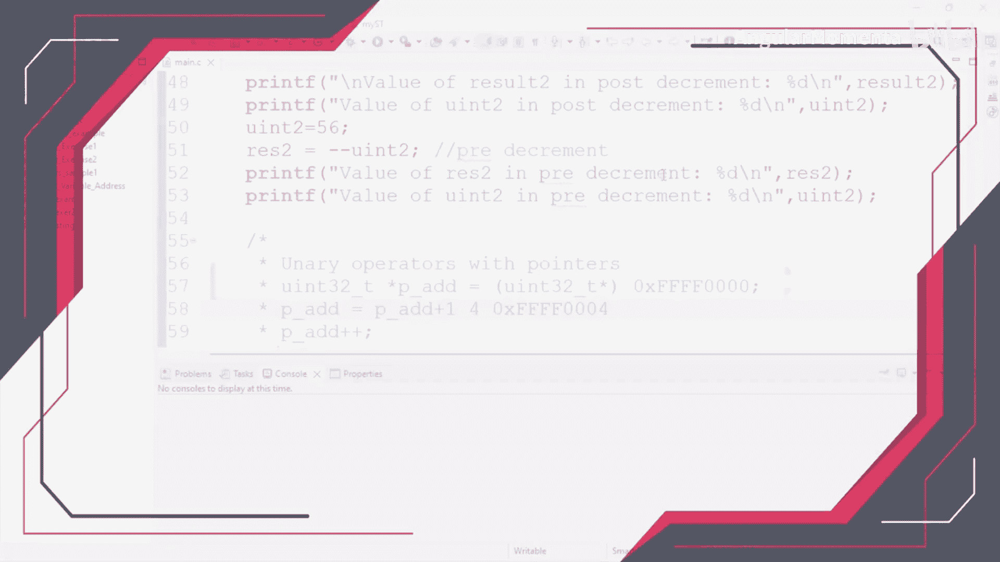
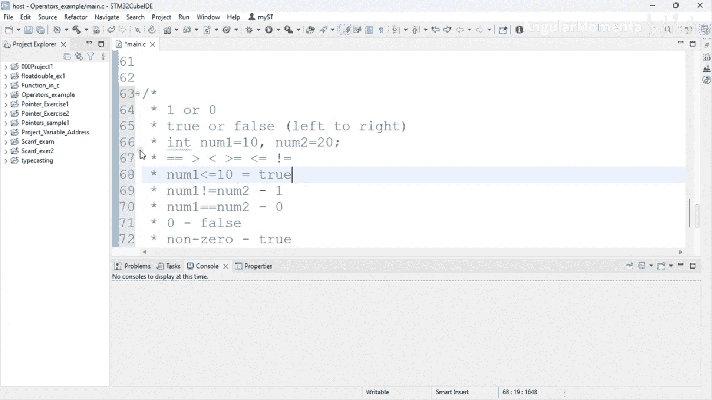

# 023：C语言中的关系运算符





在本节课中，我们将学习C语言中的关系运算符。关系运算符用于比较两个值，并根据比较结果返回一个布尔值。这些运算符是编写条件判断语句的基础，在嵌入式系统编程中至关重要。

## 关系运算符概述

上一节我们介绍了运算符的基本概念。本节中，我们来看看专门用于比较的关系运算符。关系运算符对操作数进行某种评估，并返回一个值。这个返回值在C语言中以整数形式表示：**1** 代表“真”（True），**0** 代表“假”（False）。

关系运算符也被称为二元运算符，因为它们需要至少两个操作数才能进行运算。这些运算符的求值顺序总是从左到右。

## 关系运算符列表

以下是C语言中可用的关系运算符列表。我们之前在运算符的入门介绍中已经简要提及过它们。

*   **等于** (`==`): 用于比较两个操作数是否相等。注意，单个等号 (`=`) 是赋值运算符，而双等号 (`==`) 才是比较运算符。
*   **大于** (`>`): 检查左侧操作数是否大于右侧操作数。
*   **小于** (`<`): 检查左侧操作数是否小于右侧操作数。
*   **大于或等于** (`>=`): 检查左侧操作数是否大于或等于右侧操作数。
*   **小于或等于** (`<=`): 检查左侧操作数是否小于或等于右侧操作数。
*   **不等于** (`!=`): 检查两个操作数是否不相等。这是一个否定运算符。

## 运算符使用示例与解释

为了更好地理解，让我们通过一些代码示例来看看这些运算符是如何工作的。

假设我们定义两个变量并赋值：
```c
int number1 = 10;
int number2 = 20;
```

现在，我们可以使用关系运算符来比较它们：

*   **检查相等性**：`number1 == number2`。因为10不等于20，所以这个表达式的结果是 **0**（假）。
*   **检查不相等**：`number1 != number2`。因为10确实不等于20，所以这个表达式的结果是 **1**（真）。
*   **检查大于**：`number1 > number2`。因为10不大于20，所以结果是 **0**。
*   **检查小于**：`number1 < number2`。因为10小于20，所以结果是 **1**。
*   **检查大于或等于**：`number1 >= 10`。因为number1等于10，满足“等于”的条件，所以结果是 **1**。如果只使用 `>`，`number1 > 10` 的结果将是 **0**，因为它不大于10。这就是 `>=` 和 `>` 的区别。
*   **检查小于或等于**：`number1 <= 10`。同理，因为等于10，所以结果是 **1**。

在C语言中，任何求值结果为 **0** 的表达式都被视为“假”，而任何**非零**值（包括1， -1， 100等）都被视为“真”。

## 关系运算符的应用场景

使用关系运算符的表达式会求值为真或假。关系运算经常与 `if` 条件语句结合使用，用于控制程序的流程。我们将在后续的实践演示中更详细地看到它们的应用。

就像上面的例子一样，如果你想检查变量的值，你需要先创建变量并赋值，然后使用关系运算符来检查操作数之间的关系。

## 总结

本节课中我们一起学习了C语言中的关系运算符。我们了解了六种基本的关系运算符：`==`、`!=`、`>`、`<`、`>=` 和 `<=`。它们用于比较两个值，并返回1（真）或0（假）。理解这些运算符是掌握条件逻辑和程序控制流的第一步。在接下来的视频中，我们将继续探讨更多相关内容。



