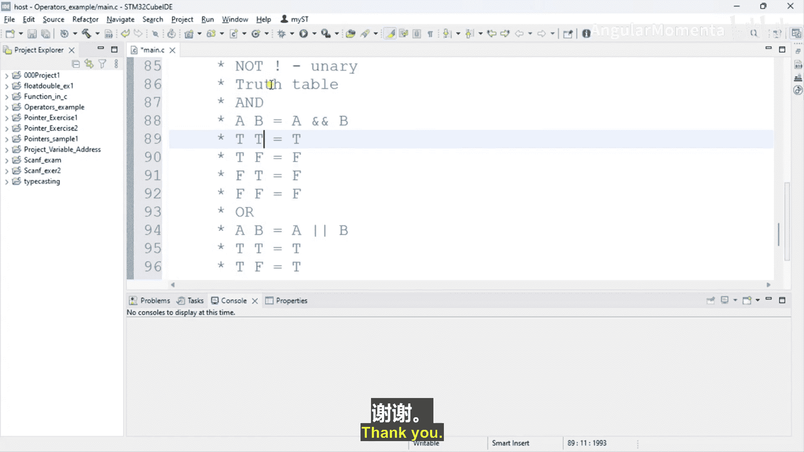

# 024：C语言中的逻辑运算符


在本节课中，我们将要学习C语言中的逻辑运算符。逻辑运算符是编程中用于组合或修改条件判断结果的重要工具，它们能帮助我们构建更复杂的逻辑表达式。

上一节我们介绍了关系运算符，本节中我们来看看如何将多个条件组合起来。

## 逻辑运算符概述

C语言提供了三种主要的逻辑运算符：逻辑与（AND）、逻辑或（OR）和逻辑非（NOT）。这些运算符用于对布尔值（真或假，在C语言中通常用非零值表示真，零表示假）进行操作。

## 逻辑与运算符（&&）

逻辑与运算符（`&&`）是一个二元运算符，它要求两个操作数。其核心规则是：只有当**两个**操作数的值都为真（非零）时，整个表达式的结果才为真（1）。如果其中任何一个操作数为假（0），结果就为假（0）。

以下是逻辑与运算符的真值表，它清晰地展示了所有可能的输入组合及其对应的输出结果：

*   **A 为真，B 为真**：`A && B` 结果为 **真**。
*   **A 为真，B 为假**：`A && B` 结果为 **假**。
*   **A 为假，B 为真**：`A && B` 结果为 **假**。
*   **A 为假，B 为假**：`A && B` 结果为 **假**。

让我们通过一个代码示例来理解：

```c
int num1 = -10;
int num2 = 20;
int result = num1 && num2; // 因为num1和num2都是非零值（真），所以result的值为1（真）
```

如果我们将 `num1` 改为 `0`：

```c
int num1 = 0;
int num2 = 20;
int result = num1 && num2; // 因为num1为0（假），所以无论num2为何值，result都为0（假）
```

## 逻辑或运算符（||）

逻辑或运算符（`||`）也是一个二元运算符。它的规则是：只要**至少有一个**操作数的值为真（非零），整个表达式的结果就为真（1）。只有当两个操作数都为假（0）时，结果才为假（0）。

以下是逻辑或运算符的真值表：

*   **A 为真，B 为真**：`A || B` 结果为 **真**。
*   **A 为真，B 为假**：`A || B` 结果为 **真**。
*   **A 为假，B 为真**：`A || B` 结果为 **真**。
*   **A 为假，B 为假**：`A || B` 结果为 **假**。

## 逻辑非运算符（!）

逻辑非运算符（`!`）是一个一元运算符，它只对一个操作数进行运算。它的功能非常简单：对操作数的布尔值进行取反。如果操作数为真（非零），则结果为假（0）；如果操作数为假（0），则结果为真（1）。

以下是逻辑非运算符的真值表：

*   **A 为真**：`!A` 结果为 **假**。
*   **A 为假**：`!A` 结果为 **真**。

## 运算符小结

理解这三种逻辑运算符的真值表有助于我们预测复杂逻辑表达式的最终结果。不过，更重要的是理解其核心规则：`&&` 要求两者皆真，`||` 要求至少一真，`!` 则直接取反。

## 总结



本节课中我们一起学习了C语言的三种逻辑运算符：逻辑与（`&&`）、逻辑或（`||`）和逻辑非（`!`）。我们了解了它们各自的作用规则，并通过真值表直观地看到了不同输入下的输出结果。这些运算符是构建条件判断和程序控制流的基础。在接下来的课程中，我们将开始学习 `if` 条件语句，届时会实际运用这些逻辑运算符来编写更强大的程序逻辑。