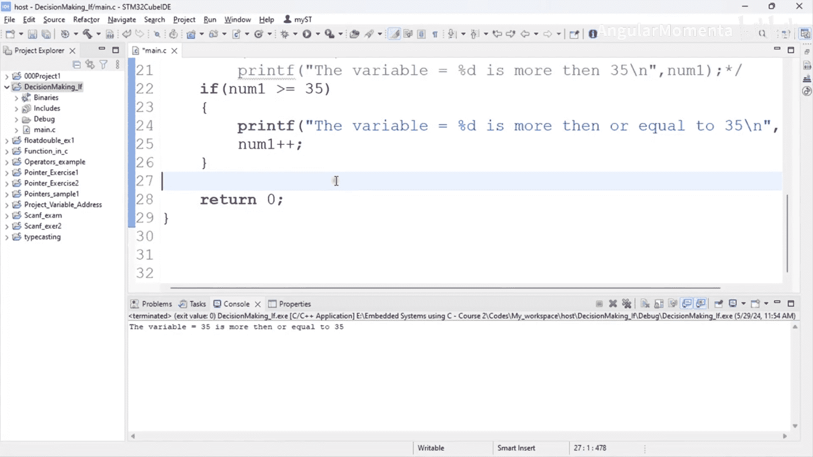

**嵌入式系统构建：ARM Cortex (STM32) 基础：构建嵌入式系统 p25 02_03_01：if语句**


在本节课中，我们将要学习C语言中的决策控制，具体从`if`语句开始。决策控制是编程的核心，它允许程序根据特定条件执行不同的代码块。

---

### **决策控制概述**

编写程序时，经常需要让某些代码仅在特定条件满足时才执行。这意味着程序必须根据内部或外部的事件或条件来做出决策。

例如，如果用户按下某个特定按键，则执行一组语句；如果用户没有按下任何按键，则执行另一组语句。在嵌入式编程中，这同样重要。

以水位指示与控制程序为例。如果传感器检测到水位超过阈值，程序就执行关闭水泵的代码；否则，程序不关闭水泵。

在C语言中，有五种实现决策控制的方式：
1.  `if`语句
2.  `if-else`语句
3.  `if-else-if`阶梯语句
4.  条件运算符
5.  `switch-case`语句

我们将在后续视频中逐一探讨。本节我们专注于`if`语句。

---

### **`if`语句详解**

`if`语句如其名，用于检查一个特定条件。如果条件为真（`true`），则执行给定的语句块；如果条件为假（`false`），则不会执行该块内的任何语句。

`if`语句有两种常见的书写格式。

**第一种是单语句执行**：如果条件为真，则执行紧随其后的一条语句，并以分号结束。
```c
if (表达式)
    语句;
```

**第二种是多语句执行**：如果条件为真，则执行花括号 `{}` 内的所有语句。每个语句都以分号结束。
```c
if (表达式) {
    语句1;
    语句2;
    // ... 更多语句
}
```

选择哪种格式取决于你需要执行的语句数量。如果只有一条语句，可以省略花括号；如果有多条语句，则必须使用花括号将它们括起来。

---

### **代码示例**

让我们通过代码示例来理解这两种格式。首先，我们创建一个简单的程序。

```c
#include <stdio.h>
#include <stdint.h>

int main() {
    uint8_t number1 = 34; // 定义一个变量并赋值为34

    // 示例1：单语句if
    if (number1 > 35)
        printf("变量值 %d 大于 35\n", number1);

    return 0;
}
```

在这个例子中，`number1`的值是34，不满足 `number1 > 35` 的条件，因此`printf`语句不会执行，程序没有输出。

现在，我们将变量值改为36，并再次运行程序。

```c
uint8_t number1 = 36; // 修改变量值为36
```

此时条件为真，程序会输出：`变量值 36 大于 35`。

接下来，我们看一个多语句执行的例子。假设在条件满足时，我们不仅要打印信息，还要增加变量的值。

```c
#include <stdio.h>
#include <stdint.h>

int main() {
    uint8_t number1 = 36;

    // 示例2：多语句if（使用花括号）
    if (number1 >= 35) {
        printf("变量值 %d 大于或等于 35\n", number1);
        number1++; // 增加变量的值
        printf("增加后的值：%d\n", number1);
    }

    return 0;
}
```

在这个例子中，我们使用了 `>=`（大于或等于）运算符。当`number1`为35或更大时，条件为真。程序会执行花括号内的所有语句：先打印信息，然后递增`number1`，最后打印递增后的值。

**重要提示**：
*   如果`if`后面只有一条语句，花括号是可选的。
*   如果`if`后面有多条语句，**必须**使用花括号将它们组合成一个代码块。
*   `if`关键字后面**不能**直接跟分号，因为`if`本身不是一个完整的语句，而是一个控制流命令。例如 `if (条件);` 是错误的，分号会形成一个空语句，导致后续代码块永远与`if`无关。

---

### **总结**



本节课我们一起学习了C语言中`if`语句的基础知识。我们了解了决策控制在编程中的重要性，掌握了`if`语句的两种基本格式：用于单条语句的无括号形式和用于多条语句的花括号形式。通过代码示例，我们实践了如何根据条件执行不同的操作，并注意了编写`if`语句时的常见注意事项。`if`语句是构建更复杂决策逻辑的基石，在接下来的课程中，我们将以此为基础，学习`if-else`等更强大的控制结构。