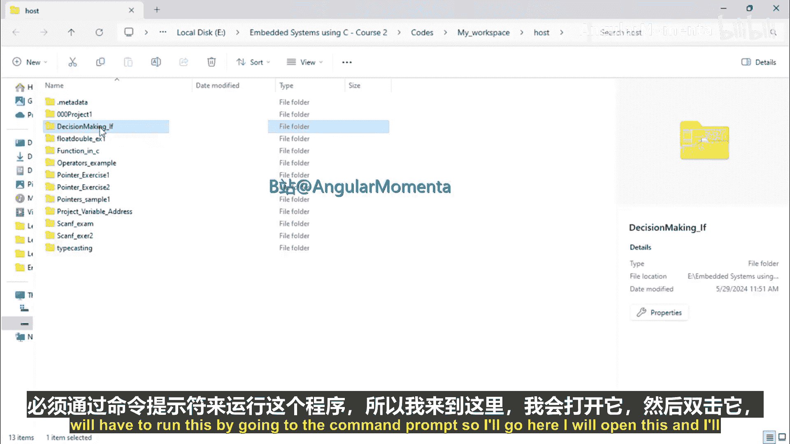
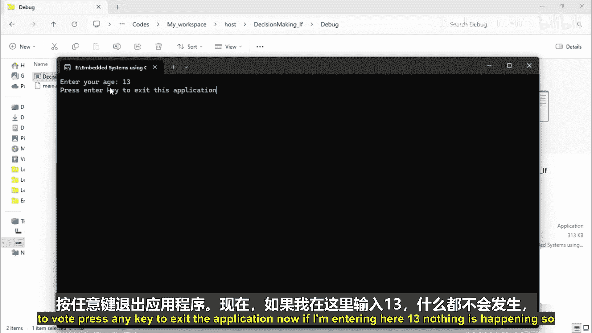
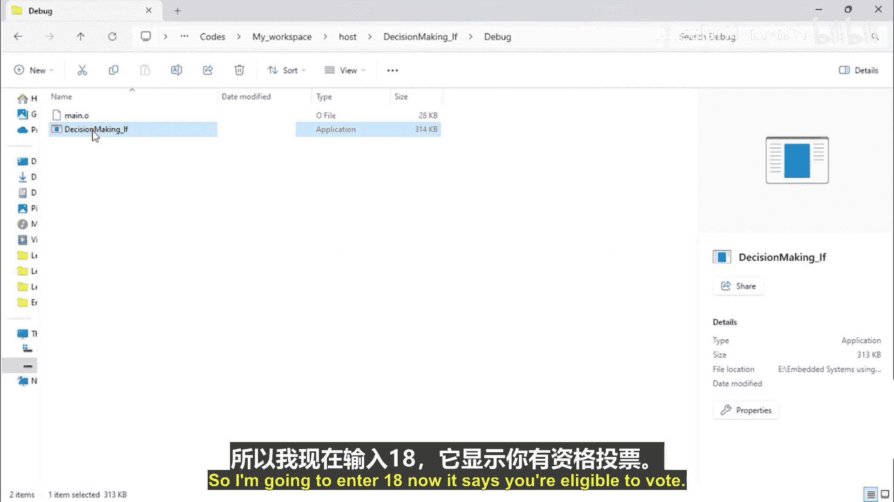
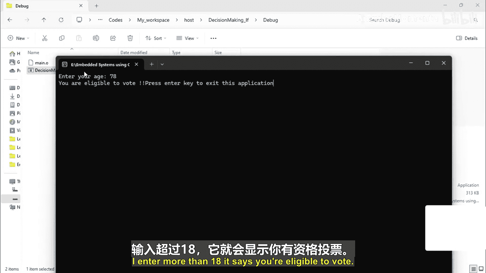
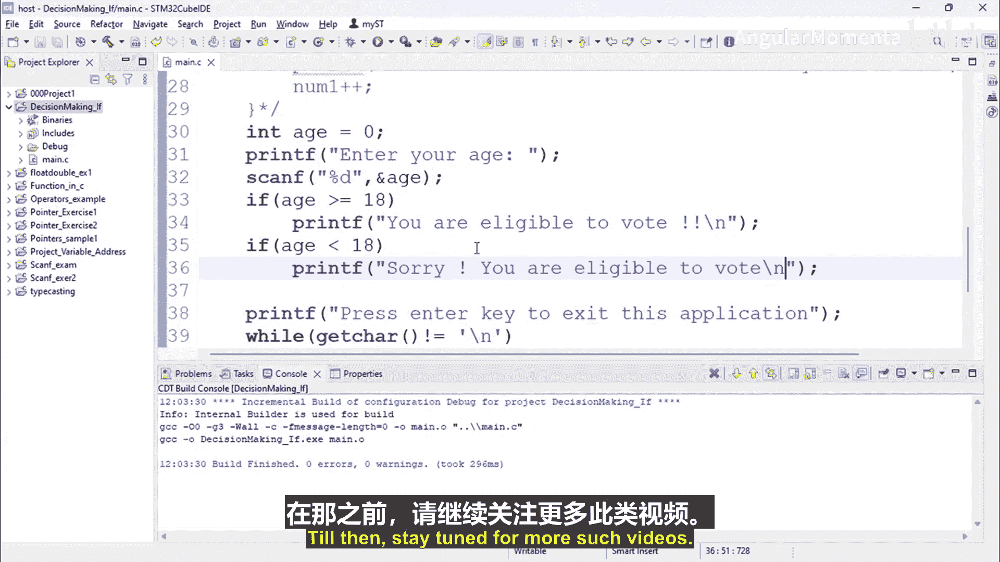

# 026：if语句练习 🧑‍💻

在本节课中，我们将通过一个具体的编程练习来学习如何使用 `if` 语句。我们将编写一个程序，根据用户输入的年龄判断其是否具有投票资格。

## 概述

我们将创建一个C语言程序。该程序会要求用户输入年龄，然后使用 `if` 语句判断该年龄是否大于或等于18岁。根据判断结果，程序会输出相应的信息，告知用户是否具备投票资格。

## 程序实现步骤

以下是实现该功能的具体步骤。

首先，我们需要包含必要的头文件并设置主函数。为了在程序结束后等待用户按键退出，我们会使用一个简单的循环。

```c
#include <stdio.h>

int main() {
    // 程序主体将写在这里
    printf("按回车键退出程序...\n");
    getchar(); // 等待用户按回车键
    return 0;
}
```

接下来，在程序主体部分，我们需要声明一个变量来存储用户的年龄，并提示用户输入。

```c
int age = 0; // 初始化年龄变量
printf("请输入您的年龄：\n");
```

为了接收用户的输入，我们需要使用 `scanf` 函数。

```c
scanf("%d", &age); // 读取用户输入的整数并存储到age变量中
```

现在，我们拥有了用户的年龄数据。核心部分在于使用 `if` 语句进行条件判断。判断的逻辑是：如果年龄大于或等于18岁，则具备投票资格；否则不具备。

我们可以使用两个独立的 `if` 语句来实现这个逻辑。

```c
if (age >= 18) {
    printf("您符合投票年龄要求，可以投票。\n");
}
if (age < 18) {
    printf("抱歉，您未达到投票年龄要求，无法投票。\n");
}
```



将以上所有部分组合起来，就得到了完整的程序。

## 完整代码示例

以下是整合后的完整程序代码。

```c
#include <stdio.h>

int main() {
    int age = 0;

    printf("请输入您的年龄：\n");
    scanf("%d", &age);

    if (age >= 18) {
        printf("您符合投票年龄要求，可以投票。\n");
    }
    if (age < 18) {
        printf("抱歉，您未达到投票年龄要求，无法投票。\n");
    }

    printf("\n按回车键退出程序...\n");
    getchar();
    getchar(); // 使用两个getchar()来消耗scanf留下的换行符并等待用户按键
    return 0;
}
```





## 程序运行与测试

现在，让我们来测试这个程序。编译并运行后，程序会提示输入年龄。



*   当输入 **20** 时，程序输出：`您符合投票年龄要求，可以投票。`
*   当输入 **16** 时，程序输出：`抱歉，您未达到投票年龄要求，无法投票。`
*   当输入 **18** 时，程序输出：`您符合投票年龄要求，可以投票。`

程序在所有三种情况下都能正确执行，并输出相应的提示信息。

## 总结

本节课中，我们一起完成了一个 `if` 语句的练习。我们学习了如何：
1.  使用 `scanf` 接收用户的整数输入。
2.  利用 `if (条件)` 结构进行条件判断。
3.  根据不同的条件（`age >= 18` 和 `age < 18`）执行不同的代码块，并向用户反馈结果。



这个练习演示了 `if` 语句在程序流程控制中的基础应用。在接下来的视频中，我们将进一步探讨 `if-else` 等更复杂的条件判断结构。