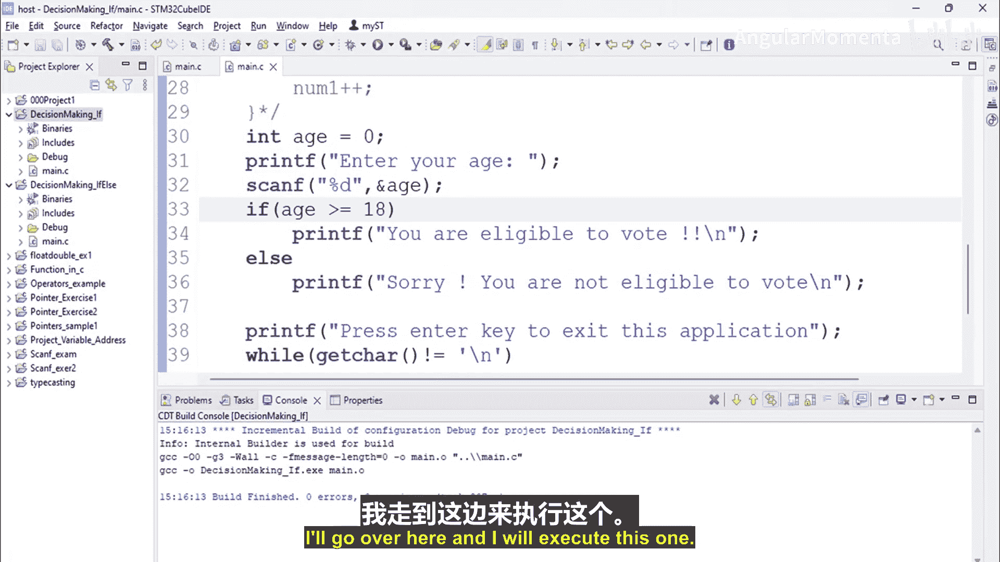
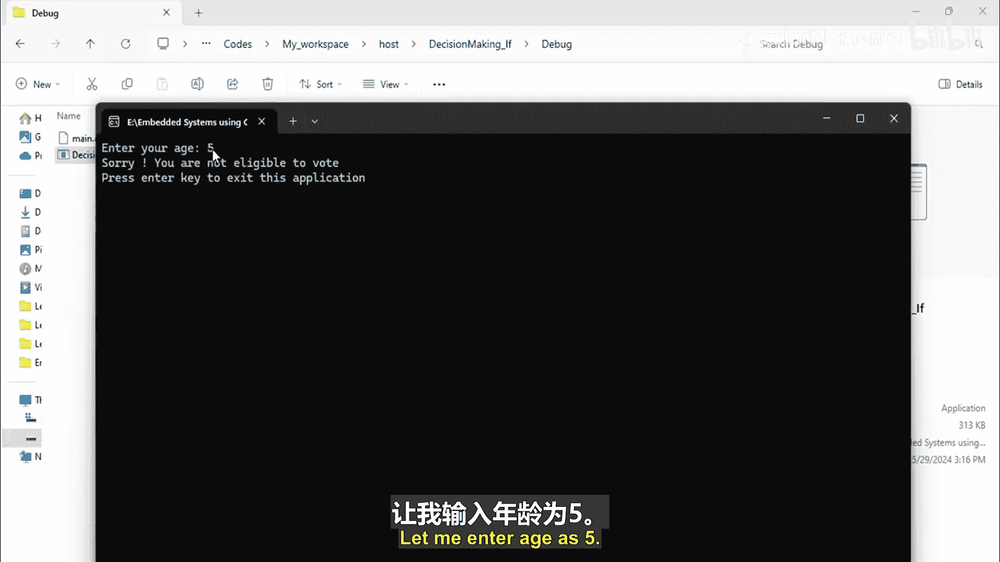
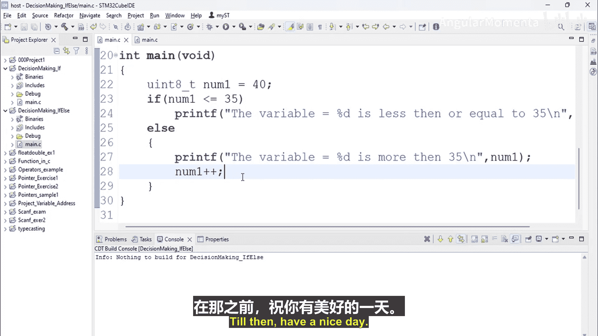

# 027：if 与 else 语句 🧠

在本节课中，我们将学习 C 语言中用于决策控制的核心结构之一：`if` 与 `else` 语句。我们将了解其基本语法、执行逻辑，并通过具体示例演示如何使用它来简化条件判断。

## 概述

`if` 与 `else` 语句允许程序根据特定条件表达式的真假，选择性地执行不同的代码块。这是实现程序分支逻辑的基础。

## 基本语法

`if-else` 语句有两种主要形式：单语句执行和多语句执行。

### 单语句执行

当条件成立或不成立时，只需执行一条语句，可以使用以下简洁形式：

```c
if (expression)
    statement1;
else
    statement2;
```

### 多语句执行

如果需要在条件分支中执行多条语句，必须使用花括号 `{}` 将这些语句组合成一个代码块：

```c
if (expression) {
    statement1;
    statement2;
    // ... 更多语句
} else {
    statement1;
    statement2;
    // ... 更多语句
}
```

## 执行逻辑

`if-else` 语句的执行遵循一个清晰的模式：
1.  首先评估 `if` 后面的**表达式**。
2.  如果表达式的结果为 **真（非零）**，则执行紧接在 `if` 后面的语句或代码块。
3.  如果表达式的结果为 **假（零）**，则跳过 `if` 部分，转去执行 `else` 后面的语句或代码块。
4.  关键点在于，**`if` 和 `else` 两部分永远不会同时执行**，程序会根据条件二选一。

## 实践示例

上一节我们介绍了 `if` 语句的基本用法，本节中我们来看看如何用 `if-else` 来优化逻辑。

### 示例1：比较数字大小

以下程序判断一个变量的值是否大于35。

```c
#include <stdio.h>

int main() {
    int number1 = 30; // 可以尝试修改此值，例如改为40

    if (number1 > 35) {
        printf("变量值 %d 大于 35。\n", number1);
    } else {
        printf("变量值 %d 小于或等于 35。\n", number1);
    }

    return 0;
}
```
*   **当 `number1` 为 30 时**，`number1 > 35` 为假，执行 `else` 块，输出：“变量值 30 小于或等于 35。”
*   **当 `number1` 为 40 时**，`number1 > 35` 为真，执行 `if` 块，输出：“变量值 40 大于 35。”

### 示例2：投票资格检查



这个例子检查用户年龄是否达到投票标准。

```c
#include <stdio.h>

int main() {
    int age;

    printf("请输入您的年龄：");
    scanf("%d", &age);

    if (age >= 18) {
        printf("您符合投票资格。\n");
    } else {
        printf("抱歉，您尚未达到投票年龄。\n");
    }

    return 0;
}
```
*   **输入年龄 18**：条件 `age >= 18` 为真，输出：“您符合投票资格。”
*   **输入年龄 5**：条件 `age >= 18` 为假，执行 `else` 块，输出：“抱歉，您尚未达到投票年龄。”

通过使用 `if-else`，我们避免了像之前课程中那样使用两个独立的 `if` 语句进行判断，使代码更简洁、逻辑更清晰。

## 总结





本节课中我们一起学习了 `if-else` 决策语句。我们掌握了它的两种语法形式，理解了其“二选一”的执行逻辑，并通过实例看到了它如何让条件判断代码更加高效和直观。在接下来的视频中，我们将通过一个练习来巩固所学：编写一个程序，接收用户输入的两个数字，并判断并输出其中较大的数；如果两数相等，则输出“两数相等”。