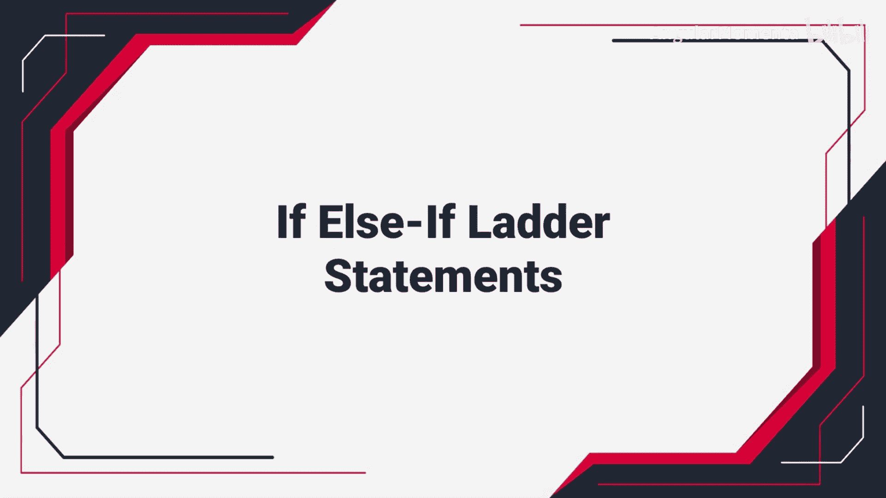
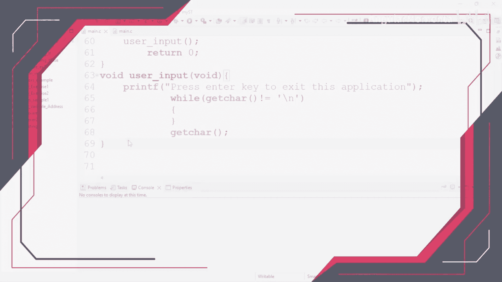
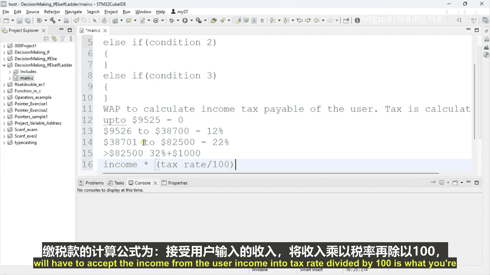
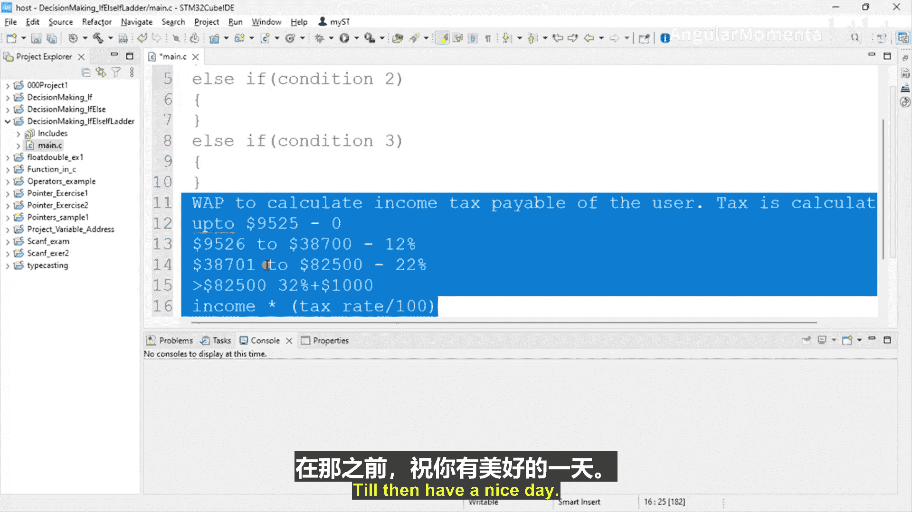

# 029：if-else-if 阶梯语句






在本节课中，我们将学习 C 语言中一种重要的多条件判断结构——`if-else-if` 阶梯语句。我们将通过一个计算个人所得税的实际例子，来理解它的工作原理和用法。

## 概述

`if-else-if` 阶梯语句用于在程序中检查多个条件。它按顺序从上到下评估每个条件，一旦某个条件为真，就执行对应的代码块，并跳过其余所有条件。如果所有条件都为假，则执行可选的 `else` 块。

## if-else-if 阶梯语句的结构

以下是 `if-else-if` 阶梯语句的基本语法结构：

```c
if (condition1) {
    // 如果 condition1 为真，执行这里的代码
} else if (condition2) {
    // 如果 condition1 为假，但 condition2 为真，执行这里的代码
} else if (condition3) {
    // 如果 condition1 和 condition2 都为假，但 condition3 为真，执行这里的代码
} else {
    // 如果所有条件都为假，执行这里的代码
}
```

它的执行流程是线性的：首先检查 `condition1`，如果为真，则执行其后的代码块，整个阶梯语句结束。如果为假，则继续检查 `condition2`，依此类推。`else` 块是可选的，用于处理所有条件都不满足的情况。

## 实践练习：计算个人所得税

为了更清晰地理解 `if-else-if` 阶梯语句，我们将完成一个编程练习。这个练习要求我们编写一个程序，根据用户输入的收入计算应缴的个人所得税。

以下是计算所依据的税率阶梯规则：

*   如果收入 **小于等于 9，525 美元**，税率为 **0%**。
*   如果收入在 **9，526 美元至 38，700 美元** 之间，税率为 **12%**。
*   如果收入在 **38，701 美元至 82，500 美元** 之间，税率为 **22%**。
*   如果收入 **大于 82，500 美元**，税率为 **32%**，并额外固定加收 **1000 美元**。

计算应缴税额的公式为：`收入 * 税率 / 100`。对于最高税率档，需在此基础上加上固定的 1000 美元。

在接下来的课程中，我们将动手编写代码来实现这个计算器，从而巩固对 `if-else-if` 阶梯语句的掌握。

## 总结





本节课我们一起学习了 `if-else-if` 阶梯语句。它是一种高效处理多个互斥条件的分支结构，通过顺序检查条件，确保只有第一个为真的条件对应的代码块会被执行。我们通过一个个人所得税计算器的例子，了解了其在实际编程中的应用场景。掌握这种结构，对于编写清晰的逻辑判断代码至关重要。