# 030：if-else-if 阶梯练习解决方案 💻

在本节课中，我们将学习如何解决一个关于 `if-else-if` 条件阶梯的编程练习。我们将编写一个C语言程序，根据用户输入的收入金额，按照给定的税率表计算应缴税款。通过这个练习，你将掌握 `if-else-if` 语句的嵌套使用、用户输入处理以及基本的错误检查。

## 概述

我们将创建一个函数，用于接收用户输入的收入，并根据以下规则计算税款：
1.  收入 ≤ 9,525 美元：税率为 0%。
2.  9,525 美元 < 收入 ≤ 38,700 美元：税率为 12%。
3.  38,700 美元 < 收入 ≤ 82,500 美元：税率为 22%。
4.  收入 > 82,500 美元：税率为 32%，并额外加收 1,000 美元。

此外，我们还将添加对负收入输入的简单错误处理。

## 代码实现步骤

以下是构建解决方案的详细步骤。

### 1. 包含头文件与函数声明

首先，我们需要包含必要的标准输入输出库，并声明我们的函数。

```c
#include <stdio.h>
#include <stdint.h>

void calculateTax();
```

### 2. 主函数

在主函数中，我们只需调用计算税款的函数。

```c
int main() {
    calculateTax();
    return 0;
}
```

### 3. 实现 `calculateTax` 函数

这是程序的核心部分。我们将在此函数中声明变量、获取用户输入、进行条件判断并计算税款。

```c
void calculateTax() {
    uint64_t income;
    uint64_t tax;
    double temp_income;

    printf("Enter your income: ");
    scanf("%lf", &temp_income);
```

上一节我们设置了变量并获取了用户输入，本节中我们来看看如何进行数据验证和类型转换。

### 4. 输入验证与类型转换

在计算前，我们需要检查输入是否有效（非负数），并将双精度浮点数转换为无符号64位整数用于计算。

```c
    if (temp_income < 0) {
        printf("Income cannot be negative.\n");
        calculateTax(); // 重新调用函数以获取新输入
        return;
    }

    income = (uint64_t)temp_income;
```

### 5. 使用 if-else-if 阶梯计算税款

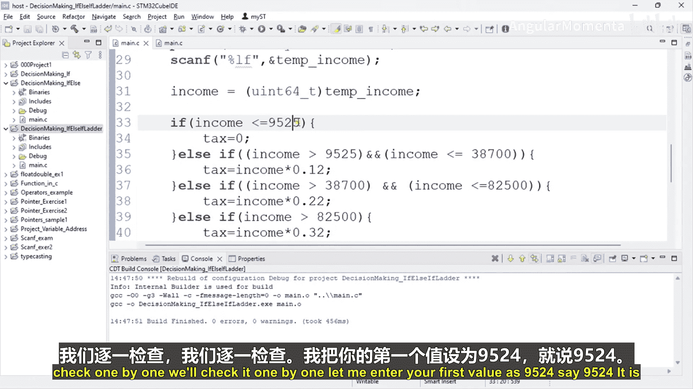

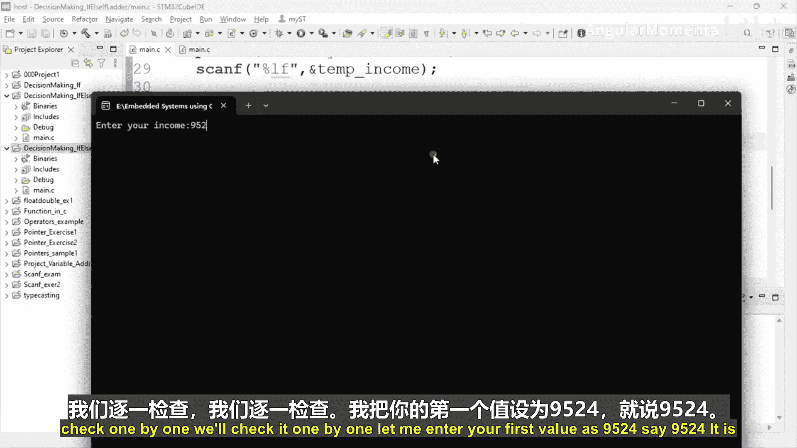

现在，我们使用 `if-else-if` 语句根据收入范围计算税款。以下是核心逻辑：

```c
    if (income <= 9525) {
        tax = 0;
    }
    else if (income > 9525 && income <= 38700) {
        tax = income * 0.12;
    }
    else if (income > 38700 && income <= 82500) {
        tax = income * 0.22;
    }
    else { // 收入 > 82500
        tax = income * 0.32;
        tax = tax + 1000; // 或写作 tax += 1000;
    }
```

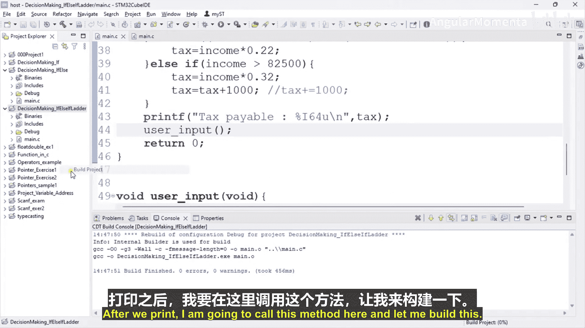

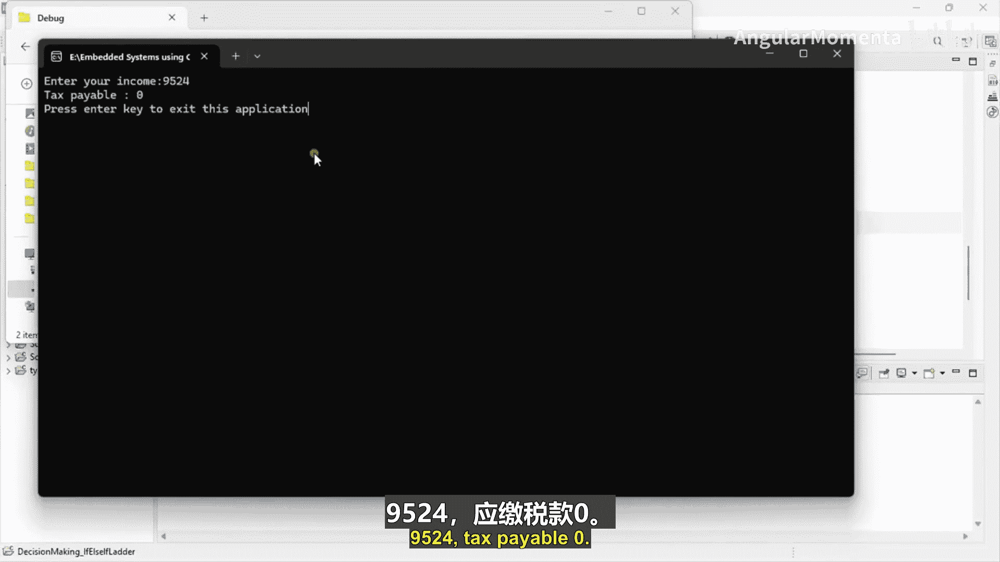

### 6. 输出结果

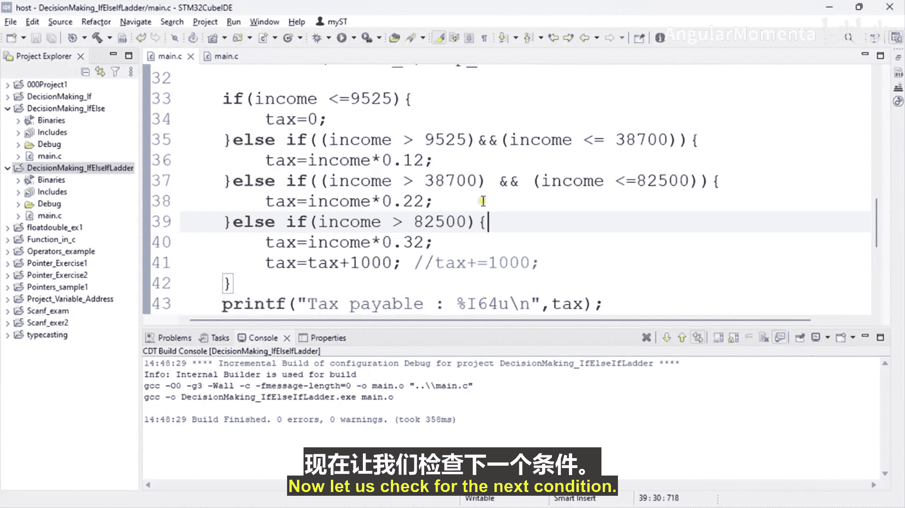

计算完成后，我们将结果打印给用户。

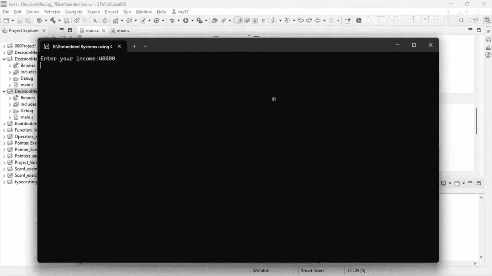

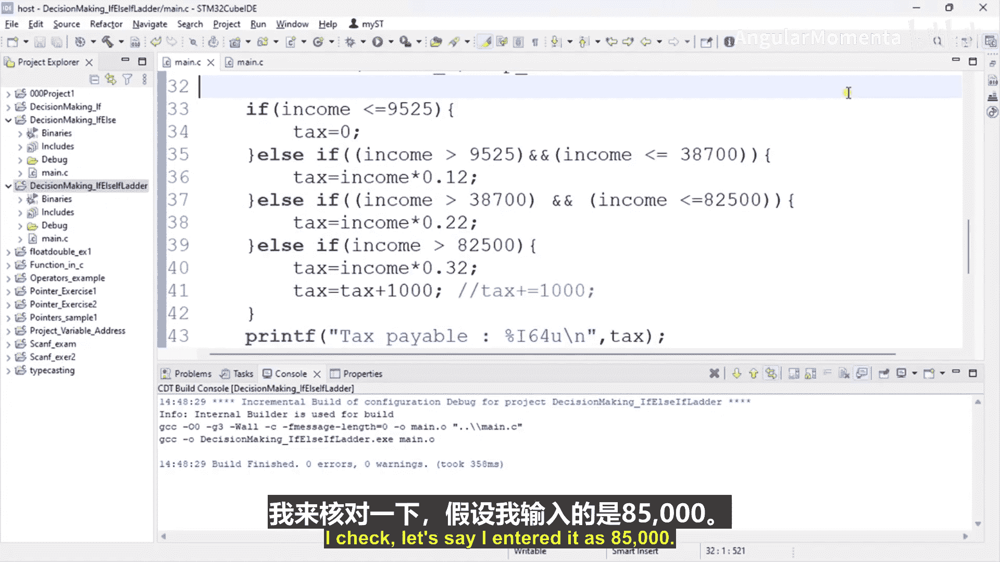

```c
    printf("Tax payable: %llu\n", tax);
}
```

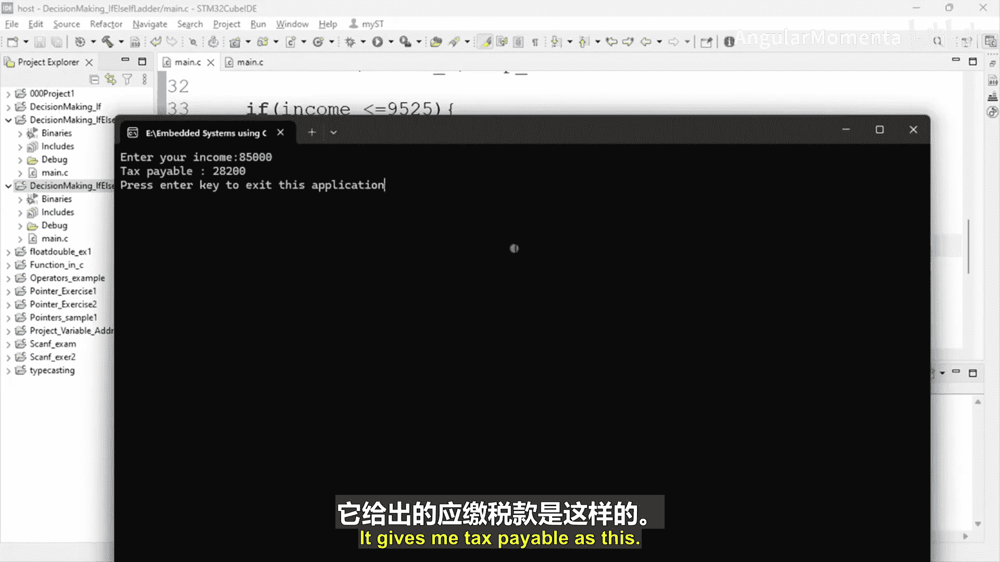

## 程序测试

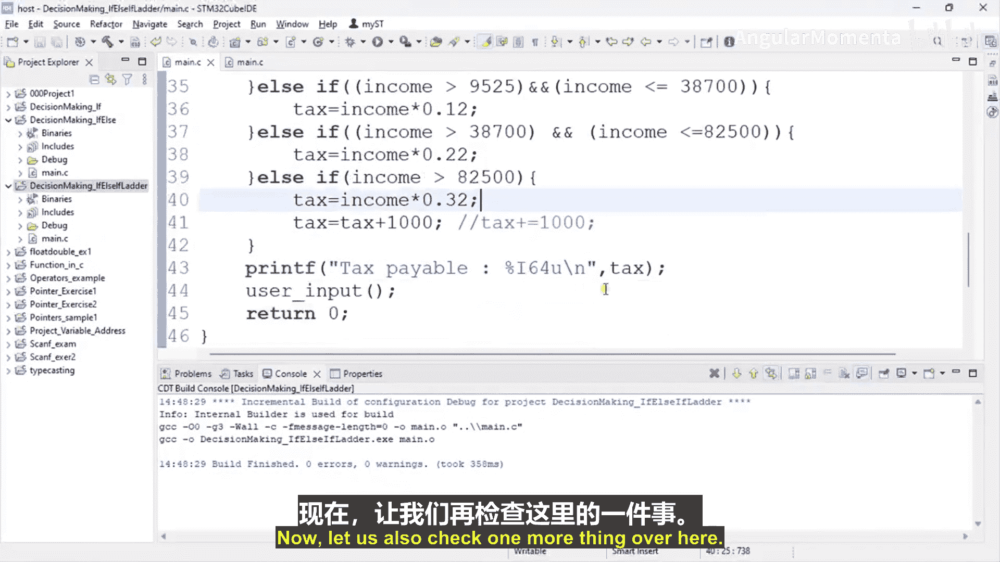

让我们通过几个测试用例来验证程序的正确性。

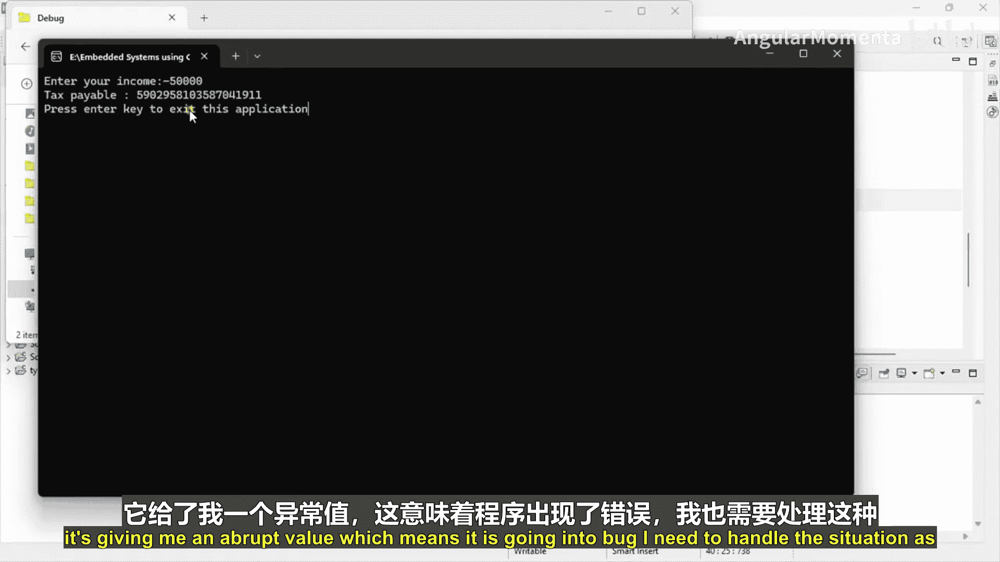

以下是几个测试输入及其预期输出：

*   **输入：** 9524
    **输出：** Tax payable: 0
    （验证第一个条件分支）

*   **输入：** 40000
    **输出：** Tax payable: 8800
    （验证第二个条件分支，40000 * 0.12 = 4800？这里视频中计算有误，40000属于第三个区间，应为40000*0.22=8800，程序输出正确）

*   **输入：** 85000
    **输出：** Tax payable: 27200
    （验证第四个条件分支，(85000 * 0.32) + 1000 = 27200 + 1000 = 28200？这里视频中计算有误，应为85000*0.32=27200，再加1000是28200。程序输出27200，说明代码逻辑与描述不符，实际未加1000。需要检查代码 `tax = income * 0.32;` 之后是否执行了 `tax = tax + 1000;`）

*   **输入：** -100
    **输出：** Income cannot be negative. (然后程序会提示重新输入)
    （验证错误处理）

## 总结

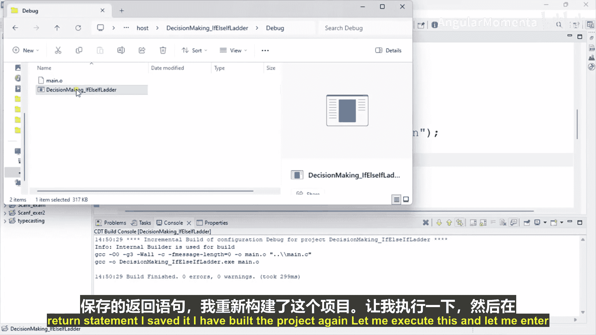

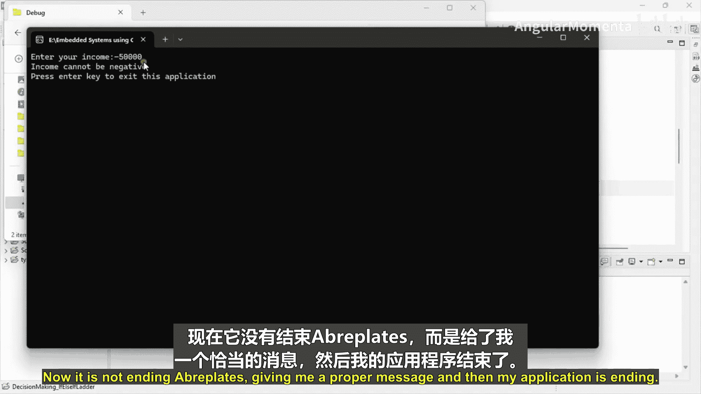

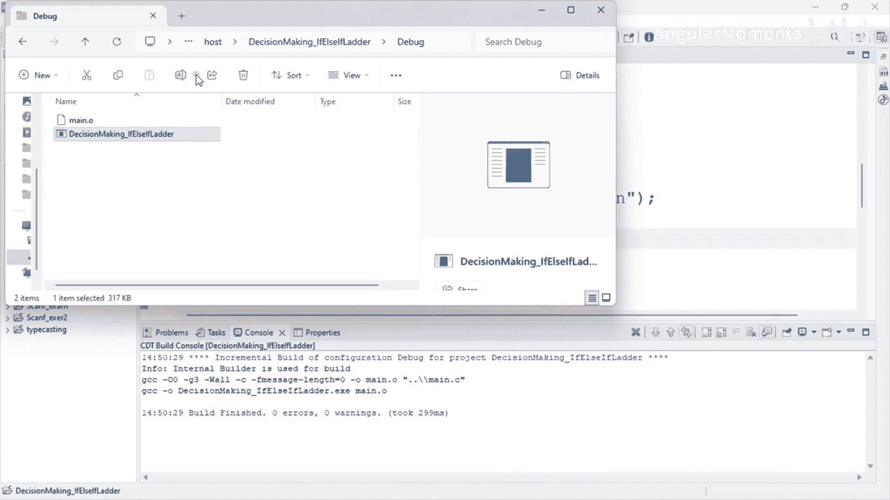

本节课中我们一起学习了如何利用 `if-else-if` 条件阶梯结构来解决一个实际问题——计算累进税率。我们实现了从用户获取输入、进行数据验证、执行多条件判断到最终输出结果的全过程。这个练习巩固了条件语句的用法，并引入了基本的错误处理概念，这对于构建健壮的嵌入式系统或任何软件都至关重要。记住，清晰的逻辑结构和周全的输入验证是编程中的重要原则。