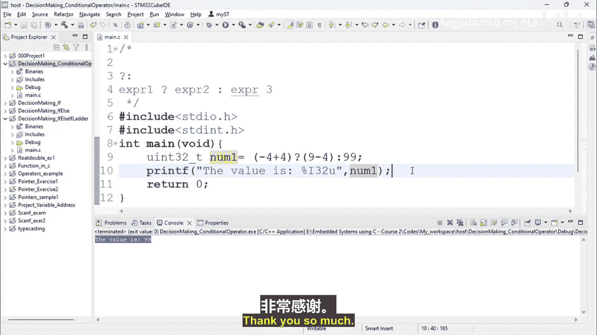

# 031：条件运算符


在本节课中，我们将学习C语言中的决策控制语句，并重点探讨**条件运算符**。条件运算符是一种三元运算符，用于根据条件进行求值。

首先，我们创建一个新项目来实践。创建一个C/C++项目，命名为 `decision_making_conditional_operator`，并添加一个名为 `main.c` 的源文件。

## 条件运算符语法

条件运算符是C语言中唯一的三元运算符，其操作符符号是 `?` 和 `:`。它之所以被称为三元运算符，是因为它需要三个操作数。

以下是条件运算符的基本语法结构：

```c
表达式1 ? 表达式2 : 表达式3
```

在这个结构中：
*   **表达式1** 是第一个操作数，通常是一个条件表达式。
*   **表达式2** 是第二个操作数，在 `?` 之后。
*   **表达式3** 是第三个操作数，在 `:` 之后。

## 条件运算符的工作原理

上一节我们介绍了条件运算符的语法，本节中我们来看看它的具体执行逻辑。条件运算符的求值过程遵循一个简单的规则：

1.  首先计算 **表达式1** 的值。
2.  如果 **表达式1** 的求值结果为 **真**（即非零），则整个条件运算符的结果是 **表达式2** 的值。
3.  如果 **表达式1** 的求值结果为 **假**（即零），则整个条件运算符的结果是 **表达式3** 的值。

让我们通过一个代码示例来加深理解。

```c
#include <stdio.h>
#include <stdint.h>

int main(void) {
    uint32_t number1 = (5 + 4) ? (9 - 4) : 99;
    printf("Value is: %lu\n", number1);
    return 0;
}
```

在这段代码中：
*   **表达式1** 是 `(5 + 4)`，结果为 `9`（非零，为真）。
*   因为条件为真，所以计算 **表达式2** `(9 - 4)`，结果为 `5`。
*   因此，变量 `number1` 被赋值为 `5`。程序运行后会输出 `Value is: 5`。

现在，我们修改一下条件，看看当条件为假时会发生什么。

```c
#include <stdio.h>
#include <stdint.h>

int main(void) {
    uint32_t number1 = (-5 + 4) ? (9 - 4) : 99;
    printf("Value is: %lu\n", number1);
    return 0;
}
```

在这段修改后的代码中：
*   **表达式1** 是 `(-5 + 4)`，结果为 `-1`（非零，为真）。注意，在C语言中，**任何非零值都被视为真**。
*   因为条件为真，所以计算 **表达式2** `(9 - 4)`，结果为 `5`。
*   因此，变量 `number1` 被赋值为 `5`。程序运行后会输出 `Value is: 5`。

为了演示假条件，我们需要一个结果为0的表达式：

```c
#include <stdio.h>
#include <stdint.h>

int main(void) {
    uint32_t number1 = (5 - 5) ? (9 - 4) : 99; // 表达式1结果为0
    printf("Value is: %lu\n", number1);
    return 0;
}
```

此时：
*   **表达式1** `(5 - 5)` 的结果为 `0`（假）。
*   因为条件为假，所以跳过 **表达式2**，计算 **表达式3** `99`。
*   因此，变量 `number1` 被赋值为 `99`。程序运行后会输出 `Value is: 99`。

## 条件运算符的应用

理解了基本工作原理后，我们来看看它的一个常见用途。条件运算符可以作为一种简洁的替代方式，来实现简单的 `if-else` 语句逻辑。

例如，下面两段代码的功能是等价的：

**使用 `if-else` 语句：**
```c
int max;
if (a > b) {
    max = a;
} else {
    max = b;
}
```

**使用条件运算符：**
```c
int max = (a > b) ? a : b;
```

可以看到，条件运算符的写法更加紧凑。但是，对于复杂的多分支判断或需要执行多条语句的情况，使用 `if-else` 或 `switch` 语句通常更具可读性。

## 总结

本节课中我们一起学习了C语言中的**条件运算符**（`? :`）。我们掌握了它的语法结构 `表达式1 ? 表达式2 : 表达式3`，并明确了其执行规则：根据**表达式1**的真假结果，选择执行并返回**表达式2**或**表达式3**的值。这种运算符提供了一种简洁的方式来编写简单的条件赋值语句，可以作为基础 `if-else` 结构的一种替代。在后续课程中，我们将继续探讨其他决策控制语句。



