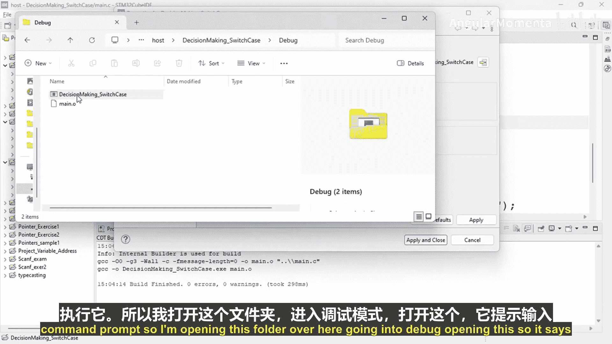
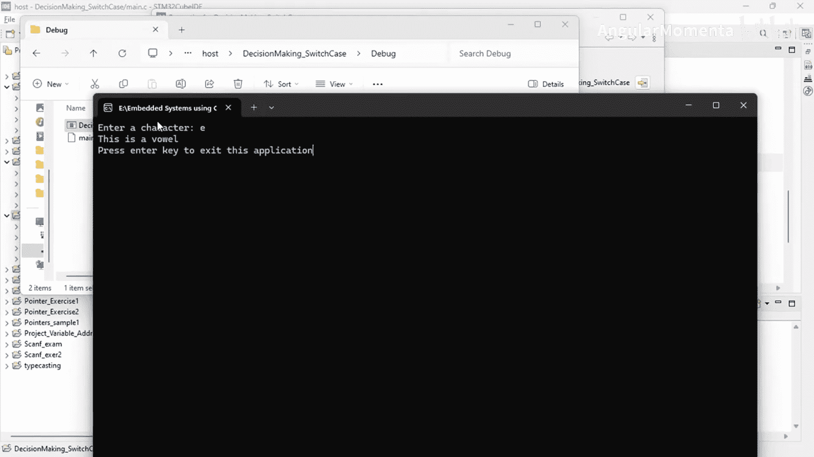
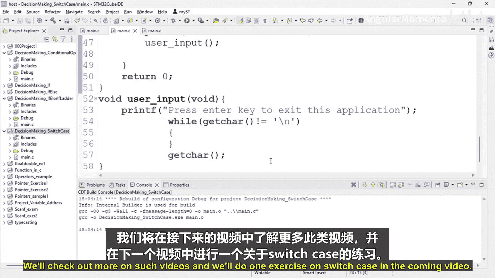

构建嵌入式系统：ARM Cortex (STM32) 基础：P32：C语言中的switch case语句 🧠

在本节课中，我们将要学习C语言编程中的`switch case`语句。这是一种用于多路分支选择的控制结构，特别适合处理一个变量与多个可能值进行比较的情况。

---

### 语法结构

`switch case`语句的基本语法结构如下：

```c
switch (expression) {
    case value1:
        // 当 expression 等于 value1 时执行的语句
        break;
    case value2:
        // 当 expression 等于 value2 时执行的语句
        break;
    // ... 可以有多个 case
    default:
        // 当 expression 与所有 case 值都不匹配时执行的语句
}
```

其中，`expression`是需要进行比较的表达式，其结果通常是一个整数或字符。`case`后面跟着一个常量值，用于与`expression`的结果进行比较。`break`语句用于跳出整个`switch`结构。`default`分支是可选的，用于处理所有`case`都不匹配的情况。

---

### 实践示例：判断元音字母

为了帮助理解，我们将通过一个判断输入字符是否为元音字母的程序来演示`switch case`的用法。

首先，我们创建一个新的C语言项目，并添加一个`main.c`源文件。程序的核心逻辑如下：

1.  提示用户输入一个字符。
2.  使用`scanf`函数读取用户输入的字符。
3.  使用`switch case`语句判断该字符是否为元音字母（A, E, I, O, U）。
4.  根据判断结果输出相应信息。

以下是实现此功能的代码：

```c
#include <stdio.h>

int main() {
    char ch;
    printf("Enter a character: ");
    scanf("%c", &ch);

    switch (ch) {
        case 'A':
        case 'E':
        case 'I':
        case 'O':
        case 'U':
            printf("This is a vowel.\n");
            break;
        default:
            printf("This is not a vowel.\n");
    }
    return 0;
}
```

在这个例子中，我们使用了多个`case`标签（‘A’, ‘E’, ‘I’, ‘O’, ‘U’）共享同一段执行代码（打印“This is a vowel.”）。这是一种常见的技巧，可以简化代码。

---



### 执行与验证

编译并运行上述程序。当您输入字符‘A’、‘E’、‘I’、‘O’或‘U’（包括大小写，注意示例代码中是大写字母）时，程序会输出“This is a vowel.”。输入其他任何字符，程序则会执行`default`分支，输出“This is not a vowel.”。

您也可以为每个元音字母编写独立的输出语句，例如：



```c
switch (ch) {
    case 'A':
        printf("This is vowel A.\n");
        break;
    case 'E':
        printf("This is vowel E.\n");
        break;
    // ... 其他元音字母
    default:
        printf("This is not a vowel.\n");
}
```

选择哪种方式取决于您的具体需求。共享代码块的方式更简洁，而独立代码块的方式可以为每个值提供更具体的反馈。

---

### 总结

本节课中我们一起学习了C语言的`switch case`语句。我们了解了它的基本语法结构，并通过一个判断元音字母的实例程序掌握了其使用方法。关键点包括：
*   `switch`语句根据一个表达式的值进行多路分支。
*   `case`标签用于指定匹配的值，并执行其后的代码块。
*   `break`语句用于在匹配成功后跳出`switch`结构。
*   `default`分支用于处理所有`case`都不匹配的情况。
*   多个`case`标签可以指向同一段执行代码，这有助于简化逻辑。



在接下来的课程中，我们将通过更多练习来巩固对`switch case`语句的理解。