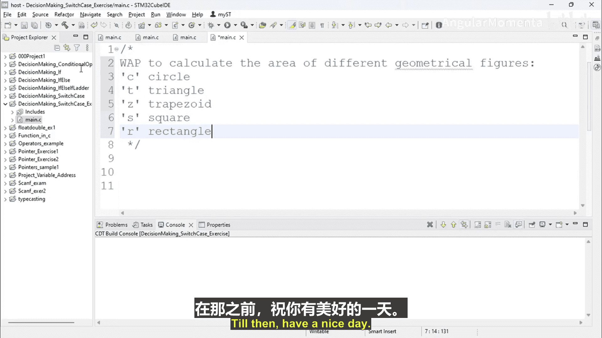

# 033：switch-case 语句练习 🧮

在本节中，我们将通过一个编程练习来巩固对 `switch-case` 决策语句的理解。我们将编写一个程序，根据用户输入的不同代码，计算并输出相应几何图形的面积。

## 概述

我们将创建一个名为“决策制定：switch-case练习”的C++项目。程序的核心功能是：提示用户输入一个代表特定几何图形的代码（例如，T代表三角形，C代表圆形），然后根据该代码请求必要的尺寸参数（如半径、底边、高），最后计算并显示面积。程序还需包含基本的错误处理，例如检查输入的参数是否为负值。

## 练习详解

以下是该练习的具体要求和实现步骤。

程序需要支持计算多种几何图形的面积。用户首先输入一个代表图形的字母代码。

根据用户输入的代码，程序将引导用户输入计算该图形面积所需的参数。

*   **圆形 (C)**：需要半径 `radius`。面积公式为：`area = PI * radius * radius`。
*   **三角形 (T)**：需要底边 `base` 和高 `height`。面积公式为：`area = 0.5 * base * height`。
*   **梯形 (Z)**：需要上底 `base1`、下底 `base2` 和高 `height`。面积公式为：`area = 0.5 * (base1 + base2) * height`。
*   **正方形 (S)**：需要边长 `side`。面积公式为：`area = side * side`。
*   **长方形 (A)**：需要长度 `length` 和宽度 `width`。面积公式为：`area = length * width`。

程序必须对用户输入的参数进行验证。例如，如果用户为半径输入了-1，程序应输出错误信息“半径不能为负数”，而不是进行错误计算。

## 实现思路

上一节我们介绍了 `switch-case` 语句的语法，本节中我们来看看如何将其应用于实际编程问题。我们将使用 `switch-case` 结构来根据用户输入的字符代码，分流到不同的计算逻辑中。

以下是实现这个程序的基本逻辑流程：

1.  定义必要的变量来存储用户输入的代码和图形参数。
2.  提示用户输入图形代码。
3.  使用 `switch` 语句，根据输入的代码进入不同的 `case` 分支。
4.  在每个 `case` 分支中：
    *   提示用户输入计算该图形面积所需的参数。
    *   检查输入的参数是否有效（如是否为正数）。
    *   如果有效，则根据公式计算面积并显示结果。
    *   如果无效，则显示错误信息。
5.  使用 `default` 分支处理用户输入了未定义代码的情况。

## 总结

本节课中我们一起学习了如何运用 `switch-case` 语句来解决一个多分支选择问题。我们设计了一个计算不同几何图形面积的程序，它不仅能根据用户选择执行相应计算，还加入了参数验证等基础错误处理功能。这个练习很好地演示了 `switch-case` 在组织清晰、结构化的决策逻辑时的实用性。在接下来的视频中，我们将动手实现这个程序。