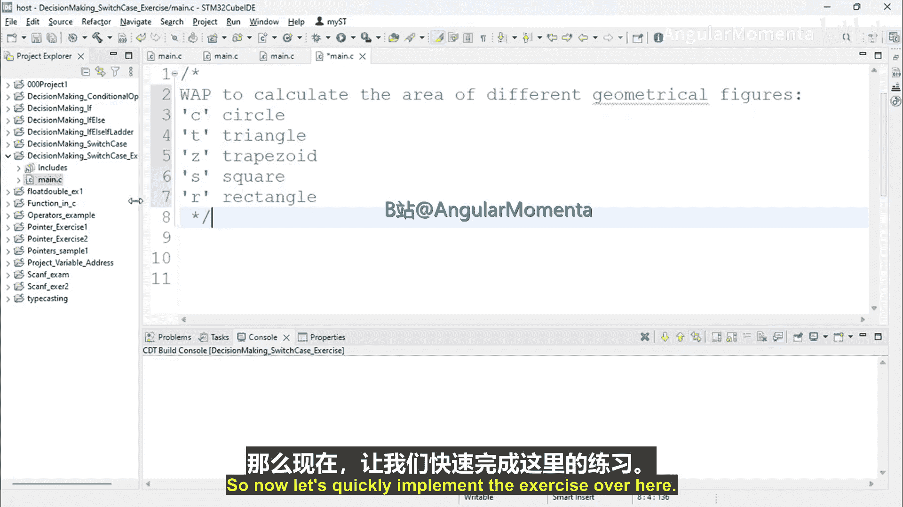
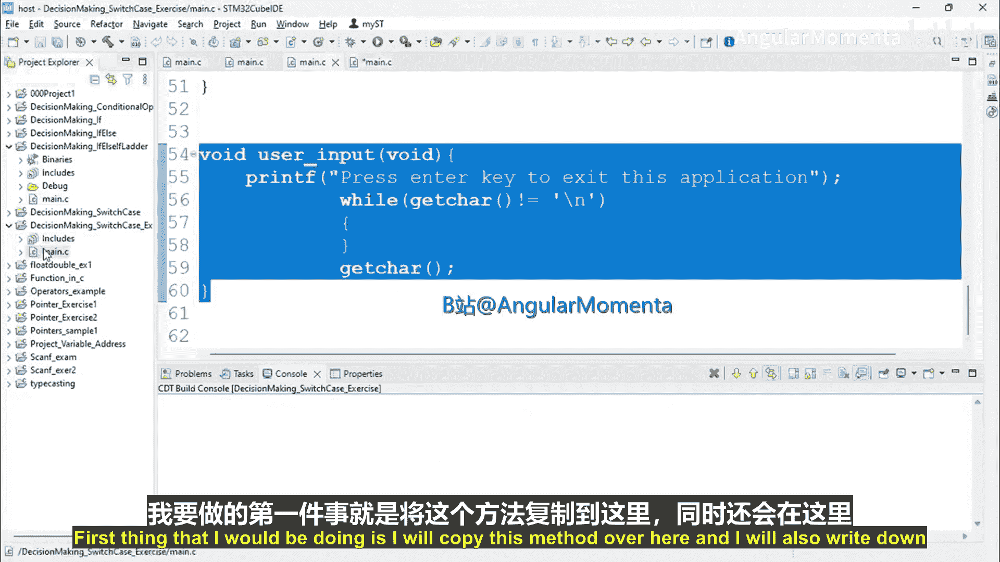
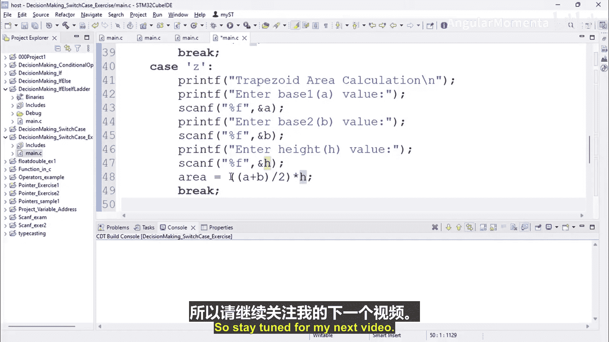

# 034：Switch Case 练习解答 第1部分


## 概述





在本节课中，我们将学习如何使用C语言中的`switch-case`语句来构建一个简单的几何图形面积计算程序。我们将通过一个具体的编程练习，实现根据用户输入的不同代码来计算圆形、三角形和梯形的面积。

## 程序结构搭建

首先，我们需要搭建程序的基本框架。这包括包含必要的头文件、声明函数原型以及定义主函数。

```c
#include <stdio.h>
#include <stdint.h>

void user_input(void);

int main(void) {
    user_input();
    return 0;
}
```

上一节我们搭建了程序的基本框架，本节中我们来看看如何实现用户交互部分。

## 用户交互与变量定义

以下是实现用户交互的步骤。我们首先向用户展示一个菜单，然后接收用户输入的图形代码。

```c
void user_input(void) {
    uint8_t code;
    float radius, base, height, area;
    float base1, base2; // 用于梯形

    printf("Area Calculation Program\n");
    printf("For Circle, enter C\n");
    printf("For Triangle, enter T\n");
    printf("For Trapezoid, enter Z\n");
    printf("For Square, enter S\n");
    printf("For Rectangle, enter R\n");
    printf("Enter the code here: ");
    scanf("%c", &code);
```

## 实现Switch-Case逻辑

获取用户输入后，我们使用`switch-case`语句来根据不同的代码执行相应的面积计算逻辑。

```c
    switch(code) {
        case 'C':
            printf("Circle Area Calculation\n");
            printf("Enter radius value: ");
            scanf("%f", &radius);
            area = 3.1415 * radius * radius;
            printf("Area: %f\n", area);
            break;
```

## 计算三角形面积

如果用户输入的是`T`，程序将计算三角形的面积。三角形的面积公式是 **`面积 = (底 * 高) / 2`**。

```c
        case 'T':
            printf("Triangle Area Calculation\n");
            printf("Enter base value: ");
            scanf("%f", &base);
            printf("Enter height value: ");
            scanf("%f", &height);
            area = (base * height) / 2;
            printf("Area: %f\n", area);
            break;
```

## 计算梯形面积

如果用户输入的是`Z`，程序将计算梯形的面积。梯形的面积公式是 **`面积 = ((上底 + 下底) / 2) * 高`**。

```c
        case 'Z':
            printf("Trapezoid Area Calculation\n");
            printf("Enter base1 value: ");
            scanf("%f", &base1);
            printf("Enter base2 value: ");
            scanf("%f", &base2);
            printf("Enter height value: ");
            scanf("%f", &height);
            area = ((base1 + base2) / 2) * height;
            printf("Area: %f\n", area);
            break;
```

## 总结



本节课中我们一起学习了如何利用`switch-case`控制流结构来创建一个多分支的程序。我们实现了根据用户输入选择不同几何图形并计算其面积的功能，涵盖了圆形、三角形和梯形的计算。在下一部分，我们将继续完成正方形和矩形的面积计算，并进一步完善这个程序。