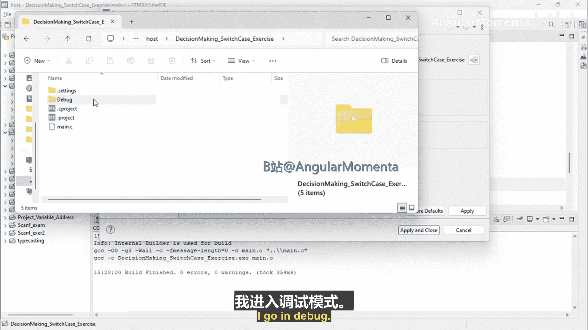
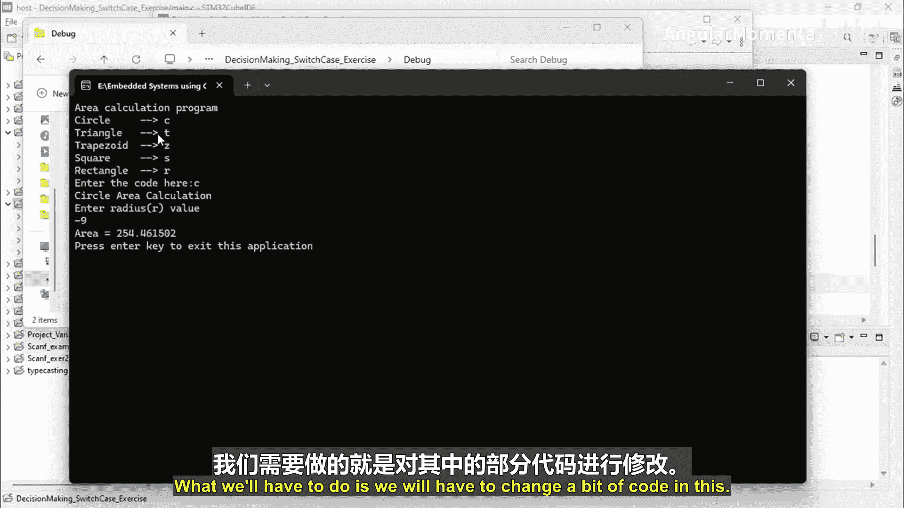
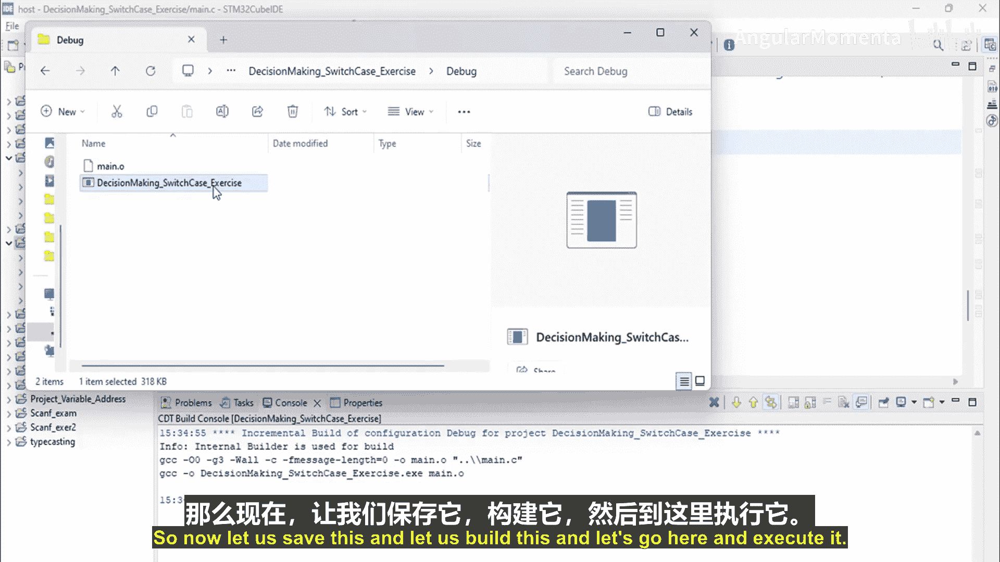
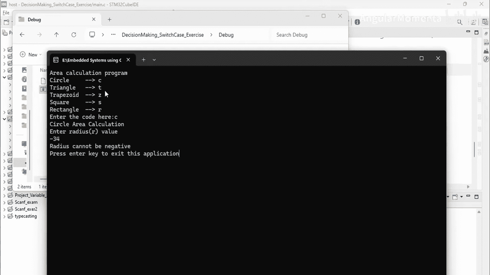
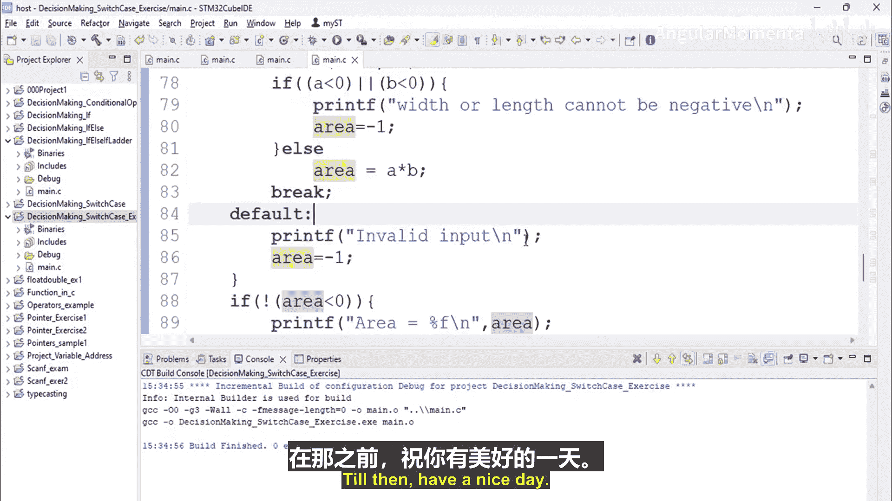

# 035：switch-case 练习解答 第二部分

## 概述

在本节中，我们将继续完成一个使用 `switch-case` 语句的编程练习。我们将为计算不同几何图形面积的程序添加输入验证功能，确保用户输入的数值（如半径、边长等）是有效的非负数。通过这个练习，你将学习如何在 `switch-case` 结构中结合条件判断，以构建更健壮的程序。

## 继续编写代码

上一节我们介绍了 `switch-case` 的基本结构并处理了部分图形。本节中，我们来看看如何为每个分支添加输入验证，并完善整个程序。

以下是继续编写代码的步骤：

1.  **处理正方形面积计算**
    对于正方形，我们需要接收边长并计算面积。同时，需要验证边长是否为非负数。
    ```c
    case 'S': // 正方形
        printf("请输入边长值: ");
        scanf("%f", &a);
        if (a < 0) {
            printf("边长不能为负数。\n");
            area = -1;
        } else {
            area = a * a; // 面积公式：边长 * 边长
        }
        break;
    ```

2.  **处理矩形面积计算**
    对于矩形，我们需要接收宽度和长度。同样，需要验证这两个值。
    ```c
    case 'R': // 矩形
        printf("请输入宽度和长度: ");
        scanf("%f %f", &a, &b);
        if (a < 0 || b < 0) {
            printf("宽度或长度不能为负数。\n");
            area = -1;
        } else {
            area = a * b; // 面积公式：宽度 * 长度
        }
        break;
    ```



3.  **添加默认情况**
    当用户输入无效选项时，程序应给出提示。
    ```c
    default:
        printf("无效输入。\n");
        area = -1;
        break;
    ```

## 完善主逻辑



`switch-case` 语句结束后，我们需要根据 `area` 变量的值来决定是否输出结果。如果 `area` 不小于 0（即计算成功），则打印面积；否则不打印。

```c
// switch-case 语句结束

if (!(area < 0)) { // 如果 area 不小于 0
    printf("面积为: %.2f\n", area);
}

printf("按任意键继续...\n");
getchar(); // 等待用户输入，以便查看结果
```

## 测试与验证

现在，让我们构建并运行程序，测试各种情况。

1.  **测试有效输入**：选择三角形（T），输入合法的底和高，程序应正确计算并显示面积。
2.  **测试无效图形代码**：输入一个未定义的字母，程序应显示“无效输入”。
3.  **测试负值输入**：
    *   选择圆形（C），输入负的半径，程序应提示“半径不能为负数”。
    *   选择矩形（R），输入负的宽度或长度，程序应提示“宽度或长度不能为负数”。
    *   选择梯形（Z），输入负的底或高，程序应提示“底或高不能为负数”。



经过测试，程序现在能够正确处理各种有效和无效的输入，确保了健壮性。



## 总结



本节课中我们一起学习了如何扩展 `switch-case` 结构的功能。我们不仅用其来根据用户选择执行不同的代码分支，还**在每个分支内部结合了 `if` 条件语句**来进行输入验证。这种组合是编写可靠、用户友好程序的关键。通过完成这个练习，你掌握了使用控制结构处理复杂逻辑的基本方法，这是嵌入式系统乃至所有编程领域的重要技能。