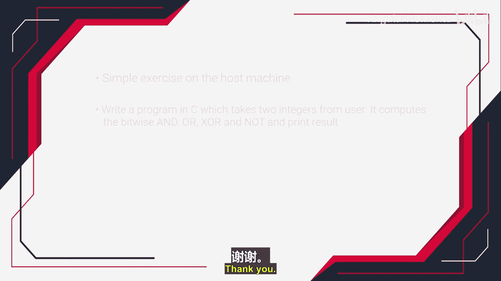

# 036：C语言中的位运算符


在本节课中，我们将学习C语言中的位运算符。位运算符在嵌入式系统编程中至关重要，常用于操作内存地址、外设寄存器内容和状态寄存器等。掌握位运算符是嵌入式C编程的重要一环。

## 逻辑运算符与位运算符的区别

首先，我们需要区分逻辑运算符和位运算符。逻辑运算符关注操作数的真假（非零为真，零为假），而位运算符则对操作数的每一位进行逐位运算。

例如，逻辑与运算符是 `&&`，位与运算符是 `&`。假设有两个变量：
```c
int A = 40;  // 二进制: 0010 1000
int B = 30;  // 二进制: 0001 1110
```
逻辑运算 `A && B` 的结果为 `1`（真），因为A和B都是非零值。

## 位运算符详解

以下是C语言中可用的六种位运算符。

### 1. 位与运算符 `&`

位与运算符对两个操作数的每一位执行逻辑与操作。规则是：只有两个对应位都为1时，结果位才为1，否则为0。

对于 `A & B`：
```
A: 0010 1000 (40)
B: 0001 1110 (30)
&: 0000 1000 (8)
```
因此，`C = A & B` 的结果是 `8`。

### 2. 位或运算符 `|`

位或运算符对两个操作数的每一位执行逻辑或操作。规则是：只要两个对应位中有一个为1，结果位就为1。

对于 `A | B`：
```
A: 0010 1000 (40)
B: 0001 1110 (30)
|: 0011 1110 (62)
```
因此，`C = A | B` 的结果是 `62`。

### 3. 位非运算符 `~`

位非运算符是单目运算符，它对操作数的每一位执行逻辑非操作（取反）。规则是：1变为0，0变为1。

对于 `~A`：
```
A:  0010 1000 (40)
~A: 1101 0111 (215，假设为8位无符号整数)
```
因此，`C = ~A` 的结果是 `215`（8位情况下）。

### 4. 位异或运算符 `^`

位异或运算符对两个操作数的每一位执行异或操作。规则是：两个对应位不同时，结果位为1；相同时，结果位为0。

异或运算的真值表如下：
```
A  B | A ^ B
0  0 |   0
0  1 |   1
1  0 |   1
1  1 |   0
```
对于 `A ^ B`：
```
A: 0010 1000 (40)
B: 0001 1110 (30)
^: 0011 0110 (54)
```
因此，`C = A ^ B` 的结果是 `54`。

### 5. 左移运算符 `<<`

左移运算符将操作数的所有位向左移动指定的位数。右侧空出的位用0填充。

例如，`A << 2` 表示将A的二进制位向左移动2位。
```
A:    0010 1000 (40)
A<<2: 1010 0000 (160)
```

### 6. 右移运算符 `>>`

右移运算符将操作数的所有位向右移动指定的位数。对于无符号数，左侧空出的位用0填充；对于有符号数，行为可能依赖于编译器（通常进行符号扩展）。

例如，`A >> 2` 表示将A的二进制位向右移动2位。
```
A:    0010 1000 (40)
A>>2: 0000 1010 (10)
```

## 位运算符在嵌入式编程中的应用

在嵌入式C程序中，位运算符常用于以下操作：
*   **测试位**：检查某个特定位是1还是0。
*   **设置位**：将某个特定位设为1。
*   **清除位**：将某个特定位设为0。
*   **切换位**：将某个特定位从0变为1，或从1变为0。

例如，控制一个连接到微控制器端口的LED：
*   点亮LED可能需要设置端口寄存器的某个位。
*   关闭LED可能需要清除该位。
*   读取外设状态寄存器时，需要测试特定的状态位。

## 实践练习

为了巩固理解，我们将在下一节中完成一个简单的练习。我们将编写一个C程序，该程序从用户处获取两个整数，然后计算并打印这两个数的位与、位或、位异或和位非的结果。

本节课中，我们一起学习了C语言中的六种位运算符（`&`， `|`， `~`， `^`， `<<`， `>>`），理解了它们与逻辑运算符的区别，并探讨了它们在嵌入式系统编程中的基本应用。下一节我们将通过编程练习来实际应用这些知识。



