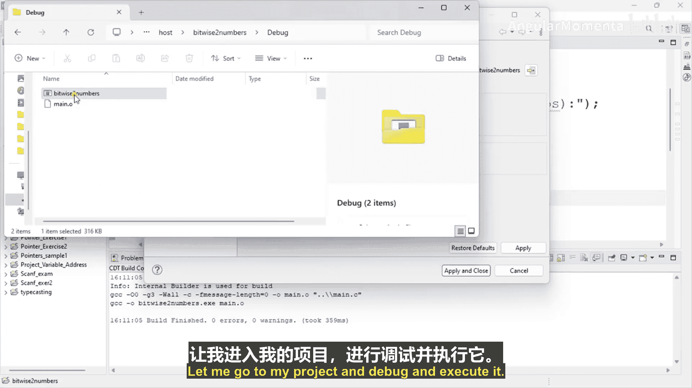
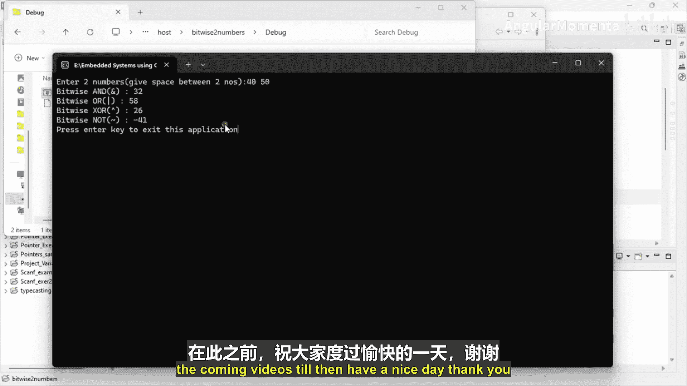

# 037：按位与和按位或运算

在本节课中，我们将学习如何在C语言中实现基本的按位运算符，包括按位与、按位或、按位异或和按位非。我们将通过一个具体的编程练习来演示这些运算符的用法和效果。

## 概述

我们将创建一个新的C语言项目，编写一个程序，该程序接收用户输入的两个整数，然后计算并输出这两个数的按位与、按位或、按位异或以及第一个数的按位非结果。通过这个练习，你将直观地理解这些位运算的工作原理。

## 项目创建与代码编写

首先，我们需要创建一个新的项目并添加一个源文件。

以下是创建项目的步骤：
1.  创建一个新的C项目。
2.  在项目中添加一个名为 `main.c` 的源文件。

接下来，我们开始编写 `main.c` 文件中的代码。程序的核心逻辑是包含必要的头文件，定义主函数，接收用户输入，进行计算，并打印结果。

以下是 `main.c` 文件的完整代码：

```c
#include <stdint.h>
#include <stdio.h>

int main() {
    // 声明两个整数变量
    int32_t number1, number2;

    // 提示用户输入两个数字
    printf("请输入两个数字，用空格分隔：\n");
    // 读取用户输入
    scanf("%d %d", &number1, &number2);

    // 计算并打印按位与的结果
    printf("按位与 (number1 & number2): %d\n", number1 & number2);
    // 计算并打印按位或的结果
    printf("按位或 (number1 | number2): %d\n", number1 | number2);
    // 计算并打印按位异或的结果
    printf("按位异或 (number1 ^ number2): %d\n", number1 ^ number2);
    // 计算并打印number1的按位非结果
    printf("按位非 (~number1): %d\n", ~number1);

    return 0;
}
```

## 代码解析

上一节我们列出了完整的程序代码，本节中我们来详细解析每一部分的作用。

以下是代码中关键部分的解释：
*   `#include <stdint.h>` 和 `#include <stdio.h>`： 引入标准库，分别用于使用固定宽度整数类型（如`int32_t`）和标准输入输出函数（如`printf`和`scanf`）。
*   `int32_t number1, number2;`： 声明两个32位有符号整数变量。
*   `printf(“请输入两个数字，用空格分隔：\n”);`： 向用户显示输入提示信息。
*   `scanf(“%d %d”, &number1, &number2);`： 从标准输入读取两个整数，并分别存储到`number1`和`number2`变量中。
*   `printf(“按位与 (number1 & number2): %d\n”, number1 & number2);`： 计算`number1`和`number2`的按位与（`&`），并打印结果。
*   `printf(“按位或 (number1 | number2): %d\n”, number1 | number2);`： 计算`number1`和`number2`的按位或（`|`），并打印结果。
*   `printf(“按位异或 (number1 ^ number2): %d\n”, number1 ^ number2);`： 计算`number1`和`number2`的按位异或（`^`），并打印结果。
*   `printf(“按位非 (~number1): %d\n”, ~number1);`： 计算`number1`的按位非（`~`），并打印结果。按位非是一元运算符，只对`number1`进行操作。

## 运行与验证

代码编写完成后，我们需要编译并运行程序来验证其功能。

以下是运行示例：
1.  编译并构建项目。
2.  运行生成的可执行文件。
3.  程序会提示：“请输入两个数字，用空格分隔：”。
4.  假设输入 `40` 和 `50`，然后按回车键。
5.  程序将输出以下结果：
    *   按位与 (number1 & number2): 32
    *   按位或 (number1 | number2): 58
    *   按位异或 (number1 ^ number2): 26
    *   按位非 (~number1): -41



这个输出展示了针对输入值40和50，各个按位运算符的具体计算结果。

## 总结



本节课中我们一起学习了C语言中基本按位运算符的实践应用。我们创建了一个完整的程序，该程序能够接收用户输入，并演示了**按位与 (`&`)**、**按位或 (`|`)**、**按位异或 (`^`)** 和**按位非 (`~`)** 运算符的使用方法及运算结果。通过这个动手练习，你应该对如何在嵌入式系统编程中操作数据的单个比特位有了更直观的认识。在接下来的课程中，我们将继续深入探讨位运算的更多高级应用。