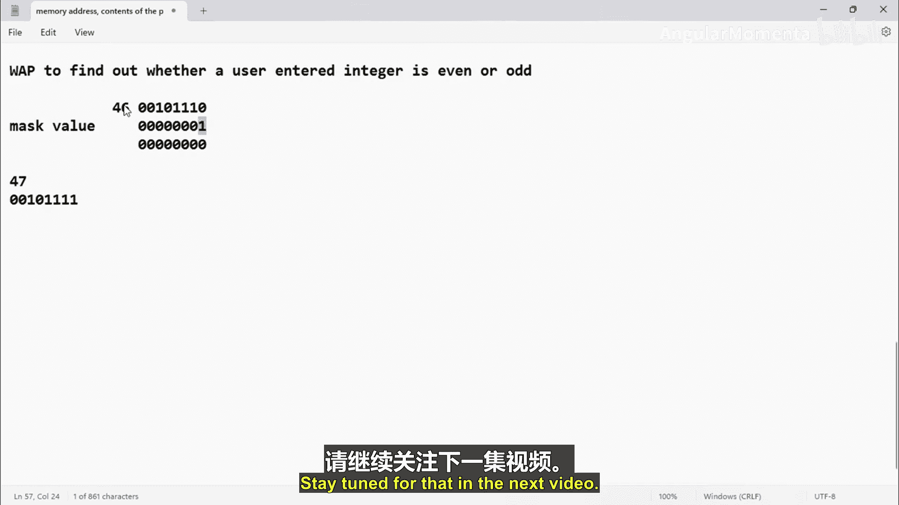

# 038：位运算符的位测试适用性 🧪


在本节课中，我们将学习位运算符在嵌入式C编程中的一个核心应用：**位测试**。我们将通过编写一个判断整数奇偶性的程序，来具体理解如何使用位掩码技术来测试特定位的状态。

上一节我们介绍了位运算符的基本概念。本节中我们来看看如何利用这些运算符进行实际的位操作。

## 位测试的应用场景

在嵌入式C程序中，位操作非常常见。以下是几种典型操作及其对应的运算符：
*   **测试位**：使用 **按位与 (&)** 运算符。
*   **设置位**：使用 **按位或 (|)** 运算符。
*   **清除位**：使用 **按位取反 (~)** 和 **按位与 (&)** 运算符的组合。
*   **翻转位**：使用 **按位异或 (^)** 运算符。

我们将通过一个练习来理解位测试。这个练习的目标是：编写一个程序，判断用户输入的整数是奇数还是偶数，并将结果打印到控制台。我们将使用**测试位的逻辑**来实现这个功能。

## 判断奇偶性的位逻辑原理

判断一个数字是奇数还是偶数有很多方法，但我们将使用基于位测试的逻辑。其原理非常简单。

让我们考虑一个数字，例如整数 `46`。它的二进制形式是 `00101110`。这是一个偶数，其**最低有效位 (LSB)** 是 `0`。

再以 `47` 为例，其二进制形式是 `00101111`。这是一个奇数，其LSB是 `1`。

这表明：
*   当LSB为 `0` 时，数字是**偶数**。
*   当LSB为 `1` 时，数字是**奇数**。

因此，通过测试一个数字的**最低有效位**，我们就可以判断它是奇数还是偶数。这就是我们理解的基本逻辑。

## 位掩码技术

为了测试特定位，我们将使用一种称为**位掩码**的技术。位掩码是编程中用于测试或修改给定数据中特定位状态的一种方法。

我们需要创建一个**掩码值**，然后对该掩码值和原始数据执行位运算，以获得我们想要的结果。

现在让我们分析具体如何操作。假设我们有一个输入数字，以二进制格式表示。我们以数字 `46` (`00101110`) 为例。

我们可以将这个数字的位分为两个区域：
1.  **区域1**：除了我们关心的最低有效位（LSB）之外的所有高位。
2.  **区域2**：我们关心的最低有效位（LSB）。

在这个例子中，我们的目标是测试LSB以判断奇偶性，因此**区域1**对我们没有意义。这就是为什么我们在该区域使用掩码值 `0`。

对于**区域2**，我们创建一个掩码值。整个掩码值除了LSB位置为 `1` 外，其余位都是 `0`。对于8位数，这个掩码就是 `00000001`（即十进制的 `1`）。

现在，我们将原始数据 (`00101110`) 与掩码 (`00000001`) 进行**按位与 (&)** 运算：
```
数据:   0 0 1 0 1 1 1 0
掩码: & 0 0 0 0 0 0 0 1
结果:   0 0 0 0 0 0 0 0
```
运算结果是 `0`。因为数据LSB是 `0`，与掩码的 `1` 相与得到 `0`。我们可以得出结论：该数字是**偶数**。

如果数字是奇数，例如 `47` (`00101111`)：
```
数据:   0 0 1 0 1 1 1 1
掩码: & 0 0 0 0 0 0 0 1
结果:   0 0 0 0 0 0 0 1
```
运算结果是 `1`（非零）。我们可以得出结论：该数字是**奇数**。

这就是掩码值的重要性。通过这种技术，我们可以测试任何我们想要的位位置。在这个例子中，我们检查的是第1位（LSB），所以我们将掩码中除了该位设为 `1` 外，其余所有位都设为 `0`。

## 程序实现思路

根据以上逻辑，我们可以设计程序的步骤：
1.  获取用户输入的一个整数。
2.  将该整数与掩码值 `1` 进行**按位与 (&)** 运算。
3.  检查运算结果：
    *   如果结果为 `0`，则数字为**偶数**。
    *   如果结果为 `1`（非零），则数字为**奇数**。
4.  打印相应的结果信息。



本节课中我们一起学习了如何使用位运算符进行位测试，并深入理解了位掩码技术的原理和应用。我们通过判断整数奇偶性的具体例子，掌握了通过**按位与 (&)** 运算和掩码值来测试特定位状态的方法。在下一节中，我们将动手编写代码来实现这个程序。