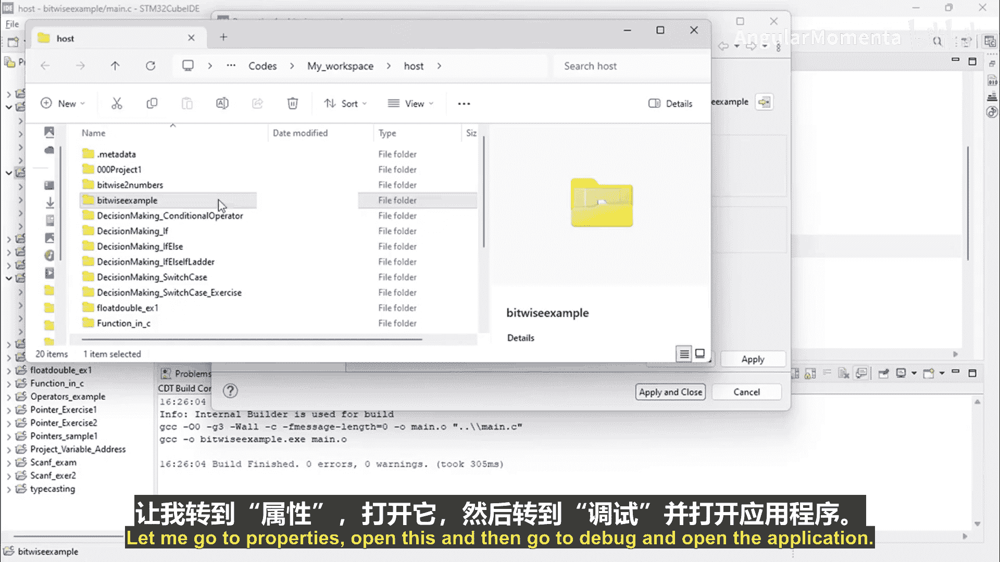
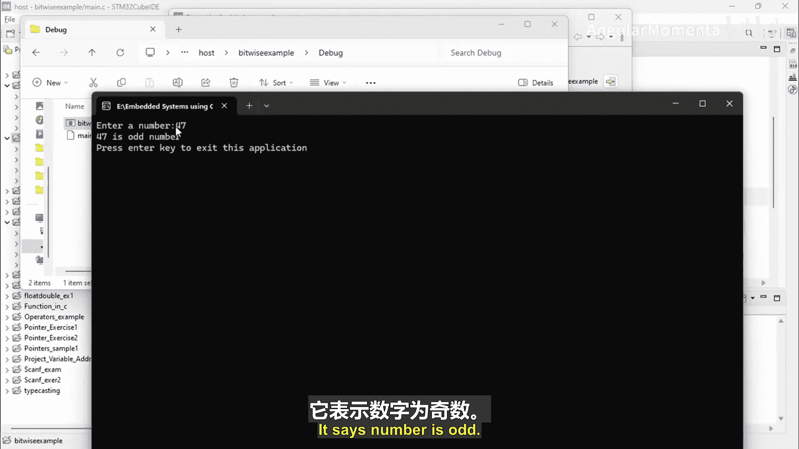
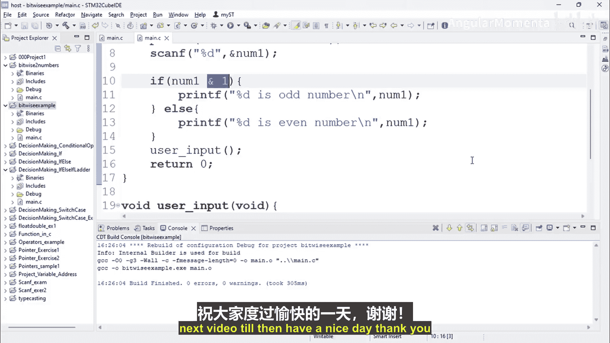

构建嵌入式系统：ARM Cortex (STM32) 基础：第39章：利用位测试判断奇偶性

在本节课中，我们将学习如何编写一个C语言程序，利用位运算来判断一个整数是奇数还是偶数。这是嵌入式系统编程中处理底层数据的基础技能。

上一节我们介绍了位运算的基本概念，本节中我们来看看如何具体应用位与运算进行奇偶性判断。

### 程序编写步骤

以下是创建一个判断奇偶性程序的完整步骤。

1.  **创建新项目**：在集成开发环境中创建一个新的C项目，命名为“bitwise_example”。
2.  **添加源文件**：在项目中添加一个新的源文件，命名为 `main.c`。
3.  **包含头文件**：在 `main.c` 文件中，包含必要的标准输入输出库。
    ```c
    #include <stdio.h>
    #include <stdint.h>
    ```
4.  **定义主函数**：创建 `main` 函数作为程序入口。
    ```c
    int main(void) {
        return 0;
    }
    ```
5.  **声明变量**：在主函数中，声明一个32位无符号整数变量 `number1` 来存储用户输入。
    ```c
    uint32_t number1;
    ```
6.  **获取用户输入**：使用 `printf` 提示用户输入，并使用 `scanf` 读取整数。
    ```c
    printf("Enter a number: ");
    scanf("%d", &number1);
    ```
7.  **判断奇偶性**：使用 `if` 语句和位与运算符 `&` 进行判断。核心逻辑是检查数字的最低位（LSB）。
    ```c
    if (number1 & 1) {
        printf("%d is an odd number.\n", number1);
    } else {
        printf("%d is an even number.\n", number1);
    }
    ```
    **公式解释**：`(number1 & 1)` 的结果等于 `number1` 二进制表示的最低位值。如果该位为1，则数字是奇数；如果为0，则数字是偶数。

### 程序运行与验证



完成代码编写后，需要编译并运行程序以验证其功能。

1.  **编译项目**：在IDE中构建项目，确保没有语法错误。
2.  **运行程序**：打开调试器或直接运行生成的可执行文件。
3.  **测试输入**：程序会提示输入一个数字。分别输入奇数和偶数进行测试。
    *   输入偶数（如 `4`），程序输出：“4 is an even number.”
    *   输入奇数（如 `7`），程序输出：“7 is an odd number.”

程序运行结果符合预期，证明利用位与运算判断奇偶性的方法是正确的。关键在于使用掩码 `1` 与目标数字进行按位与操作。

### 下节预告





本节课中我们一起学习了如何通过位测试判断数字的奇偶性。在下一节视频中，我们将进行一个更深入的练习：编写程序，将给定数字的第四位和第七位（从最低位0开始计数）设置为1，然后计算并输出结果。我们将先手动计算二进制值，再通过程序验证。我们下节课再见。