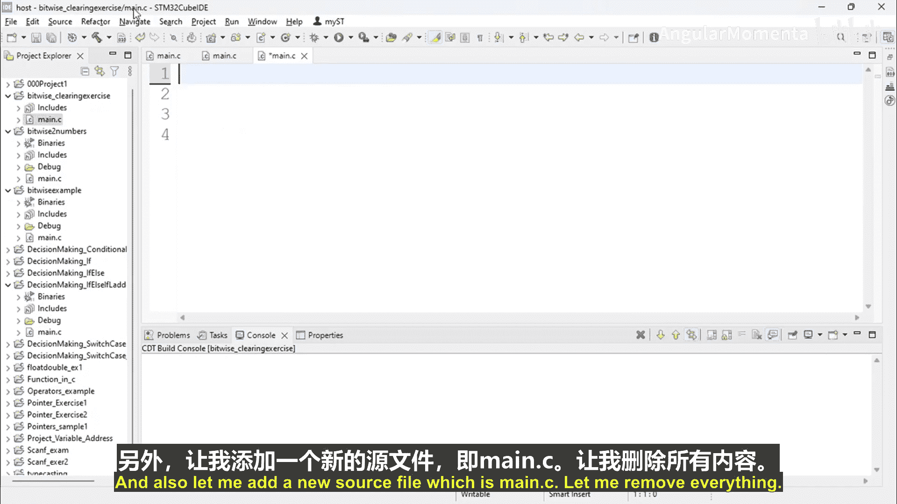
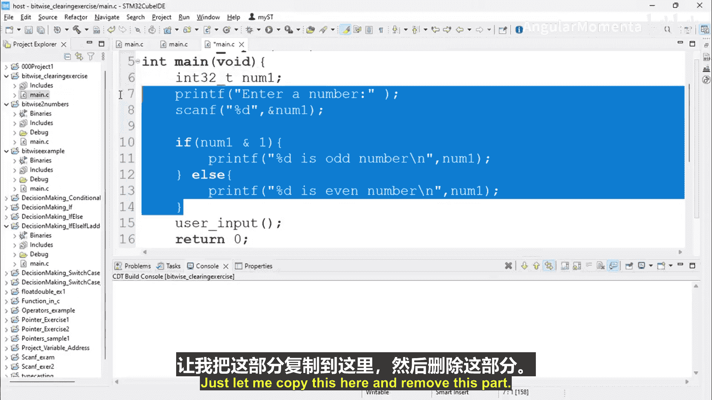
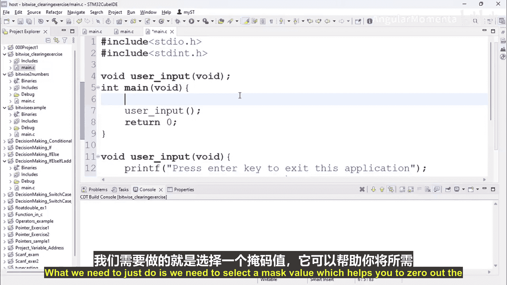
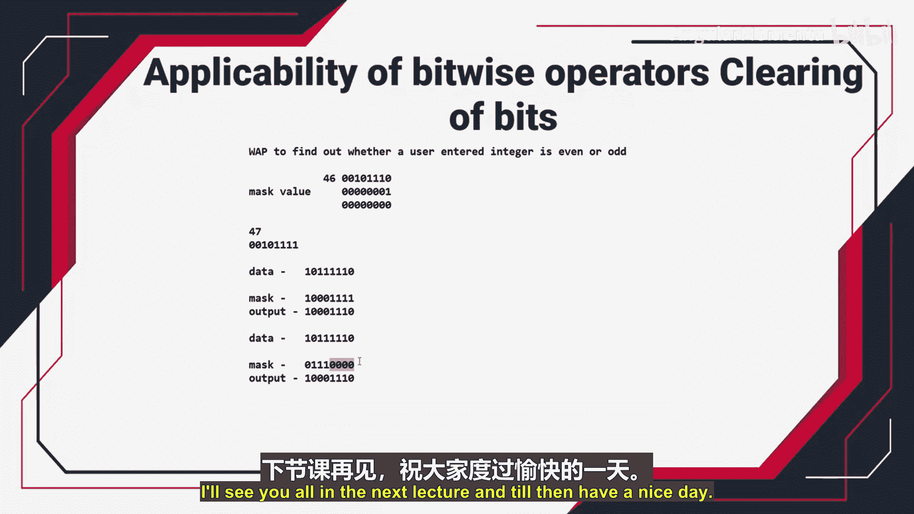

# 040：位运算符清除位的适用性






在本节中，我们将通过一个练习来学习如何使用位运算符来清除（清零）数据中的特定位。我们将编写一个程序，将给定数字的第4、5、6位清零，并打印结果。

## 理解清除位的概念

清除位意味着将特定位的状态重置为0。我们的目标是让一个字节（8位）中的第4、5、6位变为0，同时确保第0到3位以及第7位的值不受影响。

那么，应该使用哪种位运算来清除位呢？答案是**位与（AND）** 运算。位或（OR）运算用于设置位（置1），而位与运算既可以用于测试位，也可以用于清除位。

## 清除位的两种方法

核心思想是使用一个**掩码（mask）** 与原始数据进行位与运算。以下是两种常用的方法。

### 方法一：掩码中需清除的位设为0



在这种方法中，我们创建一个掩码，其中需要保持不变的位设为1，需要清零的位设为0。然后，将原始数据与此掩码进行位与运算。

**公式：**
`result = data & mask`

例如，假设原始数据是 `0b10111110`（二进制），我们需要清零第4、5、6位（从第0位开始计数）。那么掩码应为 `0b10001111`（二进制），即 `0x8F`（十六进制）。

**运算过程：**
```
  数据 (data):   1 0 1 1 1 1 1 0
  掩码 (mask):   1 0 0 0 1 1 1 1  (0x8F)
位与 (&) 结果:   1 0 0 0 1 1 1 0
```
可以看到，第4、5、6位被成功清零，其他位保持不变。

### 方法二：掩码中需清除的位设为1，然后取反

另一种方法是先创建一个掩码，其中需要清零的位设为1，其他位设为0。然后，对这个掩码进行**位非（NOT）** 运算取反，再将取反后的掩码与原始数据进行位与运算。

**公式：**
`result = data & (~mask)`

例如，要清零第4、5、6位，我们先创建掩码 `0b01110000`（这些位为1）。然后对其取反得到 `~0b01110000 = 0b10001111`，这个结果与方法一的掩码完全相同。

**代码示例：**
```c
uint8_t data = 0xBE; // 二进制 10111110
uint8_t mask = 0x70; // 二进制 01110000，对应第4、5、6位
uint8_t result = data & (~mask); // 结果与方法一相同
```

## 练习：编写清除位程序

现在，让我们动手实践。我们将创建一个名为 `bit_wise_clearing_exercise` 的C++项目，并编写代码。

以下是实现步骤：
1.  定义一个8位无符号整数变量，并赋予一个初始值（例如 `0xBE`）。
2.  选择上述任一方法创建合适的掩码。
3.  使用位与运算符执行清除操作。
4.  打印原始数据和操作后的结果，以验证第4、5、6位是否被清零。

**示例代码：**
```c
#include <stdio.h>
#include <stdint.h>

int main() {
    // 原始数据
    uint8_t data = 0xBE; // 二进制 1011 1110
    printf("原始数据: 0x%02X\n", data);

    // 方法一：直接使用掩码 0x8F (二进制 1000 1111)
    uint8_t mask1 = 0x8F;
    uint8_t result1 = data & mask1;
    printf("使用方法一清除第4、5、6位后: 0x%02X\n", result1);

    // 方法二：使用掩码取反
    uint8_t mask2 = 0x70; // 二进制 0111 0000，对应第4、5、6位
    uint8_t result2 = data & (~mask2);
    printf("使用方法二清除第4、5、6位后: 0x%02X\n", result2);

    return 0;
}
```

运行此程序，两种方法将输出相同的结果，确认特定位已被成功清零。

## 总结与展望

在本节中，我们一起学习了如何使用位与运算符来清除数据中的特定位。我们掌握了两种创建掩码的方法：直接构造清零位为0的掩码，或先构造清零位为1的掩码再取反。这两种方法都能有效地实现位的清零操作，是嵌入式编程中处理寄存器或数据包位域的基础技能。



在下一讲中，我们将介绍**位移运算符**，它们能帮助我们更灵活、高效地进行位的设置、清除和切换操作，敬请期待。