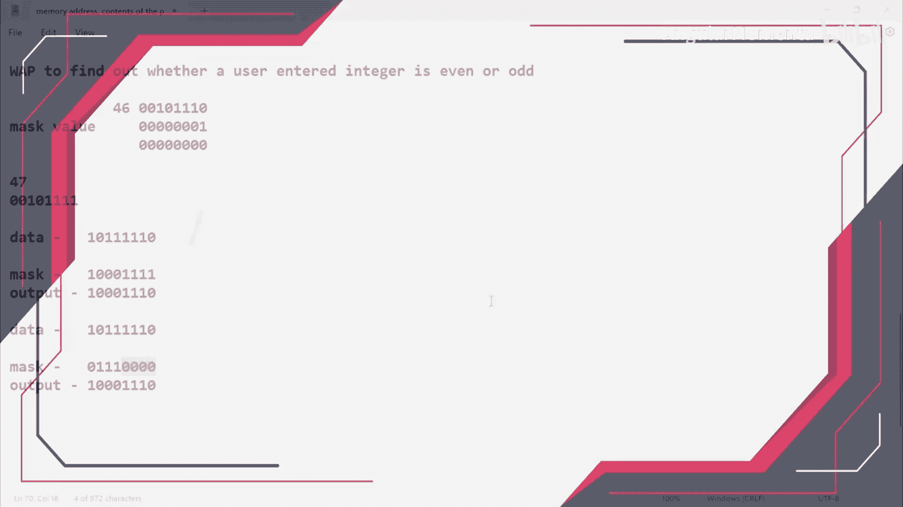
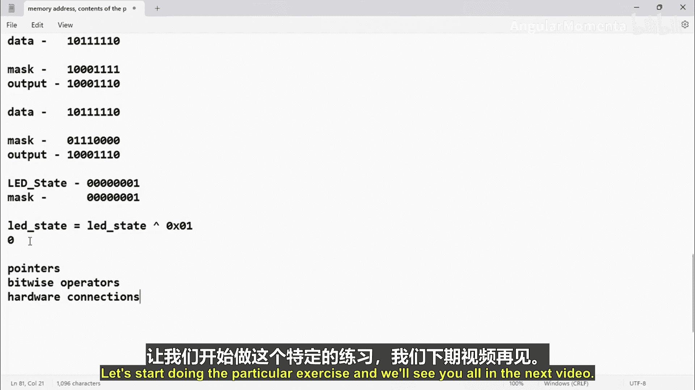

# 041：异或位运算符的适用性 🧩




在本节课中，我们将学习异或位运算符，并了解如何利用它来切换（或称为“翻转”）数据中的特定位。这对于控制嵌入式系统中的硬件（如LED）状态非常有用。

上一节我们介绍了位运算符的基础知识，本节中我们来看看异或运算符的具体应用。

## 异或运算符原理

异或运算符需要两个操作数。其运算规则是：当两个操作数**相等**时，结果为0；当两个操作数**不相等**时，结果为1。

以下是异或运算的真值表：

| 操作数 A | 操作数 B | 结果 (A XOR B) |
| :------: | :------: | :------------: |
|    0     |    0     |       0        |
|    0     |    1     |       1        |
|    1     |    0     |       1        |
|    1     |    1     |       0        |

这个特性可以用公式表示为：
**结果 = (A != B)**

## 异或运算符的应用：切换位状态

我们可以利用异或运算的特性来切换某个变量的特定位。例如，假设我们有一个变量 `led_state` 用于表示LED的状态（0表示熄灭，1表示点亮）。

如果不使用异或运算符，切换LED状态的代码可能如下：

```c
if (led_state == 0) {
    led_state = 1;
} else {
    led_state = 0;
}
```

或者使用更简洁的三元运算符：
```c
led_state = (led_state == 0) ? 1 : 0;
```

然而，使用异或运算符，我们可以用一行代码实现相同的功能：
```c
led_state = led_state ^ 1;
```
或者使用更常见的简写形式：
```c
led_state ^= 1;
```

其工作原理是：
*   如果 `led_state` 是 `0`，则 `0 ^ 1 = 1`，状态变为点亮。
*   如果 `led_state` 是 `1`，则 `1 ^ 1 = 0`，状态变为熄灭。

## 实践前的知识准备

为了在目标开发板上实践这个例子，你需要掌握以下知识：

*   **指针**：你已经学习过相关内容。
*   **位运算**：理解位运算符的工作原理。
*   **硬件连接**：了解你所使用的微控制器端口与外部组件（如LED）的连接方式。

从下一个视频开始，我们将逐步涵盖这些硬件相关的知识。

---



本节课中我们一起学习了异或位运算符的独特性质及其在嵌入式编程中的一个典型应用——切换硬件状态。通过使用 `^=` 运算符，我们可以用非常简洁的代码实现状态的翻转，这比传统的条件判断语句更加高效和优雅。在后续的实践中，我们将把这一知识应用到真实的硬件控制中。