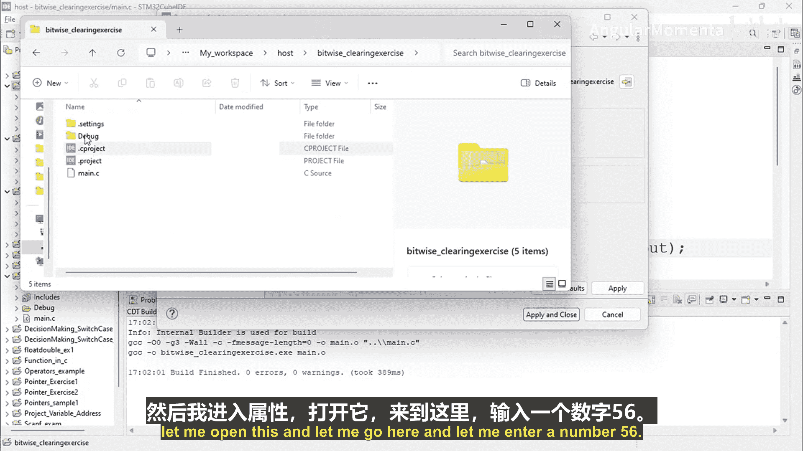
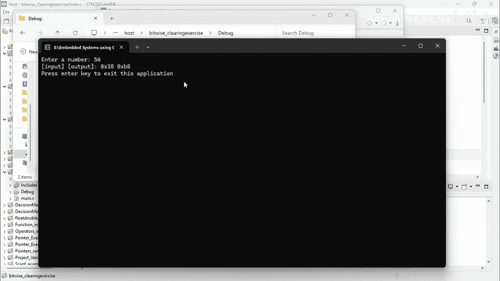

# 042：P42 03_02_03_位运算符的比特位设置适用性 💻

在本节课中，我们将学习如何使用位运算符来设置一个给定数字的特定位。我们将通过一个具体的编程练习来理解位运算符的适用性，特别是**按位或**和**按位与**在“设置”操作中的区别。

## 练习目标 🎯

本次练习的目标是编写一个程序，将给定数字的**第4位**和**第7位**设置为1，同时不影响其他任何位。程序需要打印出操作后的结果。

## 核心概念解析 🔍

为了设置特定位，我们需要使用一个**掩码**。掩码是一个二进制数，其中我们想要设置的位为1，其余位为0。

上一节我们介绍了位运算符的基本概念，本节中我们来看看如何应用它们来设置比特位。

### 选择正确的位运算符

以下是决定使用哪个运算符的关键分析：

假设我们有一个8位数据：`0011 1110`（二进制）。
我们的目标是设置第4位（从右向左，从0开始计数）和第7位。

*   **掩码值**应为：`1001 0000`（二进制），即第7位和第4位为1。
*   我们需要决定使用**按位与**还是**按位或**。

让我们通过示例来测试：

**使用按位与 (&) 操作：**
```
数据:   0011 1110
掩码:   1001 0000
结果:   0001 0000
```
分析：按位与操作将数据中与掩码中`0`对应的位都清零了，这并非我们想要的结果。

**使用按位或 (|) 操作：**
```
数据:   0011 1110
掩码:   1001 0000
结果:   1011 1110
```
分析：按位或操作成功地将掩码中为`1`的位（第7位和第4位）在数据中设置为`1`，而其他位保持不变。

**结论：**
*   **按位与**运算符主要用于**测试**特定位是否为1，而不是用于设置位。
*   **按位或**运算符用于**设置**特定位为1，而不是用于测试。

## 编程实现 🛠️

现在，让我们将理论转化为代码。我们将编写一个C语言程序来实现上述功能。

以下是实现步骤：
1.  从用户输入获取一个整数。
2.  定义一个掩码，其十六进制值为`0x90`（对应二进制`1001 0000`，即设置了第7位和第4位）。
3.  使用**按位或**运算符将输入数字与掩码结合，生成结果。
4.  以十六进制格式打印原始数字和结果。

```c
#include <stdio.h>

int main() {
    int number;
    int output;

    printf("Enter a number: ");
    scanf("%d", &number);

    output = number | 0x90; // 使用按位或设置第4位和第7位

    printf("Your input:  0x%x\n", number);
    printf("Your output: 0x%x\n", output);

    return 0;
}
```

## 运行示例 📟

让我们运行程序并输入一个测试值（例如56）。

程序输出可能类似于：
```
Enter a number: 56
Your input:  0x38
Your output: 0xb8
```
*   输入`56`的十六进制是`0x38`（二进制`0011 1000`）。
*   与掩码`0x90`（二进制`1001 0000`）进行按位或操作后，结果为`0xB8`（二进制`1011 1000`）。
*   可以看到，第7位和第4位被成功设置为1，其他位保持不变。



## 总结 📝

本节课中我们一起学习了位运算符在嵌入式编程中的一项关键应用：设置特定位。
*   我们明确了**按位或**是用于设置位的正确运算符。
*   我们通过一个完整的编程练习，演示了如何定义掩码并使用`|`运算符来设置一个数字的第4位和第7位，同时不影响其他位。
*   理解并正确使用位运算符是进行底层硬件操作和优化内存使用的核心技能。



通过掌握这些概念，你将能够更有效地控制微控制器的寄存器和硬件状态，这是构建高效嵌入式系统的基础。