# 043：编码点亮LED 🔧

在本节课中，我们将开始进行点亮LED的实践练习。这个练习并非直接编写代码，而是需要我们先理解硬件连接。首先，我们需要了解外部硬件（即LED）是如何连接到微控制器的。

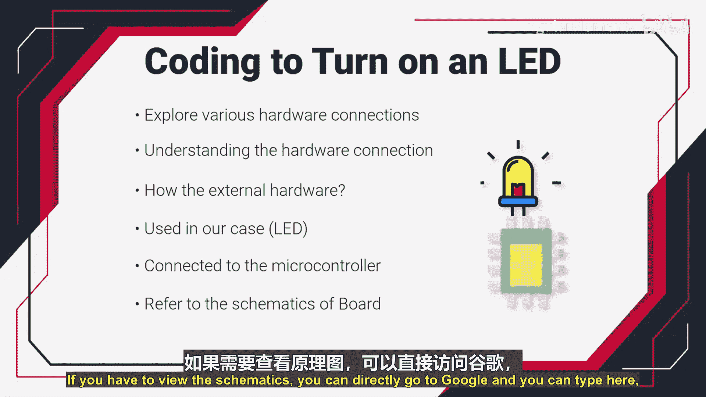

## 理解硬件连接 🔌

为了理解硬件连接，我们必须参考开发板的原理图。原理图展示了板上所有电子元件的连接方式。

以下是获取原理图的步骤：

1.  打开浏览器，访问搜索引擎。
2.  输入你的开发板型号（例如：STM32F407G-DISC1）和“原理图”或“schematic”进行搜索。
3.  从搜索结果中找到并下载原理图文件（通常为PDF格式）。

对于本教程使用的STM32F407G-DISC1开发板，我们已经下载了原理图文件，并会将其附在课程资源中。如果你使用不同的开发板，请下载对应型号的原理图。

## 在原理图中定位LED 💡

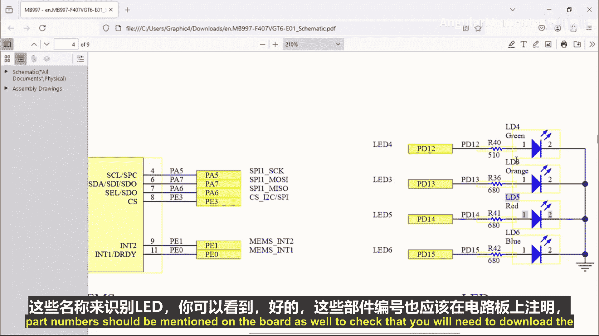

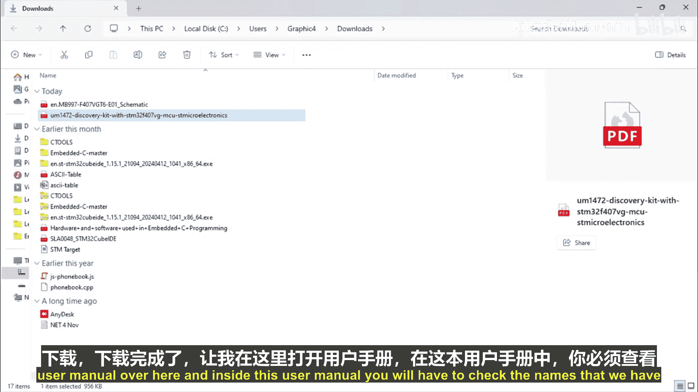

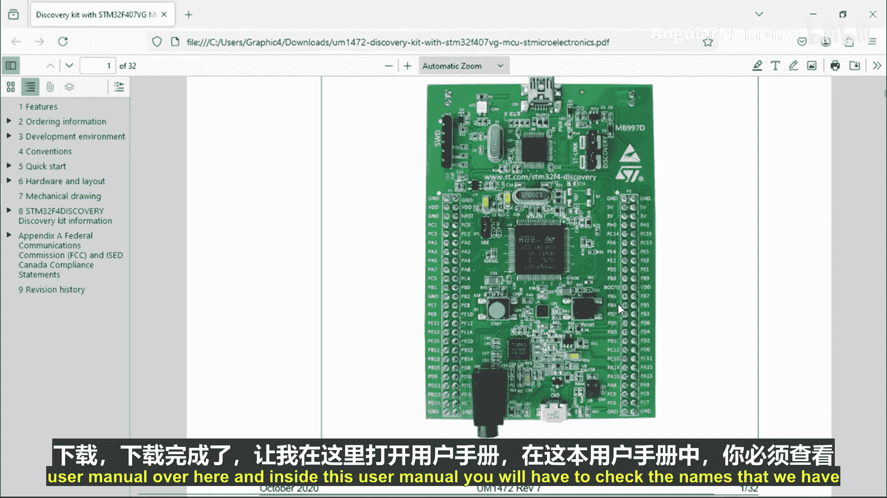

打开原理图文件后，我们需要找到LED的部分。通常可以通过搜索“LED”来快速定位。

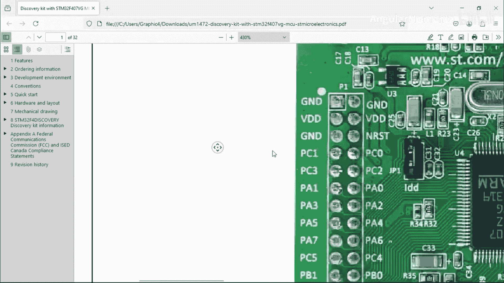

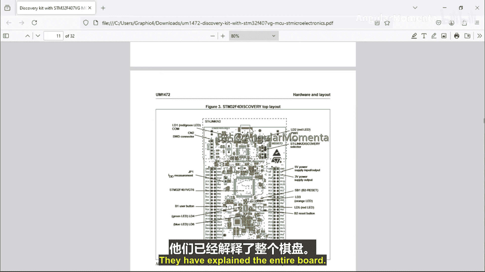

在STM32F407G-DISC1的原理图中，我们可以找到四个LED，它们的标识和颜色如下：
*   **LD3**：绿色LED
*   **LD4**：橙色LED
*   **LD5**：红色LED
*   **LD6**：蓝色LED

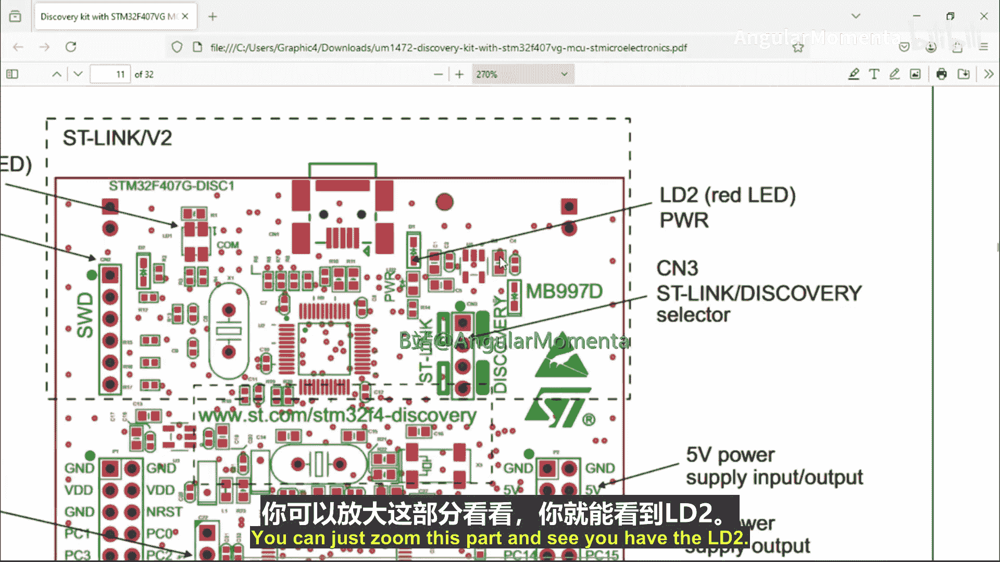

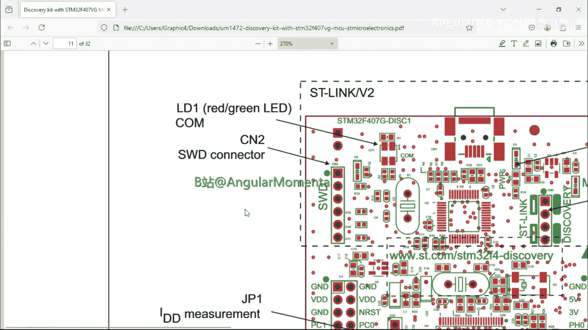

每个LED旁边会标注其型号（Part Number），例如绿色LED的型号为“LED GREEN”。

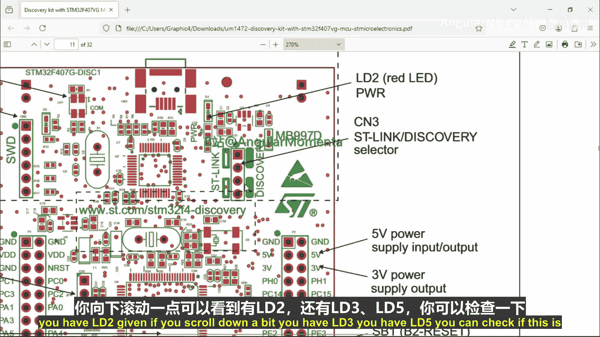

## 在用户手册和实物板上确认LED 📖

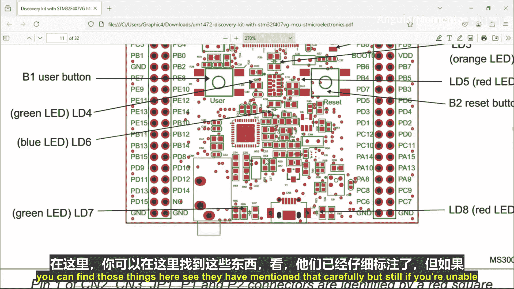

为了在实物开发板上找到这些LED，我们需要参考用户手册。同样，可以通过搜索“板卡型号 + user manual”来下载用户手册。

在用户手册的板卡布局图中，可以清晰地看到标记为LD3、LD4、LD5、LD6的LED位置。你可以对照实物板卡，仔细查看这些标识（它们通常印刷在LED旁边）。

## 分析LED与微控制器的连接 🧠

回到原理图，查看LED的具体连接。我们发现：
*   绿色LED（LD4）连接到了 **PD12**。
*   蓝色LED（LD6）连接到了 **PD15**。

这里的“PD12”代表 **Port D（端口D）的第12号引脚**。这引出了我们的下一个核心概念：什么是端口？

## 理解GPIO端口 ⚙️

微控制器（MCU）拥有许多用于连接外部设备的引脚。在STM32系列MCU中，这些引脚被组织成不同的**端口（Port）**，例如Port A、Port B、Port C、Port D等。

查看原理图中MCU的引脚图，可以看到所有引脚都被引出到板载的排针上。每个端口通常包含**16个引脚**（PA0-PA15， PB0-PB15， 以此类推）。

这些端口引脚被称为 **GPIO（General Purpose Input/Output， 通用输入输出）**。之所以称为“通用”，是因为它们功能灵活，可以用于多种目的，例如：
*   连接简单的输入输出设备（如LED、按钮）。
*   实现通信协议（如UART、I2C、SPI）。

## 控制引脚的核心问题 ❓

我们的目标是：通过软件控制**PD12**这个GPIO引脚，使其输出高电平（High）或低电平（Low），从而点亮或熄灭与之连接的绿色LED。

那么，如何通过软件来控制一个具体的硬件引脚呢？这正是我们嵌入式编程的关键。在下一节视频中，我们将深入探讨STM32的GPIO编程模型，学习如何配置和控制引脚。

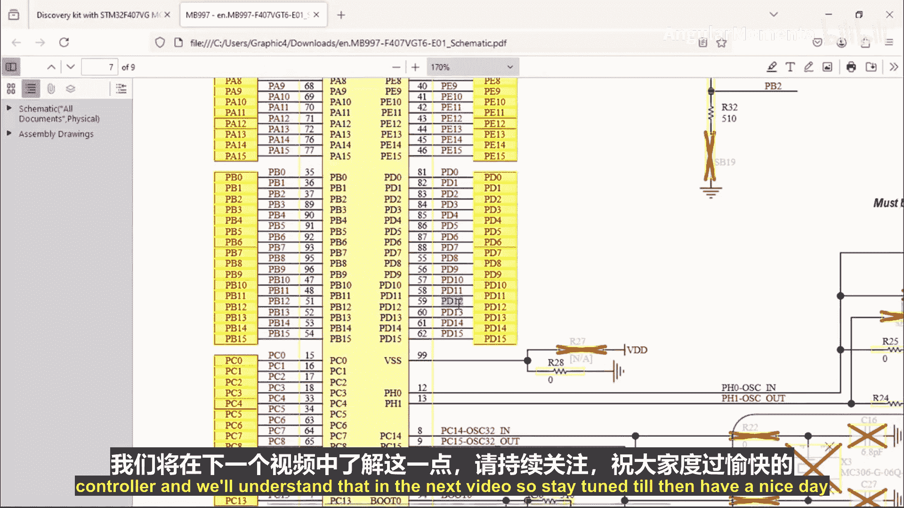

本节课中，我们一起学习了如何查阅硬件文档（原理图和用户手册），定位了LED在板卡上的位置，并理解了LED是通过GPIO端口连接到微控制器的。我们还引入了GPIO端口的概念，为接下来的实际编程打下了基础。