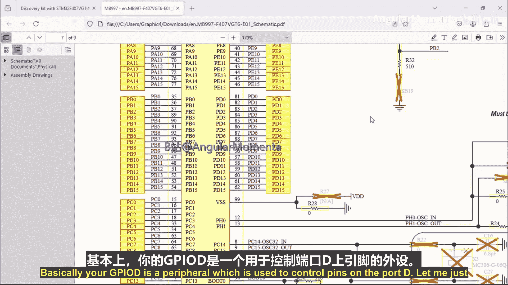
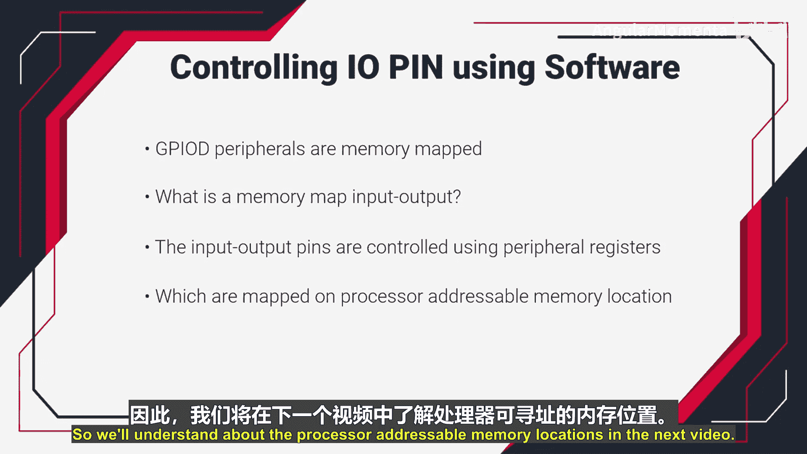

# 044：通过软件控制IO引脚

在本节课中，我们将学习如何通过软件来控制微控制器的输入输出引脚。我们将了解一个名为“G”的外设，它用于控制特定端口上的引脚，并探讨如何通过访问其寄存器来实现控制。

## 通过软件控制引脚

上一节我们介绍了微控制器的基本引脚功能。本节中我们来看看如何通过软件来具体控制这些引脚。

在微控制器内部，有一个被称为“G”的外设。这个外设专门用于控制端口D上的引脚。它拥有一组自己的寄存器，这些寄存器用于配置引脚的模式、状态以及其他功能。

软件通过向这些寄存器写入特定值，即可控制引脚的工作模式、发送数据或从端口读取数据。以下是可以通过寄存器完成的主要活动：
*   控制引脚的模式（如输入、输出）。
*   控制通过引脚发送的数据。
*   向端口写入数据。
*   从端口读取数据。

## 如何访问寄存器

那么，如何访问这些寄存器呢？答案是使用内存地址。

每个寄存器都有其唯一的内存地址。通过这个内存地址，你可以访问对应的寄存器，从而控制特定的引脚。因此，我们也可以说“G”外设的寄存器是**内存映射**的。

这引出了我们下一个要讨论的话题：什么是内存映射输入输出。

## 什么是内存映射输入输出

内存映射输入输出是指，输入输出引脚通过外设寄存器进行控制，而这些寄存器被映射到处理器可寻址的内存位置上。

至于什么是处理器可寻址的内存位置，我们将在下一个视频中详细讲解。

本节课中，我们一起学习了通过软件控制IO引脚的基本原理，了解了外设寄存器的作用及其通过内存地址进行访问的方式。我们还引入了内存映射输入输出的概念，为后续深入学习奠定了基础。