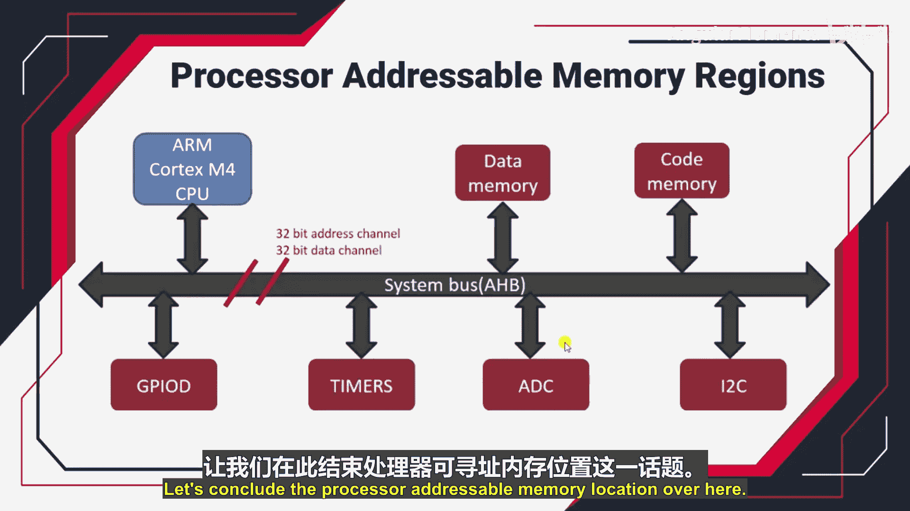

# 045：处理器可寻址内存区域


## 概述
在本节课中，我们将学习处理器可寻址内存区域的概念。我们将了解基于ARM Cortex-Mx/M4 CPU的微控制器中，处理器如何通过系统总线与内存和外设通信，以及32位地址总线如何定义4GB的线性地址空间。理解这一点是掌握微控制器内存映射和外设编程的基础。


## 系统总线与地址空间
上一节我们介绍了嵌入式系统的基本组成。本节中，我们来看看连接处理器、内存和外设的核心通道——系统总线。

在基于ARM Cortex-Mx/M4 CPU的微控制器中，系统总线是连接处理器、内存和外设的中央通道。这条总线基于ARM公司设计的AHB规范。AHB代表**高级高性能总线**。

该系统总线包含两个主要通道：
*   一个**32位地址通道**。
*   一个**32位数据通道**。

这意味着地址总线可以承载 **2^32** 个不同的地址，用于寻址不同的外设和内存。例如，若想将数据从内存传输到GPIO外设，处理器需要将目标GPIO寄存器的特定地址放到地址总线上，并通过数据总线发送数据。

## 处理器可寻址位置
既然地址总线宽度为32位，处理器能够生成的地址范围是从 `0x0000_0000` 到 `0xFFFF_FFFF`。这相当于 **4GB** 的不同地址位置。



处理器内部有一个地址生成单元。当指令被解码后，该单元会被激活，并将目标地址放置到地址总线上。这个地址决定了总线是与微控制器的代码内存、数据内存还是某个外设寄存器进行通信。

## 内存映射
上一节我们明确了处理器可以访问4GB的地址空间。本节中，我们来看看这些地址是如何具体分配给不同硬件资源的。

处理器将地址放置在地址总线上时，根据地址值所属的特定区域，总线会与相应的硬件模块对话。这种将程序内存、数据内存以及各种外设寄存器组织在同一个4GB线性地址空间内的安排，就称为处理器的**内存映射**。

这个内存映射是由ARM Cortex-Mx架构固定的。任何采用该处理器的微控制器设计者都必须遵循此映射规则。该图表在ARM Cortex-Mx技术参考手册中有详细说明。

## 总结与应用
本节课中，我们一起学习了处理器可寻址内存区域的核心概念。我们了解到：
1.  系统总线（基于AHB）是处理器与内存、外设通信的通道。
2.  32位地址总线定义了 **2^32 = 4GB** 的线性地址空间。
3.  处理器的**内存映射**将这4GB空间划分为不同区域，分别对应代码区、数据区和各个外设。
4.  例如，GPIO外设寄存器的地址就位于这个地址空间内的某个特定范围。

掌握内存映射后，我们的工作就变得简单了：一旦知道了某个外设寄存器（如GPIO）的确切地址，我们就可以在C语言中将其视为一个指针，通过读写该指针变量来直接控制外设。在接下来的视频中，我们将探索STM32微控制器的实际内存映射，这将使你的理解更加清晰。

---


**核心概念公式与代码表示：**
*   **可寻址位置总数**：`地址总数 = 2^(地址总线宽度)`
*   对于32位地址总线：`可寻址位置 = 2^32 = 4,294,967,296 个地址 (4GB)`
*   **地址范围**：从 `0x00000000` 到 `0xFFFFFFFF`。
*   **访问外设寄存器（概念示例）**：
    ```c
    // 假设 GPIOA 数据输出寄存器的地址是 0x40020000
    volatile uint32_t *pGPIOA_OUT = (volatile uint32_t *)0x40020000;
    // 通过指针写入数据，控制外设
    *pGPIOA_OUT = 0x00000001;
    ```