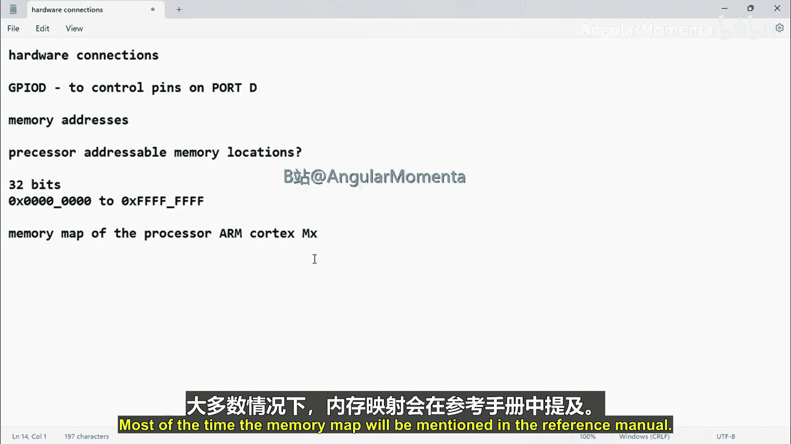
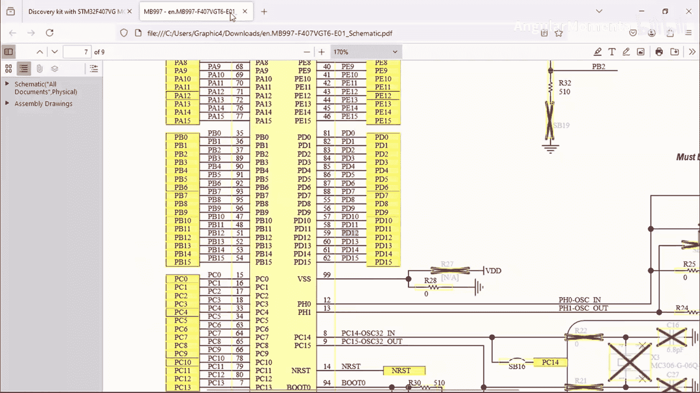
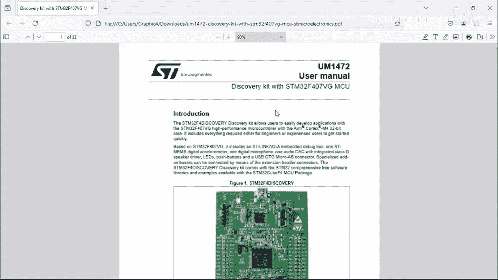
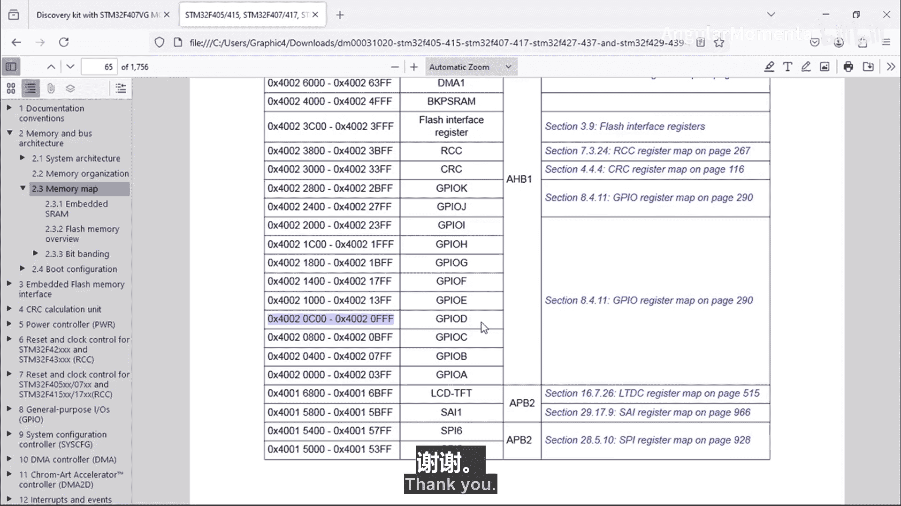

# 046：STM32存储器映射 📖

在本节课中，我们将要学习STM32微控制器的存储器映射。理解存储器映射是进行底层寄存器编程的基础，它定义了不同功能模块（如GPIO、ADC、定时器等）在微控制器地址空间中的位置。

上一节我们介绍了嵌入式系统的基本概念，本节中我们来看看STM32如何组织其内部地址空间。

## 存储器映射概述

存储器映射是微控制器设计的一部分，它规定了内部所有存储器（如Flash、RAM）和外设寄存器在统一地址空间中的分配情况。对于STM32 F407这款微控制器，其具体的存储器映射信息可以在其参考手册中找到。

大多数情况下，存储器映射信息会列在微控制器的参考手册中。在开始编程之前，必须查阅这个映射表，否则你将无法知道各个外设寄存器的具体地址。

## 如何查找外设地址

以下是查找外设基地址的步骤：

1.  打开STM32微控制器的参考手册。
2.  在目录中找到“内存和总线架构”或类似章节。
3.  进入“存储器映射”部分，你会看到一个详细的地址分配表格。

例如，如果我们想控制LED，就需要配置GPIO外设的寄存器。通过查阅手册，我们可以找到GPIO D外设的基地址。

在参考手册中浏览，你可以找到GPIO D外设，其第一个寄存器的地址是 `0x40020C00`。这个地址就是GPIO D外设寄存器的基地址。

如果你想查找ADC寄存器的基地址，只需向下滚动手册，找到ADC相关的部分。对于STM32F407，它有三个ADC模块（ADC1, ADC2, ADC3），它们的寄存器地址范围会在手册中明确给出。

同样地，手册中也会列出定时器（如TIM1, TIM9, TIM10）、串口（UART）、CAN控制器、以太网MAC等所有外设的寄存器地址空间。

当处理器需要访问某个外设时，它会将对应的地址放到地址总线上，地址总线随后会与目标外设（如CAN控制器）的寄存器进行通信。

## STM32 F407的存储器布局

STM32微控制器基于ARM Cortex-M处理器内核设计。在其存储器映射表中，你可以看到不同内存区域的划分。

*   **Flash存储器**：用于存储程序代码，起始于特定的地址。
*   **嵌入式SRAM**：用于存储数据，起始于另一个特定的地址。
*   **系统存储器**：包含Bootloader等系统代码。
*   **外设寄存器区域**：所有外设（如GPIO、ADC、定时器）的寄存器都映射到这个连续的地址空间内。

此外，还有重映射区域和FMC（可变静态存储控制器）等区域。重要的是，无论你使用哪款STM32微控制器，都需要打开对应的用户手册来定位其存储器映射图。没有这个映射图，你将无法进行外设的编程。

## 关键地址示例与注意事项

我们之前找到了GPIO D外设的地址范围。对于STM32 F407G微控制器，GPIO D的地址范围是 `0x40020C00` 起始的一段空间。

如果你使用的是不同的STM32微控制器，请务必参考该设备的参考手册以获取正确的地址范围。不要盲目地使用教程中的地址进行编码，因为不同型号的芯片其外设地址可能不同。在接下来的视频中，我们将使用这个地址，请提前核对确认。

本节课中我们一起学习了STM32存储器映射的概念和查阅方法。我们了解到存储器映射是连接软件代码与硬件外设的桥梁，通过参考手册中的映射表，我们可以找到任何外设寄存器的准确地址，这是进行底层驱动开发的第一步。下一节，我们将深入探讨外设寄存器本身的结构与功能。