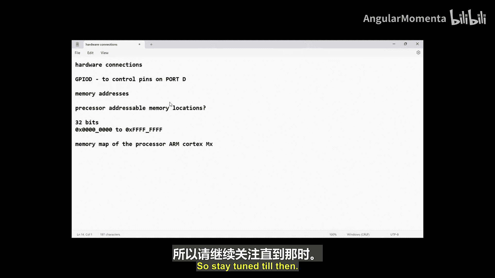

# 047：内存映射外设寄存器与IO访问

在本节课中，我们将要学习处理器可寻址内存位置的概念，以及如何通过内存映射来访问微控制器的外设和存储器。理解这些概念是进行嵌入式系统编程的基础。

## 处理器可寻址内存位置

上一节我们介绍了系统总线的基本概念，本节中我们来看看处理器如何通过地址总线来定位不同的硬件资源。

考虑一个基于 ARM Cortex-Mx/M4 CPU 的微控制器系统。系统总线（也称为系统 P 总线，基于 ARM 的 AHB 规范）连接着处理器、存储器和外设。这条总线包含两个通道：
*   一个 **32 位地址通道**
*   一个 **32 位数据通道**

由于地址总线宽度为 32 位，这意味着处理器可以在地址总线上放置 2^32 个不同的地址，即 4 GB 的地址空间，以此来定位不同的存储器和外设。

例如，如果你想将数据从数据存储器传输到 GPIO 外设以输出到外部引脚，你需要通过系统总线将数据发送到该外设的某个寄存器中。为此，你必须将正确的地址放置在地址总线上，以“瞄准”这个特定的外设寄存器。

## 内存映射

上一节我们了解了地址总线的能力，本节中我们来看看这些地址是如何被组织起来，以对应微控制器内部的不同资源的。

处理器不能随意使用地址来访问外设。例如，要读取 ADC 外设的数据，必须在地址总线上放置正确的地址。这个将 4 GB 线性地址空间划分为不同区域，并分配给代码存储器、数据存储器和各个外设寄存器的安排，就称为处理器的**内存映射**。

这个内存映射是由 ARM Cortex-Mx 架构定义的。微控制器设计者在使用该处理器时，必须遵循这个映射规则。该图表可以在 ARM Cortex-Mx 技术参考手册中找到。

以下是核心结论：
*   程序存储器、数据存储器和各种外设的寄存器都被组织在同一个线性的 4 GB 地址空间内。
*   GPIO 作为一个外设，其寄存器的地址必须落在为外设保留的地址区域内。

一旦你知道了某个外设寄存器的具体地址（例如 GPIO 的某个寄存器地址），你的工作就变得简单了。你可以将这个地址视为一个指针，通过读写指向这个地址的指针变量，就可以控制该外设。

## 探索实际内存映射

在下一节视频中，我们将探索 STM32 微控制器的实际内存映射图。通过查看具体实例，你的疑问将会得到进一步澄清。

本节课中我们一起学习了处理器可寻址内存空间和内存映射的核心概念。我们了解到，处理器通过 32 位地址总线可以访问 4 GB 的空间，这个空间被预先划分并映射到了芯片内部的存储器和外设寄存器上。掌握内存映射是直接通过 C 语言指针操作硬件寄存器的基础。