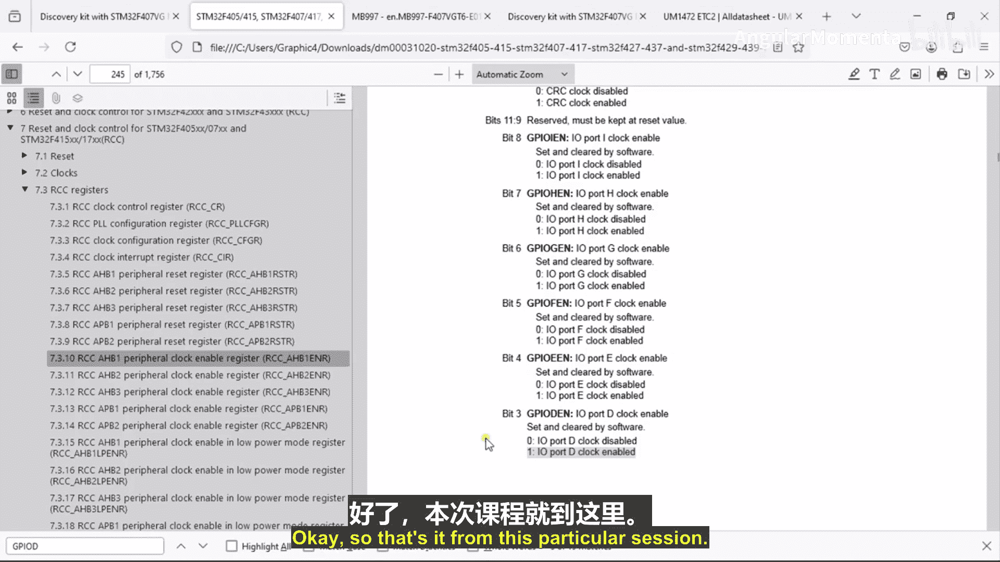

# 049：使能外设时钟

## 概述

在本节课程中，我们将学习如何为STM32微控制器上的外设（例如GPIO端口）使能时钟。这是配置和使用任何外设前必须完成的关键步骤，因为未使能时钟的外设将不会响应任何配置操作。

## 使能外设时钟的必要性

上一节我们介绍了外设的基本概念。本节中我们来看看如何激活它们。在配置外设之前，必须首先使能其时钟。否则，外设将不会接受任何配置值。这是因为时钟信号驱动着外设内部的逻辑电路，没有时钟，外设就无法工作。

## 时钟控制寄存器

我们可以通过微控制器的控制寄存器来使能外设时钟。在STM32微控制器中，时钟控制寄存器被映射到内存映射中的一个特定地址范围。

这个地址范围是：**0x4002 3800** 到 **0x4002 3BFF**。

负责管理时钟的模块称为**RCC**，即**复位与时钟控制**模块。RCC模块负责控制微控制器各个部分的时钟，包括处理器、不同外设、总线和存储器等。

## 定位正确的RCC寄存器

RCC模块有自己的一组寄存器来控制时钟，这些寄存器就位于上述地址范围内。我们需要找到并操作RCC中正确的寄存器来为目标外设使能时钟。

以下是定位和操作RCC寄存器的步骤：

1.  **查阅参考手册**：打开STM32的参考手册，找到RCC（复位与时钟控制）章节。
2.  **确定外设所在的总线**：不同的外设挂载在不同的总线上。例如，GPIO端口D（GPIOD）挂载在**AHB1**总线上。这可以通过查阅数据手册中的内部架构图或用户手册来确认。
3.  **选择对应的时钟使能寄存器**：在RCC章节中，找到控制AHB1总线上外设时钟的寄存器，即 **RCC AHB1外设时钟使能寄存器**。
4.  **计算寄存器地址**：该寄存器有一个偏移地址（例如 **0x30**）。将此偏移地址加到RCC模块的基地址（**0x4002 3800**）上，即可得到该寄存器的完整地址。
5.  **设置正确的位**：在RCC AHB1外设时钟使能寄存器中，每个位控制一个特定外设的时钟。例如，要使能GPIOD的时钟，需要将该寄存器中对应的位（例如**位3**）设置为 **1**。当前该位为 **0**，表示时钟被禁用。

## 总结

本节课中我们一起学习了使能STM32外设时钟的完整流程。核心步骤是：首先通过参考手册确定外设所在的总线，然后在RCC模块中找到对应的总线时钟使能寄存器，最后通过设置该寄存器中特定的位来开启时钟。这个过程是后续所有外设配置和操作的基础。

