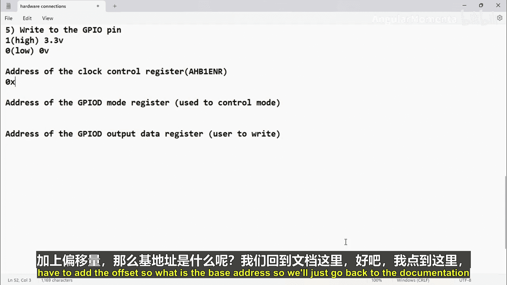
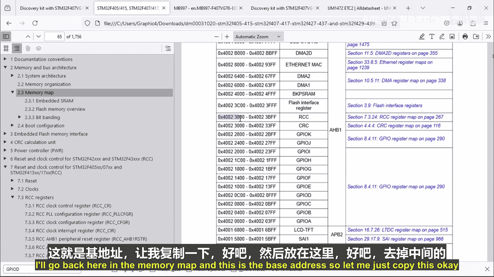
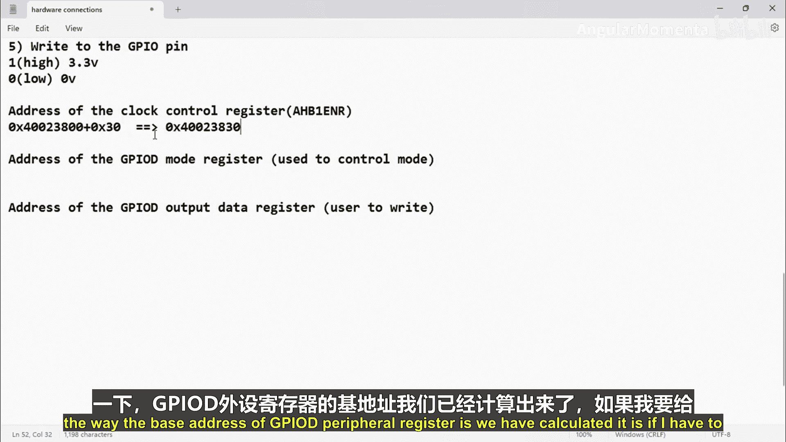
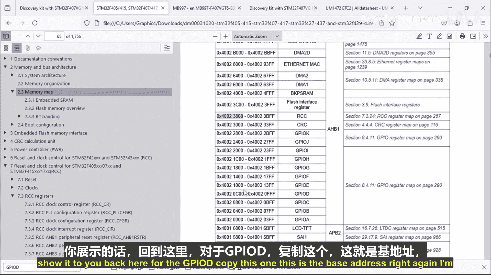
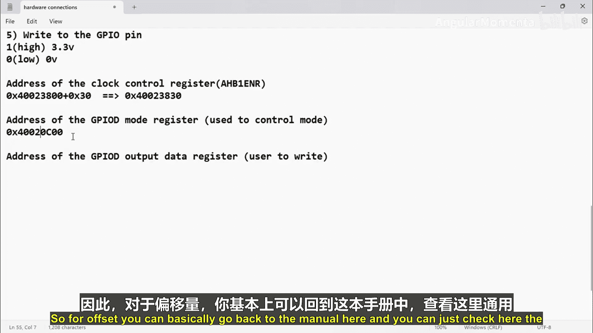
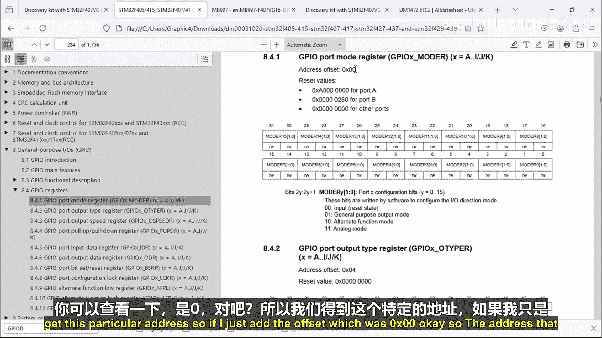
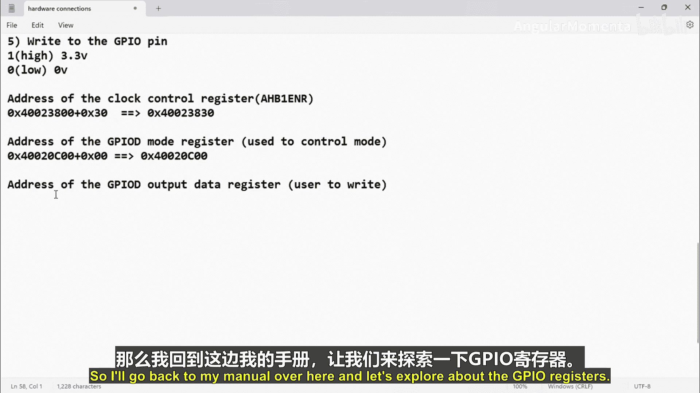
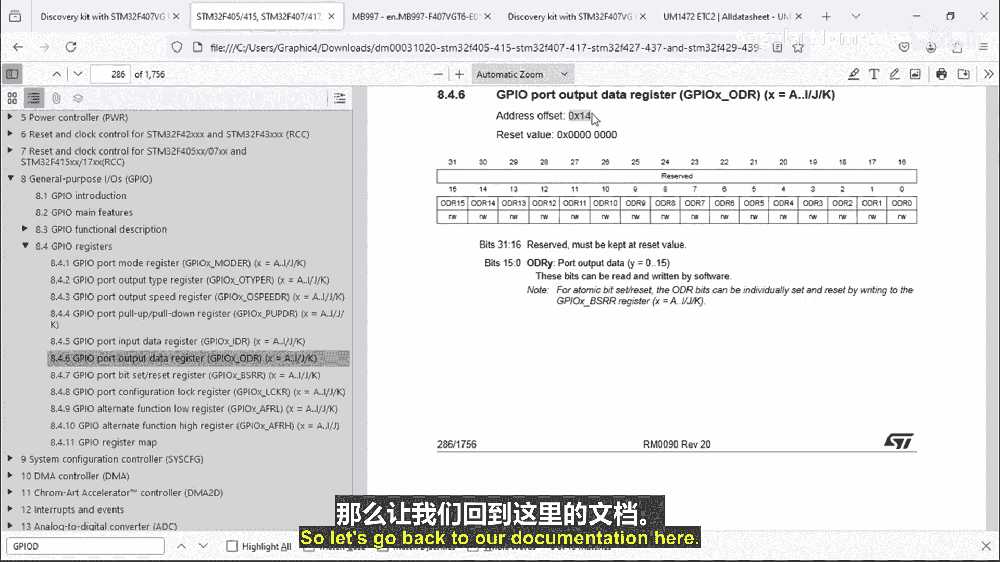
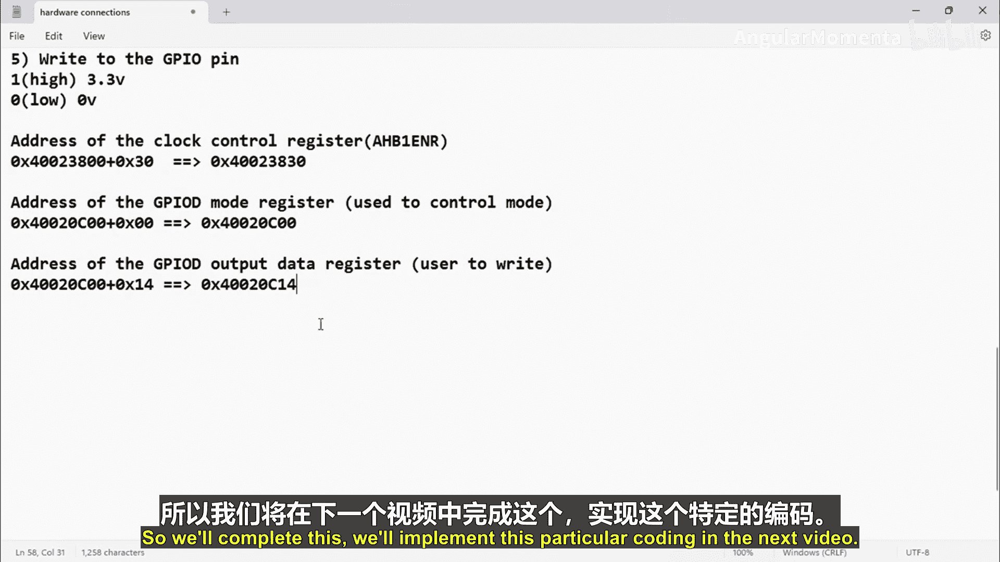

# 050：计算外围寄存器地址

在本节课中，我们将学习如何计算STM32微控制器中外围寄存器的地址。这是直接通过内存地址操作硬件寄存器、控制GPIO引脚等外设的基础。

上一节我们介绍了如何通过RCC寄存器来启用GPIO端口的时钟。本节中，我们来看看如何具体计算所需操作寄存器的内存地址。

## 计算RCC寄存器地址

首先，我们需要计算用于启用GPIO时钟的RCC寄存器地址。具体是`AHB1ENR`寄存器。

计算地址需要两个部分：**基地址**和**偏移量**。地址计算公式为：
`寄存器地址 = 基地址 + 偏移量`

以下是计算步骤：

1.  **查找基地址**：根据芯片的内存映射图，RCC外设的基地址是`0x4002 3800`。
2.  **查找偏移量**：从参考手册可知，`AHB1ENR`寄存器相对于RCC基地址的偏移量是`0x30`。
3.  **进行计算**：将基地址与偏移量相加。
    `0x40023800 + 0x30 = 0x40023830`

因此，`AHB1ENR`寄存器的地址是`0x40023830`。

## 计算GPIO模式寄存器地址

接下来，为了控制GPIO引脚的工作模式，我们需要计算GPIO模式寄存器（`MODER`）的地址。我们以GPIOD为例。

以下是计算GPIOD `MODER`地址的步骤：

1.  **查找基地址**：根据内存映射，GPIOD外设的基地址是`0x4002 0C00`。
2.  **查找偏移量**：从GPIO寄存器手册中可以看到，模式寄存器（`MODER`）的偏移量是`0x00`。
3.  **进行计算**：
    `0x40020C00 + 0x00 = 0x40020C00`

所以，GPIOD模式寄存器的地址就是其基地址本身，即`0x40020C00`。

**关于模式寄存器**：这是一个32位寄存器，每2位控制一个引脚的模式（例如，引脚0由位[1:0]控制）。模式编码为：
-   `00`：输入模式
-   `01`：通用输出模式
-   `10`：复用功能模式
-   `11`：模拟模式

在本练习中，我们需要将引脚12设置为输出模式，因此需要将位[25:24]设置为`01`。

## 计算GPIO输出数据寄存器地址

最后，为了控制引脚输出高电平或低电平，我们需要计算GPIO输出数据寄存器（`ODR`）的地址。

以下是计算GPIOD `ODR`地址的步骤：

1.  **使用相同的基地址**：GPIOD的基地址仍然是`0x4002 0C00`。
2.  **查找偏移量**：输出数据寄存器（`ODR`）的偏移量是`0x14`。
3.  **进行计算**：
    `0x40020C00 + 0x14 = 0x40020C14`

因此，GPIOD输出数据寄存器的地址是`0x40020C14`。

**关于输出数据寄存器**：该寄存器的低16位（位[15:0]）分别对应端口的16个引脚。将某一位设置为1，对应的引脚输出高电平；设置为0则输出低电平。例如，要控制引脚12，就需要操作位12。

## 总结

本节课中我们一起学习了STM32寄存器地址计算的核心方法。我们掌握了通过 **`基地址 + 偏移量`** 的公式来计算特定外设寄存器的绝对内存地址。我们具体计算了三个关键寄存器的地址：
1.  RCC的`AHB1ENR`寄存器（`0x40023830`），用于启用时钟。
2.  GPIOD的`MODER`寄存器（`0x40020C00`），用于设置引脚模式。
3.  GPIOD的`ODR`寄存器（`0x40020C14`），用于控制引脚输出电平。

有了这些地址，我们就可以在接下来的课程中，通过创建指针变量来访问它们，并通过设置相应的位字段来启用时钟、配置引脚为输出模式，最终点亮LED。