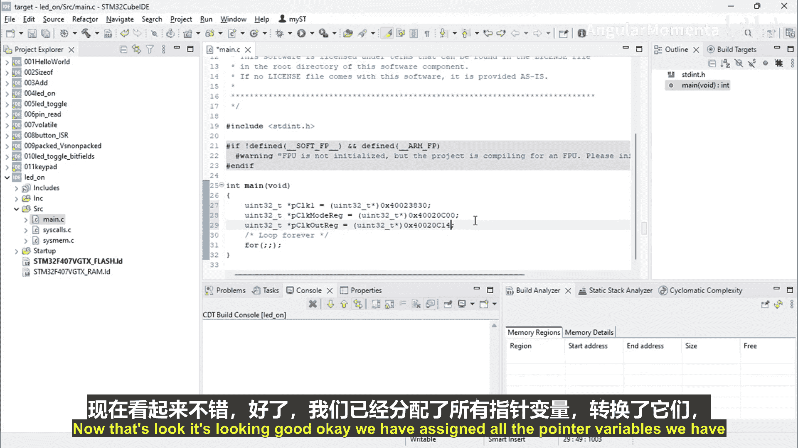

# 051：LED 驱动程序设计编码部分 第1集


## 概述
在本节课中，我们将开始动手编写LED驱动程序的代码。我们将学习如何在STM32项目中创建新工程，并初始化用于控制GPIO外设的指针变量。

---

## 创建新STM32项目

上一节我们讨论了LED驱动的基本原理，本节中我们来看看如何开始编码。首先，我们需要在集成开发环境中创建一个新的STM32项目。

1.  打开你的IDE，并选择一个合适的工作空间。
2.  点击 `File` -> `New`，然后选择创建 `STM32 Project`。
3.  项目创建向导启动后，需要一些时间加载。

## 选择开发板型号

项目初始化完成后，需要选择你所使用的具体开发板型号。

1.  在目标选择器中，找到并选择你的开发板。例如，教程中使用的是 `STM32F407G`。
2.  点击 `Next` 进入下一步。
3.  为项目命名，例如 `LED_Control`。
4.  在项目设置中，选择 `Empty` 模板，其他选项保持默认。
5.  点击 `Finish` 完成项目创建。IDE需要一些时间来生成项目文件。

## 处理初始警告

项目创建后，你可能会在 `main.c` 文件中看到一个警告或错误。

以下是解决方法：
1.  右键点击项目，选择 `Properties`。
2.  导航到 `C/C++ Build` -> `Settings` -> `Tool Settings` 选项卡。
3.  在 `MCU GCC Compiler` -> `Preprocessor` 部分，将 `Define symbols` 中的内容清空或设置为 `none`。
4.  点击 `Apply and Close`。之前的警告就会消失。

## 初始化指针变量

现在项目已设置完毕，我们可以开始编写代码。首先，我们需要创建指针变量来存储GPIO外设寄存器的内存地址。所有外设寄存器都是32位的。

我们将使用以下数据类型和步骤：
*   **数据类型**：`uint32_t`，用于确保变量是32位无符号整数。
*   **指针声明**：使用星号 `*` 来声明指针变量。

以下是创建和初始化第一个指针变量的代码示例：
```c
uint32_t *pRCC;
pRCC = (uint32_t*)0x40023830;
```
代码解释：
*   `uint32_t *pRCC;` 声明了一个名为 `pRCC` 的指针变量。
*   `0x40023830` 是RCC（复位和时钟控制）寄存器中某个特定寄存器的内存地址。
*   由于编译器将 `0x40023830` 视为一个普通数字，而我们需要的是一个内存地址，因此使用 `(uint32_t*)` 进行强制类型转换，将其转换为指向 `uint32_t` 类型的指针。

按照同样的方法，我们需要再创建两个指针变量。为了代码清晰，建议使用有意义的名称。

以下是创建另外两个寄存器的指针变量：
```c
uint32_t *pMODER;
pMODER = (uint32_t*)0x40020C00;

uint32_t *pOUTPUT;
pOUTPUT = (uint32_t*)0x40020C14;
```
变量说明：
*   `pMODER`：指向GPIO模式寄存器的指针。
*   `pOUTPUT`：指向GPIO输出数据寄存器的指针。

至此，我们已经成功创建并初始化了三个控制LED所需的关键寄存器指针变量。

---



## 总结
本节课中，我们一起学习了LED驱动程序编码的初始步骤。我们首先创建了一个新的STM32项目，并正确配置了开发环境。接着，我们声明并初始化了三个重要的指针变量（`pRCC`， `pMODER`， `pOUTPUT`），它们分别对应着时钟配置、引脚模式设置和输出控制的寄存器地址。这为下一步实际配置引脚和点亮LED打下了基础。