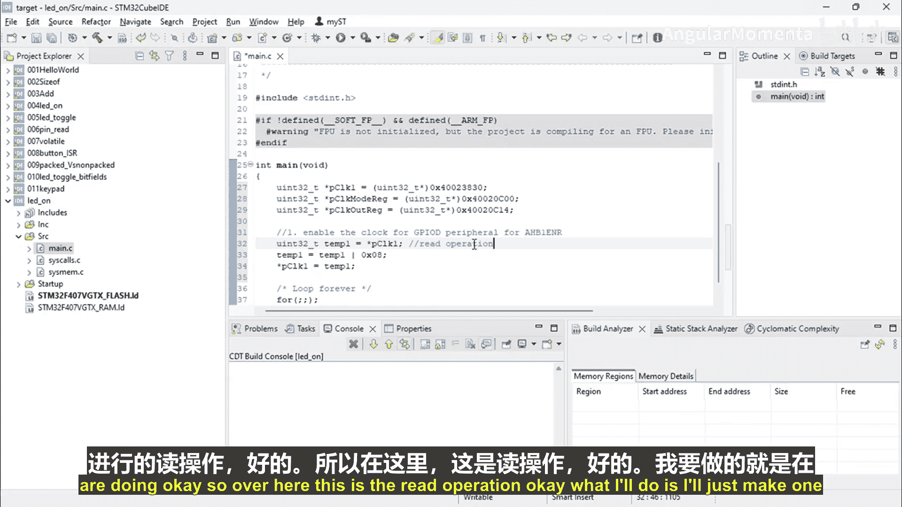
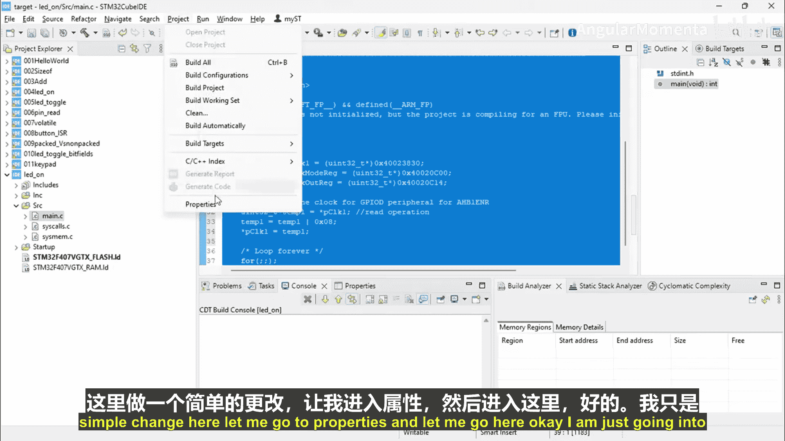
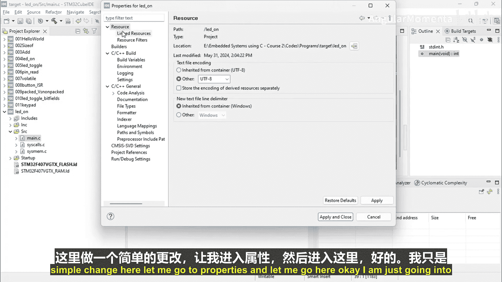
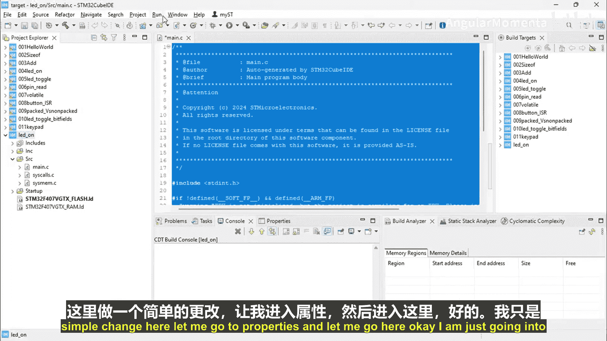
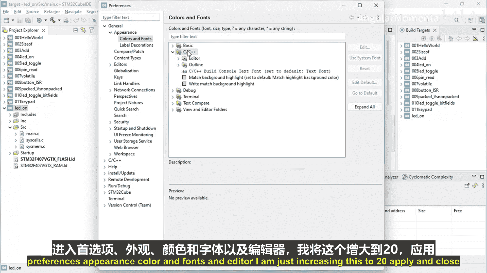
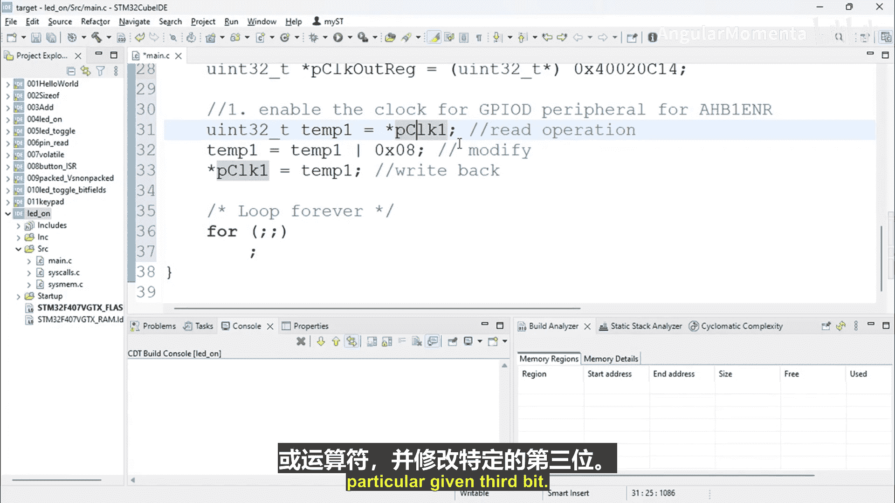

# 052：LED运动编码第二部分


在本节课中，我们将学习如何为STM32微控制器的GPIO端口启用时钟。这是配置外设、使其正常工作的关键步骤。我们将重点介绍如何安全地操作寄存器中的特定位，而不影响其他位。

上一节我们介绍了如何查找和定义寄存器的内存地址。本节中我们来看看如何通过位操作来启用GPIO端口的时钟。

## 启用GPIO时钟

我们的第四步是启用GPIO端口的时钟。这需要操作`RCC_AHB1ENR`寄存器。具体来说，我们需要将该寄存器的第三位设置为1。

操作寄存器时，必须非常小心。只能修改我们需要的特定位，而不能影响寄存器中的其他位。如果错误地更改了其他位，可能会导致程序出现严重问题，尤其是在大型项目中。因此，我们将使用位操作技术来精确控制。

### 使用位操作设置特定位

为了安全地设置寄存器的第三位，我们需要遵循“读-改-写”的操作流程。以下是具体步骤：

1.  **读取**：首先，将寄存器的当前值读取到一个临时变量中。
2.  **修改**：然后，使用位操作（此处为按位或运算）修改临时变量中的特定位。
3.  **写入**：最后，将修改后的值写回寄存器。

这样就能确保只改变目标位，而其他位保持不变。

### 代码实现

以下是实现上述步骤的C语言代码示例。我们假设已经定义了一个指向`RCC_AHB1ENR`寄存器地址的指针变量 `RCC_AHB1ENR_PTR`。



```c
// 步骤1：读取寄存器的当前值到一个临时变量
uint32_t temp1 = *RCC_AHB1ENR_PTR;







// 步骤2：使用按位或运算设置第三位（位2，因为从0开始计数）
// 掩码值 0x08 的二进制为 0000 1000，即第三位为1
temp1 = temp1 | 0x08;




// 步骤3：将修改后的值写回寄存器
*RCC_AHB1ENR_PTR = temp1;
```

**代码解释**：
*   `uint32_t temp1 = *RCC_AHB1ENR_PTR;`：这行代码通过解引用指针，将寄存器当前的值复制到临时变量`temp1`中。
*   `temp1 = temp1 | 0x08;`：这行代码对`temp1`和掩码`0x08`进行按位或运算。无论`temp1`的第三位原来是0还是1，运算后该位都会被设置为1，其他位则保持不变。
*   `*RCC_AHB1ENR_PTR = temp1;`：最后，将已设置好第三位的`temp1`值写回寄存器，完成时钟启用操作。

通过这三步操作，我们精确地启用了GPIO端口的时钟，而不会干扰到`RCC_AHB1ENR`寄存器中可能被其他功能使用的其他位。



本节课中我们一起学习了如何为STM32的GPIO端口启用时钟。关键在于理解并应用“读-改-写”的寄存器操作流程，并使用位运算来安全、精确地控制特定位。这是嵌入式编程中一项基础且重要的技能。