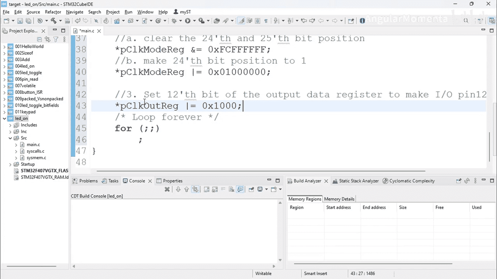

# 053：LED控制


在本节课中，我们将学习如何通过直接操作寄存器来控制STM32微控制器上的GPIO引脚，以实现LED的点亮。我们将完成三个核心任务：启用GPIO外设时钟、配置引脚为输出模式、以及设置引脚输出为高电平。

## 启用GPIO外设时钟

首先，我们需要启用GPIO端口的时钟。在STM32中，外设需要通过AHB1总线使能时钟后才能使用。我们将通过设置`RCC_AHB1ENR`寄存器的相应位来完成此操作。

以下是具体步骤：

1.  首先，我们需要找到控制GPIO端口（例如GPIOD）时钟的位。对于GPIOD，这是第3位。
2.  然后，我们通过位或（`|=`）操作将该位置1，同时不影响寄存器中的其他位。

```c
// 启用 GPIOD 的时钟 (AHB1ENR 寄存器的第3位)
RCC->AHB1ENR |= (1 << 3);
```

上一节我们介绍了启用时钟的基本原理，本节中我们来看看如何配置GPIO引脚的模式。

## 配置GPIO引脚为输出模式

时钟启用后，下一步是配置目标引脚（例如PD12）为通用输出模式。这需要通过配置`GPIOx_MODER`（模式寄存器）来实现。每个引脚由该寄存器中的连续2个位控制。

以下是具体步骤：

1.  首先，我们需要清除目标引脚对应的两个模式位（例如PD12对应位24和位25），将它们设置为00（输入模式）。
2.  然后，我们将这两个位设置为01，即将引脚配置为通用输出模式。

```c
// 假设 pGPIOx_MODER 是指向 GPIOD->MODER 寄存器的指针
// 1. 清除 PD12 对应的模式位 (位24和位25)
*pGPIOx_MODER &= ~(0x3 << 24);
// 2. 将 PD12 配置为通用输出模式 (01)
*pGPIOx_MODER |= (0x1 << 24);
```

通过以上操作，我们完成了引脚的输出模式配置。接下来，我们将学习如何控制这个引脚的输出电平。

## 设置GPIO引脚输出为高电平

引脚模式配置完成后，我们就可以通过`GPIOx_ODR`（输出数据寄存器）来控制其输出电平。将对应引脚的位置1，即可输出高电平（点亮LED）。

以下是具体步骤：

1.  找到控制目标引脚（PD12）的位，即第12位。
2.  使用位或（`|=`）操作将该位置1。

```c
// 将 PD12 引脚输出设置为高电平
GPIOD->ODR |= (1 << 12);
```

## 代码整合与测试

现在，我们将以上三个步骤的代码整合到主函数中。完整的初始化顺序应为：先启用时钟，再配置模式，最后设置输出电平。

```c
int main(void)
{
    // 1. 启用 GPIOD 时钟
    RCC->AHB1ENR |= (1 << 3);

    // 2. 配置 PD12 为输出模式
    // 清除模式位
    GPIOD->MODER &= ~(0x3 << 24);
    // 设置为通用输出模式
    GPIOD->MODER |= (0x1 << 24);

    // 3. 设置 PD12 输出高电平，点亮LED
    GPIOD->ODR |= (1 << 12);

    while(1)
    {
        // 主循环
    }
}
```

编写完代码后，将其编译并下载到STM32开发板进行测试。如果连接正确，对应的LED应该被点亮。

## 总结

本节课中我们一起学习了STM32 GPIO编程的三个核心步骤：
1.  **启用外设时钟**：通过设置`RCC_AHB1ENR`寄存器来激活GPIO端口的时钟。
2.  **配置引脚模式**：通过操作`GPIOx_MODER`寄存器，将特定引脚设置为通用输出模式。
3.  **控制输出电平**：通过读写`GPIOx_ODR`寄存器，可以设置引脚输出高电平或低电平，从而控制外部设备如LED。



通过直接操作寄存器，我们掌握了最底层的硬件控制方法，这是理解和使用STM32 HAL库或LL库的重要基础。