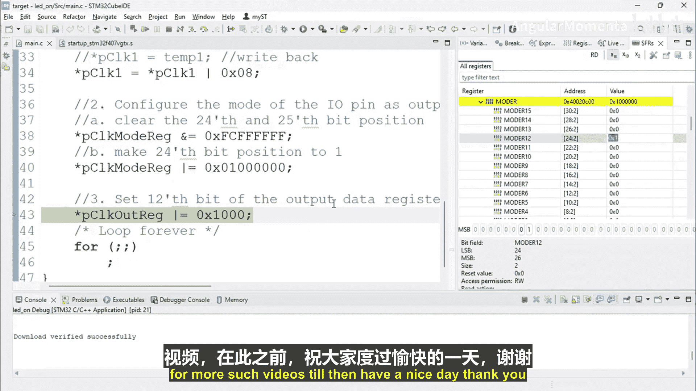

# 054：LED 运动编码部分四


在本节课中，我们将学习如何编译一个嵌入式项目，并使用调试器实时观察微控制器寄存器的变化，以验证我们的代码是否正确配置了硬件。

上一节我们介绍了如何通过指针操作寄存器来配置GPIO。本节中，我们来看看如何编译项目，并使用调试工具验证寄存器的配置过程。

## 编译项目

首先，我们需要编译整个项目。在集成开发环境中，找到编译或构建的选项并执行。

以下是编译项目的步骤：
1.  在IDE中定位到构建菜单。
2.  选择“全部构建”选项以编译整个项目。

## 观察寄存器内容

编译完成后，我们可以使用调试器来观察微控制器内部寄存器的实时状态。这有助于监控微控制器的各种实时活动。

为了观察寄存器，我们需要打开相应的调试视图。

以下是打开寄存器观察窗口的步骤：
1.  在IDE的菜单栏中，找到“窗口”选项。
2.  选择“显示视图” -> “其他...”。
3.  在弹出的对话框中，搜索并选择“寄存器”视图，然后打开它。

打开后，你将看到一个寄存器窗口。这里显示的是微控制器的通用寄存器。

如果你想观察特定外设的寄存器，可以打开另一个名为“SFRs”（特殊功能寄存器）的视图。

以下是观察外设寄存器的步骤：
1.  在“显示视图”中，找到并打开“SFRs”视图。
2.  在这个视图中，你可以找到并展开特定的外设，例如 `GPIOA`，来查看其相关寄存器。

## 调试与验证

现在，让我们开始调试程序，并逐步执行代码，观察寄存器的变化。

首先，我们需要重置芯片，使其恢复到初始状态。在调试工具栏中，找到并点击“重置”按钮。

重置后，我们可以看到所有寄存器的值都恢复为默认值（通常是0）。例如，模式寄存器的值现在是0。

接下来，我们开始逐行执行代码。使用“单步跳过”功能（通常是F6键）来执行每一条C语言语句。

我们的第一行代码是编程RCC模块中的 `AHB1ENR` 寄存器，以启用GPIO端口的时钟。

在SFRs视图中，找到 `RCC` 寄存器组，然后定位到 `AHB1ENR` 寄存器。执行单步操作后，观察该寄存器的值是否从默认值变为我们设定的值（例如，某一位从0变为1）。这证明我们成功启用了GPIO端口的时钟。

如果这一步没有成功，寄存器的值将保持不变。因此，跟踪寄存器的变化对于验证代码是否正确操作硬件至关重要。

启用时钟后，下一步是配置GPIO的模式寄存器。在SFRs视图中，找到 `GPIOA` 下的模式寄存器。

继续单步执行代码，配置模式寄存器。观察寄存器中特定位置（例如第24位和25位）的值是否按照我们的程序从 `00` 变为 `01`。这个变化意味着我们成功将对应的GPIO引脚配置为输出模式。

如果配置正确，相应的LED应该被点亮。你可以在调试器的图形化界面中查看引脚的状态图进行确认。

## 核心概念总结

这种方法的核心是利用指针访问内存映射的寄存器。其通用公式可以表示为：

```c
*(volatile uint32_t *) (寄存器地址) = 要写入的值;
```

通过这种方式，我们可以配置任何微控制器的任何外设寄存器。



本节课中我们一起学习了如何编译嵌入式项目，并使用调试器逐步跟踪和验证寄存器配置的过程。我们看到了如何启用外设时钟、配置GPIO模式，并通过观察寄存器值的变化来确认操作是否成功。掌握这种调试方法对于嵌入式开发至关重要。