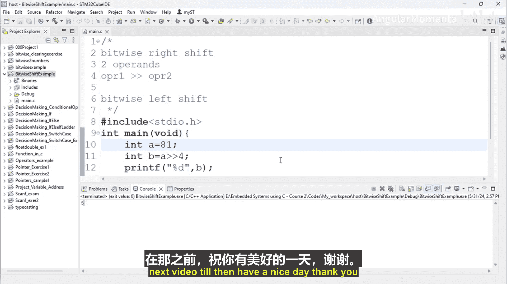

# 055：按位右移运算符


## 概述
在本节课程中，我们将学习C语言中的按位右移运算符。我们将了解其语法、工作原理，并通过代码示例演示如何对一个数值进行右移操作。

---

## 按位右移运算符介绍
上一节我们介绍了按位运算符的基本概念。本节中，我们来看看按位右移运算符。

按位右移运算符（`>>`）用于将一个数的所有二进制位向右移动指定的位数。其语法如下：

**语法：** `操作数1 >> 操作数2`

其中，`操作数1` 是要被移位的值，`操作数2` 指定了要右移的位数。

---

## 代码示例与解析
以下是使用按位右移运算符的一个具体示例。

```c
#include <stdio.h>

int main() {
    // 定义一个字符型变量并赋值
    char a = 111;
    // 将变量a的二进制位向右移动4位，结果赋值给b
    char b = a >> 4;

    // 打印移位后的结果
    printf("The value of b is: %d\n", b);
    return 0;
}
```

运行上述代码，变量 `b` 的值将是 `6`。这是因为十进制数 `111` 的二进制形式（以8位表示）向右移动了4位，空出的高位用 `0` 填充，从而得到了新的二进制值，其对应的十进制数就是 `6`。

---

## 使用整数变量进行移位
为了更清晰地展示，我们可以使用整数变量进行同样的操作。

以下是另一个示例，演示了对整数 `81` 进行右移操作。

```c
#include <stdio.h>

int main() {
    // 定义一个整型变量并赋值
    int x = 81;
    // 将变量x的二进制位向右移动4位，结果赋值给y
    int y = x >> 4;

    // 打印移位后的结果
    printf("The value of y is: %d\n", y);
    return 0;
}
```

运行此代码，变量 `y` 的值将是 `5`。这同样是因为 `81` 的二进制位右移4位后，产生了新的二进制序列，其对应的十进制值为 `5`。

---

## 核心概念总结
按位右移运算符的核心行为可以总结为以下两点：
1.  **移位**：将数值的所有二进制位整体向右移动。
2.  **补位**：在左侧（高位）空出的位置上填充 `0`。

**公式化描述：** 对于一个数 `A` 右移 `n` 位，可以近似理解为执行 `A / (2^n)` 的整数除法运算。

---



## 总结
本节课中我们一起学习了按位右移运算符（`>>`）。我们了解了它的语法，并通过具体的代码示例，观察了它对字符型和整型变量进行移位操作的结果。关键点在于，右移操作会将二进制位向右移动，并在高位补零，从而得到一个新的数值。下一节，我们将继续学习按位左移运算符。