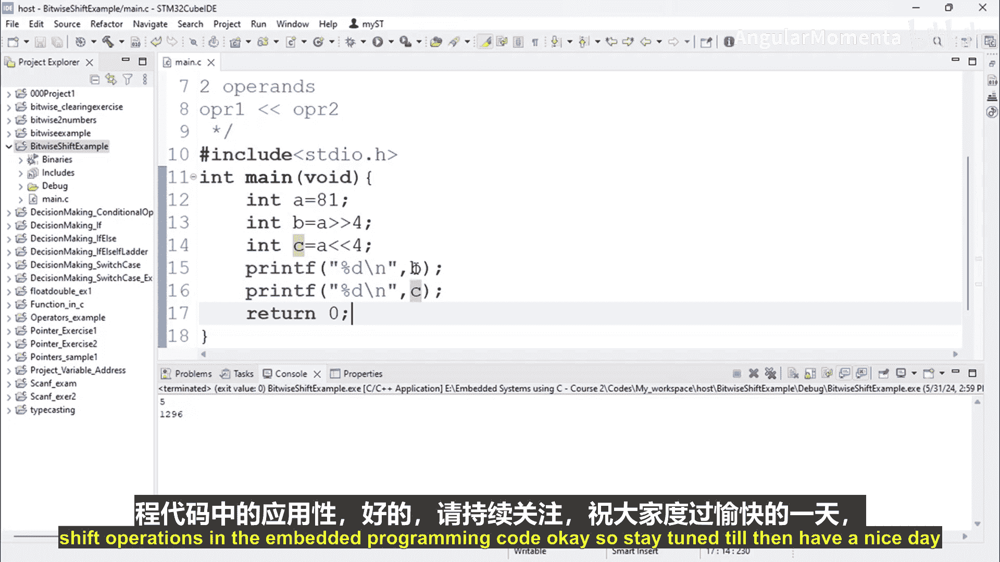

构建嵌入式系统：ARM Cortex (STM32) 基础：第56章：位左移运算符


在本节课中，我们将要学习C语言中的位左移运算符。上一节我们介绍了位右移运算符，本节中我们来看看它的对称操作——位左移运算符。

位左移运算符的语法与右移类似，它需要两个操作数。其基本形式为：**`操作数1 << 操作数2`**。它的功能是将`操作数1`的二进制位向左移动，移动的位数由`操作数2`决定。

以下是位左移运算的一个具体示例。

```c
int a = 806;
int c = a << 4;
printf(“c的值为：%d”, c);
```

在这个例子中，变量`a`的值为806。执行`a << 4`操作后，结果被赋值给变量`c`。运行程序后，`c`的值将变为12896。

现在，让我们理解二进制位是如何移动的。当执行左移操作时，数值的二进制位整体向左移动指定的位数。左侧（高位）溢出的位将被丢弃，而右侧（低位）空出的位则用0来填充。

正是由于比特位的移动和填充，导致了数值发生了改变。在嵌入式编程中，理解和掌握位左移操作至关重要。



本节课中我们一起学习了位左移运算符的语法、功能及其运算过程。在下一节视频中，我们将探讨位移动运算在嵌入式编程代码中的具体应用。