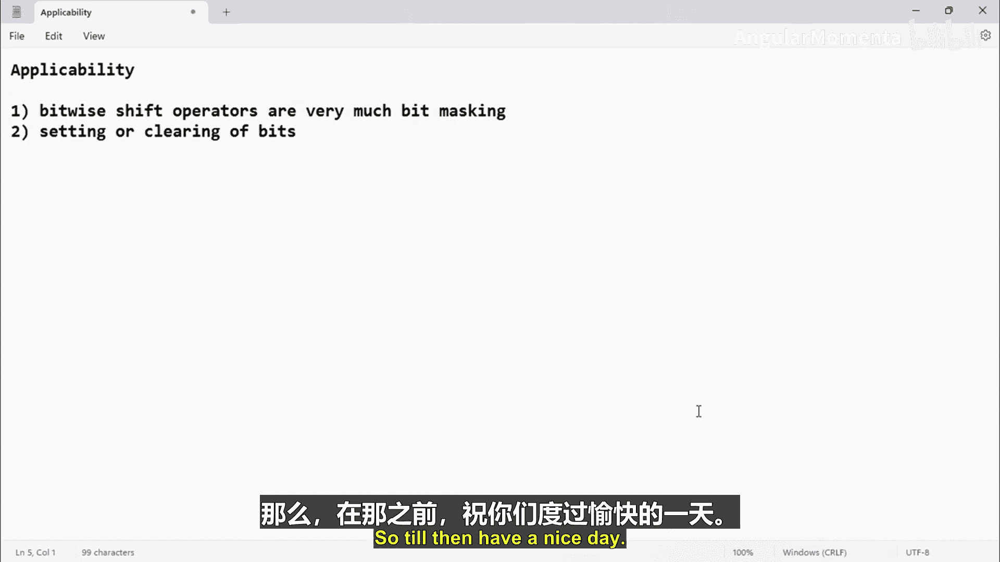

# 057：位运算移位运算符的适用性 🧮


在本节课中，我们将学习位运算中的移位运算符在嵌入式系统开发中的具体应用。我们将重点探讨如何使用移位运算符来简化设置和清除特定位的操作，这对于硬件寄存器编程至关重要。

上一节我们介绍了位运算的基本概念，本节中我们来看看移位运算符如何在实际编程中发挥作用。

## 概述

在嵌入式编程中，我们经常需要操作硬件寄存器的特定位，例如开启或关闭某个外设功能。位运算，特别是移位运算符，是实现这种“位掩码”操作的核心工具。它们能极大地简化代码，尤其是在处理多位宽数据时。

## 设置特定位

假设我们需要设置一个8位数据的第4位（从0开始计数，即二进制从右往左数的第5位）。传统方法是直接使用位或（`|`）运算和一个手动计算的掩码值。

以下是传统方法：
```c
data = data | 0x10; // 0x10的二进制是0001 0000，用于设置第4位
```
这种方法在数据位宽较小时（如8位）是可行的。但当处理32位或64位数据时，手动计算和书写掩码值（如`0x00000010`或`0x0000000000000010`）会变得繁琐且容易出错。

因此，我们推荐使用移位运算符来动态生成掩码。其核心思想是：数字1的二进制形式（`0000 0001`）在经过左移后，可以精确地在指定位生成一个“1”。

以下是使用移位运算符的方法：
```c
data = data | (1 << 4); // 将数字1左移4位，生成掩码0001 0000
```
**公式**：`目标掩码 = 1 << n`，其中 `n` 是需要设置的位的位置（从0开始计数）。

这种方法更加直观和灵活。你只需要记住“1左移n位”，而无需记忆具体的十六进制掩码值。

## 清除特定位

与设置位类似，清除特定位也可以借助移位运算符来简化。传统方法是使用位与（`&`）运算和一个在特定位为0、其余位为1的掩码。

以下是清除第4位的传统方法：
```c
data = data & 0xEF; // 0xEF的二进制是1110 1111
```
使用移位运算符，我们可以先通过左移生成一个只在目标位为1的掩码，然后对其取反，得到所需的清除掩码。

以下是使用移位运算符的方法：
```c
data = data & ~(1 << 4); // 生成0001 0000后取反，得到1110 1111
```
**公式**：`清除掩码 = ~(1 << n)`。

## 方法对比与总结

以下是两种方法的对比：

*   **传统掩码法**：直接、快速，但掩码值需要预先计算，在数据位宽很大或位位置变化时不够灵活。
*   **移位运算法**：动态生成掩码，代码意图更清晰（“左移4位”明确指出了操作的是第4位），灵活性强，是嵌入式编程中的推荐做法。

本节课中我们一起学习了移位运算符在设置和清除数据特定位时的应用。我们了解到，相比于直接使用硬编码的掩码值，使用 `(1 << n)` 来动态生成掩码能使代码更易读、更易维护，尤其是在处理复杂或位宽较大的数据时。



在下一节，我们将把学到的知识付诸实践，使用移位运算符来优化之前控制LED的代码。