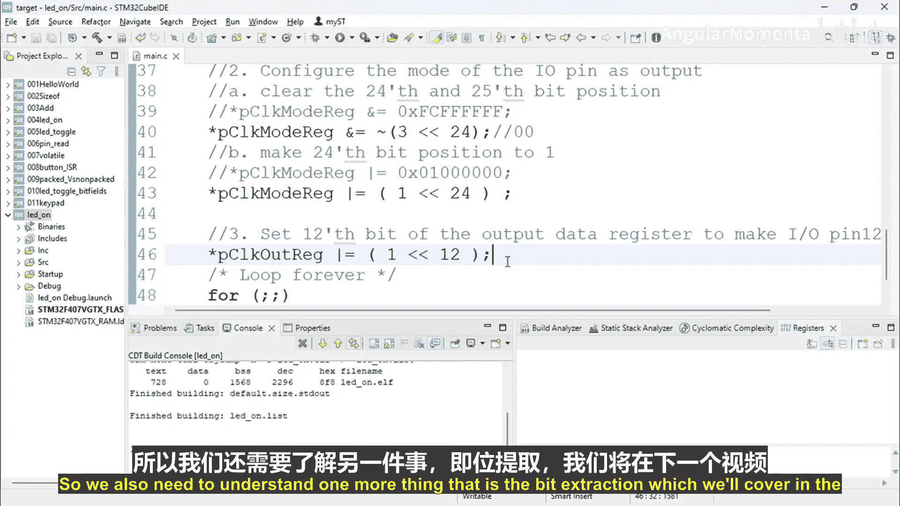

**ARM Cortex (STM32) 基础：构建嵌入式系统 p58 04_01_04：使用位运算与移位操作符修改LED灯运动** 🚀


在本节课中，我们将学习如何使用位运算和移位操作符来修改微控制器的寄存器，从而控制LED灯的运动。我们将通过改写之前的代码，用更简洁的位操作替代直接使用掩码值，使代码更易读和维护。

---

上一节我们介绍了如何通过直接赋值来配置寄存器。本节中，我们来看看如何使用位运算和移位操作符实现同样的功能，这种方法在嵌入式开发中更为常见和高效。

首先，我们需要使能GPIOD端口的时钟。这通过设置`RCC->AHB1ENR`寄存器的第3位来实现。

以下是修改步骤：

1.  **使能GPIOD时钟**：原代码使用了一个掩码值。我们可以使用移位操作来设置特定位。
    ```c
    // 原代码：RCC->AHB1ENR |= 0x08; // 设置第3位
    // 新代码：使用移位操作
    RCC->AHB1ENR |= (1 << 3); // 将数字1左移3位，等同于设置第3位为1
    ```

2.  **配置引脚模式**：我们需要清除`GPIOD->MODER`寄存器的第24和25位（用于配置引脚12的模式），然后将第24位设置为1（配置为输出模式）。
    *   **清除位**：原代码使用`&= ~`操作和掩码。我们可以组合使用移位和按位取反操作。
        ```c
        // 原代码：GPIOD->MODER &= ~(0x03000000); // 清除24、25位
        // 新代码：使用移位和取反
        GPIOD->MODER &= ~(3 << 24); // 数字3（二进制11）左移24位，然后取反，将24、25位清零
        ```
    *   **设置位**：同样，使用移位操作来设置特定位。
        ```c
        // 原代码：GPIOD->MODER |= 0x01000000; // 设置第24位为1
        // 新代码：使用移位操作
        GPIOD->MODER |= (1 << 24); // 将数字1左移24位，设置第24位为1
        ```

3.  **配置输出类型**：我们需要设置`GPIOD->OTYPER`寄存器的第12位为0（推挽输出）。
    ```c
    // 原代码：GPIOD->OTYPER &= ~(0x1000); // 清除第12位
    // 新代码：使用移位操作
    GPIOD->OTYPER &= ~(1 << 12); // 将数字1左移12位后取反，清除第12位
    ```

修改完成后，重新编译代码以确保没有错误。如果编译成功，说明我们的位操作代码功能正确。你也可以通过调试器查看寄存器窗口，观察这些位的值是否按预期变化。

---

本节课中我们一起学习了如何运用位运算与移位操作符来高效地读写微控制器寄存器。相比直接使用十六进制掩码，这种方法逻辑更清晰，更容易理解每一位的作用。我们通过使能时钟、配置引脚模式和输出类型三个步骤实践了这一技巧。

在下一个视频中，我们将探讨另一个重要的主题：位提取操作。敬请期待！



---