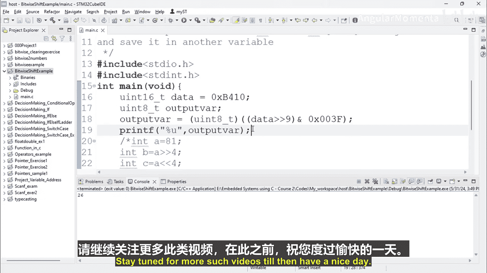

# 059：位提取


在本节课程中，我们将学习如何从一个数据中提取特定的位段。这个过程被称为位提取，是嵌入式系统编程中处理硬件寄存器数据的常用技术。

## 概述

位提取是指从一个较大的数据值中，分离出我们感兴趣的连续几位。例如，我们可能需要从一个16位的寄存器值中，提取第9位到第14位（共6位）的数据，并将其存储到一个新的变量中。我们将通过位右移和位与运算来实现这一目标。

## 问题定义

假设我们有一个16位的变量 `data`，其二进制格式如下。我们的目标是从中提取位[14:9]（即第9位到第14位，包含两端），并将这6位数据保存到另一个变量中。

## 解决方案步骤

位提取可以通过两个核心步骤完成：**右移**和**掩码**。

### 第一步：右移

首先，我们需要将目标位段移动到数据的最右侧（最低有效位，LSB）。这样，我们感兴趣的位就占据了从第0位开始的位置。

具体操作是，将原始数据向右移动9位。这样，原来的第9位就移动到了第0位的位置，原来的第14位则移动到了第5位的位置。

**公式表示：**
`shifted_data = data >> 9`

### 第二步：掩码

经过右移后，数据的低6位（第0位到第5位）就是我们想要提取的原始数据的[14:9]位。然而，数据的高位（第6位到第15位）现在包含的是无关信息（可能是0或原始数据的高位）。

为了只保留低6位，我们需要使用一个**掩码**。掩码是一个二进制数，在我们想要保留的位上为1，在其他位上为0。对于6位数据，掩码是二进制的 `0000 0000 0011 1111`，即十进制的 `0x3F`。

通过将移位后的数据与这个掩码进行**位与**运算，我们可以将高位置零，只保留低6位。

**公式表示：**
`extracted_bits = shifted_data & 0x3F`

## 代码示例

以下是使用C语言实现上述位提取过程的示例代码。

```c
#include <stdint.h>
#include <stdio.h>

int main() {
    // 定义一个16位的原始数据
    uint16_t data = 0xB410;

    // 定义一个8位的变量来存放提取结果
    uint8_t output_var;

    // 执行位提取操作：先右移9位，再与掩码0x3F进行与运算
    output_var = (uint8_t)((data >> 9) & 0x3F);

    // 打印提取结果
    printf("提取的值为：%u\n", output_var);

    return 0;
}
```

## 代码解析

1.  **变量定义**：`data` 是16位的原始数据，`output_var` 是8位的变量，用于存储提取结果。
2.  **位提取操作**：
    *   `(data >> 9)`：将 `data` 右移9位，使目标位段[14:9]移动到低6位。
    *   `& 0x3F`：使用掩码 `0x3F`（二进制 `0011 1111`）进行位与运算，清除高10位，只保留低6位。
    *   `(uint8_t)`：进行类型转换，将结果存入8位变量。
3.  **输出结果**：运行上述代码，`output_var` 的值将是26，这就是从 `0xB410` 中提取位[14:9]的结果。

## 总结

在本节课中，我们一起学习了位提取的概念和实现方法。我们了解到，通过结合**位右移运算符（>>）** 和**位与运算符（&）**，可以轻松地从数据中分离出任何连续的位段。关键步骤是先将目标位段移动到数据最右侧，然后用一个合适的掩码过滤掉不需要的位。这项技能对于直接操作微控制器中的硬件寄存器位字段至关重要。



