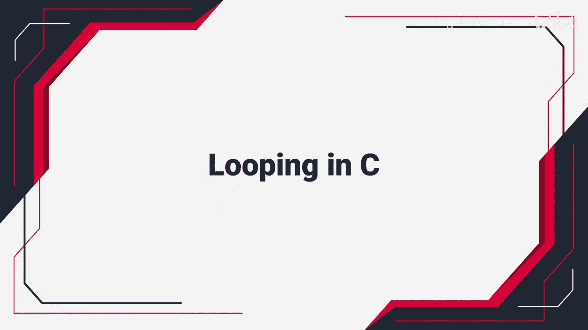
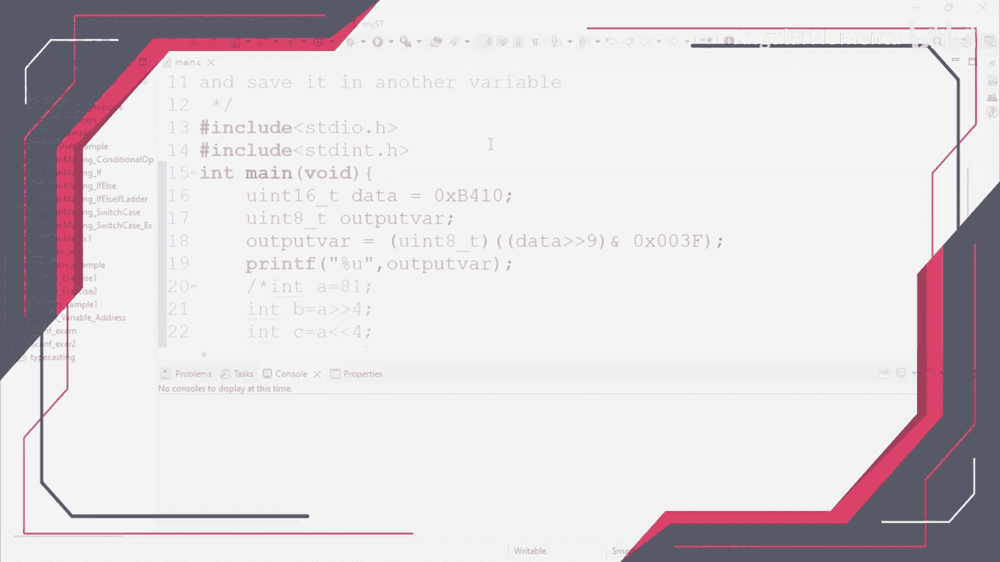
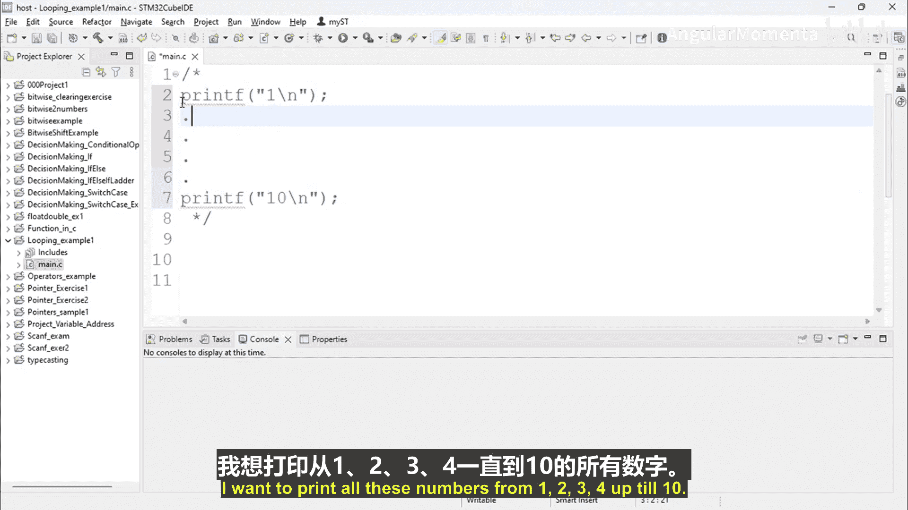
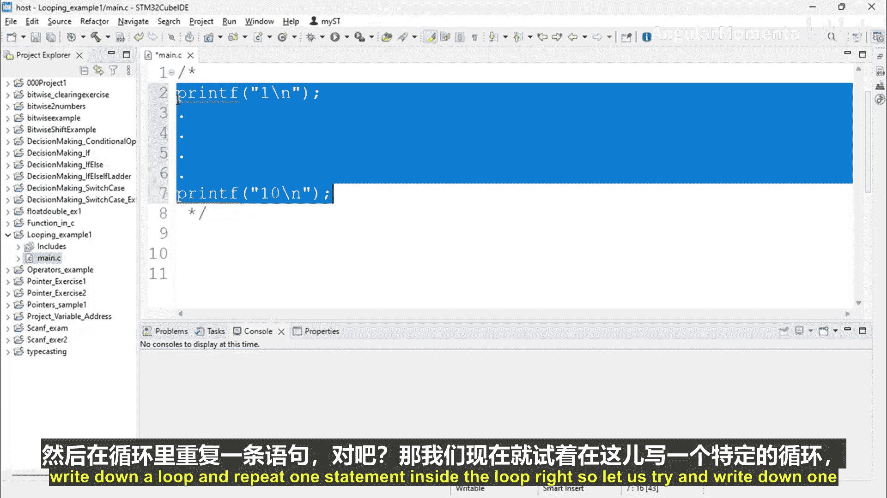
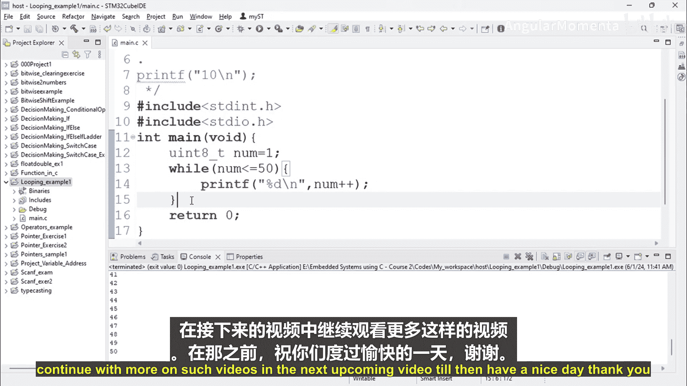

构建嵌入式系统：ARM Cortex (STM32) 基础：第04章：第02节：C语言中的循环结构






在本节课中，我们将要学习C语言编程中一个非常重要的概念：**循环结构**。循环允许我们重复执行一段代码，从而避免编写大量重复的语句，使程序更加简洁高效。我们将通过一个具体的例子来理解循环的必要性，并重点介绍**while循环**的工作原理。

### 为什么需要循环？

假设我们需要在程序中打印从1到10的所有数字。一种方法是编写10条独立的打印语句，但这会非常繁琐且低效。

以下是解决此问题的更优方法：使用循环。通过循环，我们只需编写一次打印语句，并让它重复执行10次。





### while循环示例

让我们通过一个具体的程序来理解while循环。我们将创建一个项目，使用while循环打印从1到10的数字。

首先，我们初始化一个变量 `num`，其值为1。我们的目标是当 `num` 小于或等于10时，重复执行打印和递增操作。

**代码示例：**
```c
#include <stdio.h>

int main() {
    int num = 1; // 初始化计数器

    while (num <= 10) { // 循环条件：当num小于等于10时执行
        printf("%d\n", num); // 打印当前num的值
        num++; // 将num的值增加1（后置递增）
    }

    return 0;
}
```

**代码解释：**
1.  `int num = 1;`：声明并初始化一个整型变量 `num`，起始值为1。
2.  `while (num <= 10)`：这是循环的条件。只要 `num` 的值小于或等于10，花括号 `{}` 内的代码块就会一直执行。
3.  `printf("%d\n", num);`：打印变量 `num` 的当前值。
4.  `num++;`：这是后置递增操作。它先使用 `num` 的当前值，然后再将其增加1。因此，第一次循环打印的是1，然后 `num` 变为2，依此类推。

**执行流程：**
*   第一次循环：`num` 为1，满足 `num <= 10` 的条件，打印1，然后 `num` 递增为2。
*   第二次循环：`num` 为2，满足条件，打印2，然后 `num` 递增为3。
*   ...
*   第十次循环：`num` 为10，满足条件，打印10，然后 `num` 递增为11。
*   第十一次检查：`num` 为11，不满足 `num <= 10` 的条件，循环结束。

通过这种方式，我们仅用几行代码就完成了需要十条打印语句才能完成的任务。如果我们需要打印到50，只需将循环条件改为 `num <= 50` 即可，无需修改循环体内的代码。

### C语言中的循环类型

C语言主要提供了三种循环结构，它们功能相似，主要在语法上有所区别：
1.  **while循环**：本节介绍的类型。先检查条件，条件为真则执行循环体。
2.  **for循环**：另一种常用的循环，将初始化、条件判断和更新操作集中在一行。
3.  **do...while循环**：先执行一次循环体，然后再检查条件。保证循环体至少执行一次。

在接下来的课程中，我们将继续学习 `for` 循环和 `do...while` 循环。

### 总结



本节课中我们一起学习了循环结构的基础知识。我们理解了使用循环可以避免代码重复，提高编程效率。我们重点掌握了 **while循环** 的语法和工作原理：它会在每次迭代前检查一个条件，只要条件为真，就会重复执行其代码块中的语句。通过一个打印数字的示例，我们直观地看到了循环如何简化我们的程序。