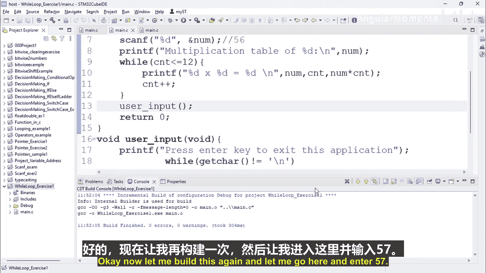
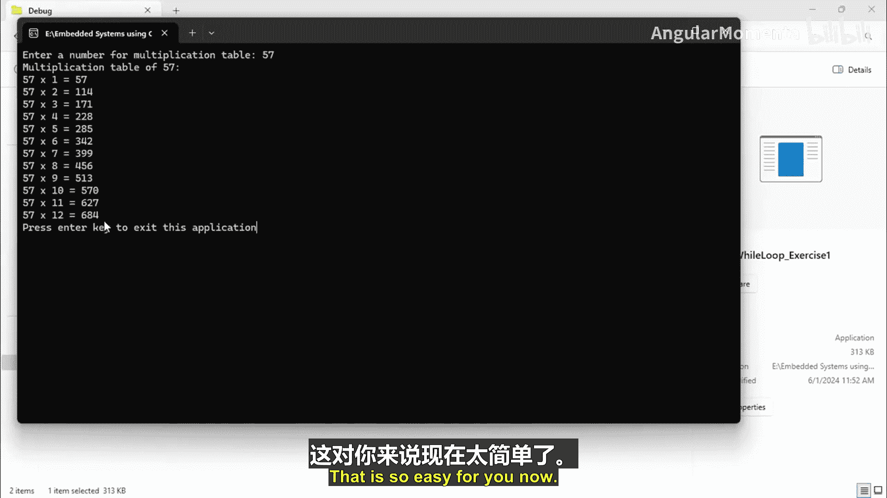
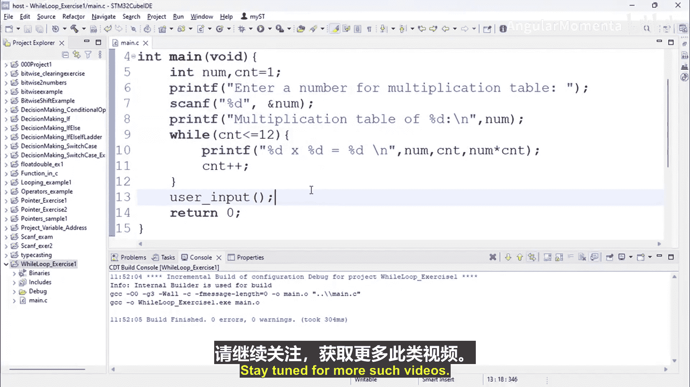

# 061：while循环练习第一部分 🔢

在本节课中，我们将学习如何使用 `while` 循环来编写一个程序，该程序能够根据用户输入的数字，自动生成并打印出其乘法表。这是一个理解循环控制流和用户交互的绝佳练习。

## 概述

我们将创建一个简单的C++项目，通过 `while` 循环结构，实现从用户处获取一个整数，然后打印出该数字从1到12的乘法表。通过这个练习，你将掌握循环的基本应用和如何将用户输入与程序逻辑结合。

## 项目创建与准备

首先，我们需要创建一个新的C++项目并添加源文件。我们将项目命名为 `whileLoopExercise1`。

```c
#include <stdio.h>
int main() {
    // 程序主体将在这里编写
    return 0;
}
```

## 程序逻辑设计

上一节我们创建了项目的基本框架，本节中我们来看看程序的具体逻辑。我们的目标是：
1.  提示用户输入一个数字。
2.  使用 `while` 循环计算并打印该数字的乘法表（例如，从1乘到12）。

以下是实现该逻辑的核心步骤：

1.  **声明变量**：我们需要两个整数变量。一个（例如 `num`）用于存储用户输入的数字，另一个（例如 `cnt`）作为计数器，从1开始递增。
2.  **获取用户输入**：使用 `printf` 提示用户，并使用 `scanf` 将输入值存储到 `num` 变量中。
3.  **打印表头**：在开始循环前，先打印一行说明，例如“Multiplication table of [num]:”。
4.  **构建循环**：使用 `while` 循环，条件是计数器 `cnt` 小于等于12。在循环体内，执行计算和打印。
5.  **循环体内操作**：在每次循环中，打印 `num`、`cnt` 以及它们的乘积 `num * cnt`。然后，将计数器 `cnt` 的值增加1（`cnt++`）。
6.  **循环结束**：当 `cnt` 增加到13时，不满足循环条件（`cnt <= 12`），循环终止，程序结束。

## 代码实现

根据上述设计，完整的程序代码如下：

```c
#include <stdio.h>

int main() {
    int num;    // 存储用户输入的数字
    int cnt = 1; // 计数器，从1开始

    // 提示用户输入
    printf("Enter a number for multiplication table: \n");
    scanf("%d", &num);

    // 打印乘法表标题
    printf("Multiplication table of %d:\n", num);

    // while循环开始
    while (cnt <= 12) {
        // 打印每一行： num x cnt = result
        printf("%d * %d = %d\n", num, cnt, num * cnt);
        cnt++; // 计数器递增
    }

    return 0;
}
```

## 程序运行示例

假设用户输入数字 `57`，程序将输出以下内容：

```
Enter a number for multiplication table:
57
Multiplication table of 57:
57 * 1 = 57
57 * 2 = 114
57 * 3 = 171
...
57 * 12 = 684
```



## 扩展与调整

这个程序的灵活性很高。如果你想打印到20而不是12，只需将 `while` 循环的条件从 `cnt <= 12` 改为 `cnt <= 20` 即可。这展示了循环如何让我们用几行代码轻松处理重复性任务，而无需手动编写大量重复的语句。

## 总结



本节课中我们一起学习了 `while` 循环的一个实际应用。我们创建了一个程序，它能够接受用户输入，并利用 `while` 循环自动生成该数字的乘法表。你掌握了如何：
*   使用 `scanf` 获取用户输入。
*   使用 `while` 循环控制重复执行流程。
*   在循环体内进行计算和输出。
*   通过修改循环条件来控制循环次数。



通过这个练习，你应该对循环在简化代码、处理重复任务方面的强大能力有了更直观的理解。