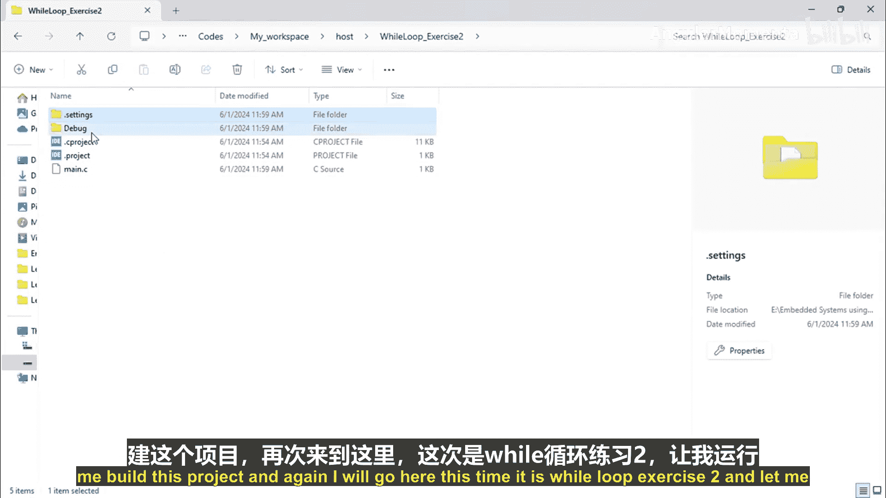
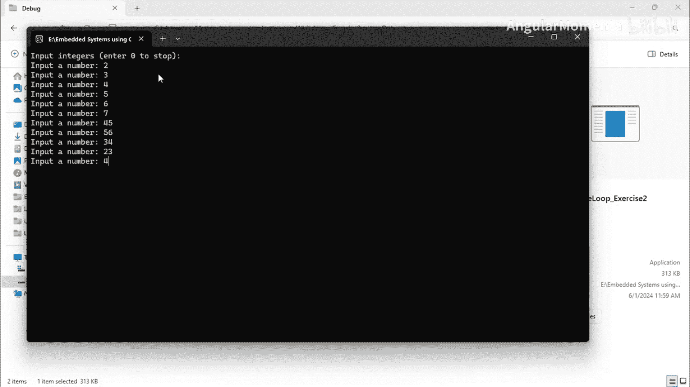
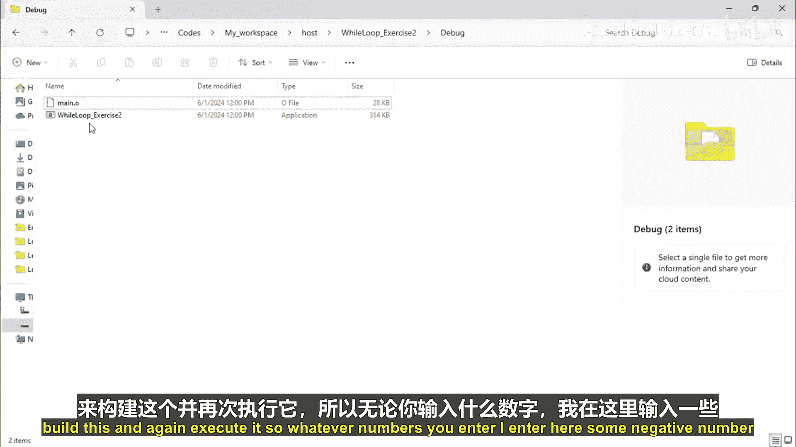
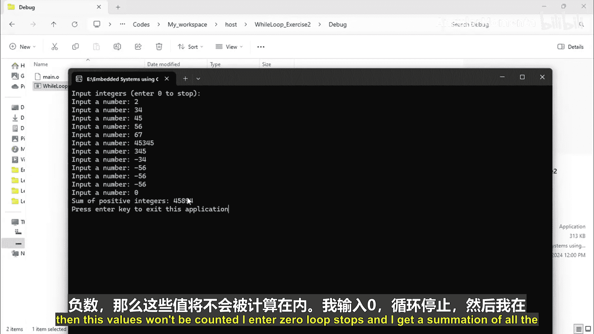
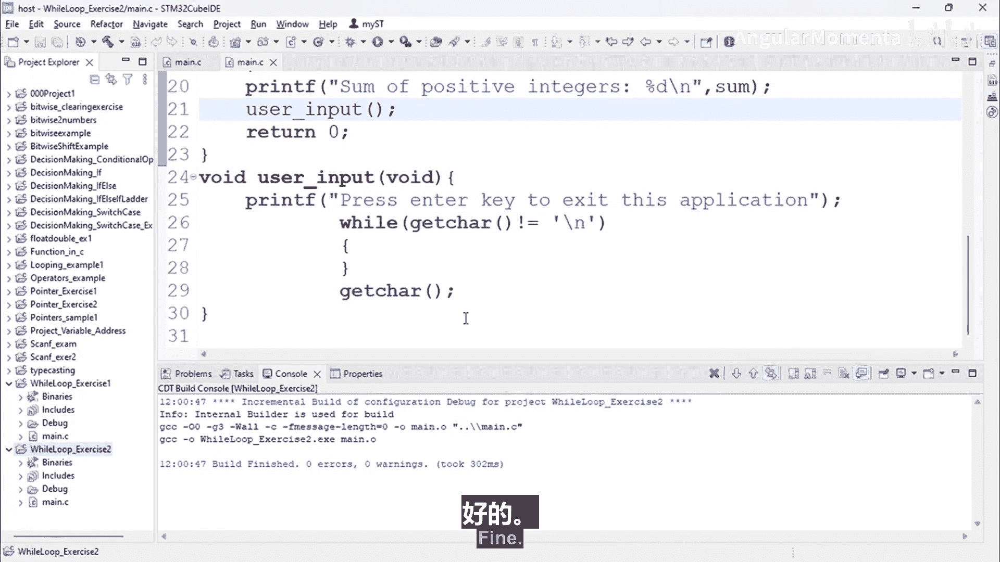

# 062：while循环练习 第二部分

在本节课程中，我们将学习如何编写一个使用 `while` 循环的程序。该程序会持续提示用户输入整数，直到用户输入数字0为止，然后计算并输出所有输入的正整数之和。

---

## 项目创建与目标

首先，我们需要创建一个新的项目。我们将项目命名为 `while_loop_exercise_2`。

接下来，我们明确程序的目标：编写一个程序，提示用户输入一系列整数，直到用户输入0为止。程序需要使用 `while` 循环来实现持续输入，并在循环结束后，计算并打印所有已输入的正整数的总和。

---

## 程序设计与实现

为了实现上述功能，我们将遵循以下步骤：

1.  包含必要的头文件。
2.  在 `main` 函数中声明变量。
3.  向用户显示操作说明。
4.  使用 `while` 循环持续接收用户输入。
5.  在循环内部判断输入值，以决定是结束循环还是累加正数。
6.  循环结束后，输出正整数的累加和。

以下是具体的代码实现步骤。

首先，我们需要包含标准输入输出头文件，并设置 `main` 函数。

```c
#include <stdio.h>

int main() {
    // 变量声明与初始化
    int number;
    int sum = 0;

    // 程序逻辑将在这里编写

    return 0;
}
```

在 `main` 函数内部，我们首先声明两个变量：`number` 用于存储用户的每次输入，`sum` 用于累加正整数的和，并将其初始化为0。

---

## 用户提示与循环逻辑

在程序开始执行时，我们需要告知用户如何操作。我们将打印一条说明信息。

```c
    printf("请输入一系列整数，输入0以停止。\n");
```

接下来，我们使用一个 `while(1)` 循环来创建一个无限循环。循环的退出条件将在循环体内部进行判断。

```c
    while(1) {
        // 循环体内的代码将不断执行
    }
```

在循环体内，我们首先提示用户输入一个数字，并使用 `scanf` 函数读取这个值。

```c
        printf("请输入一个数字: ");
        scanf("%d", &number);
```

读取用户输入后，我们需要进行判断。以下是循环内部的核心判断逻辑：

*   如果用户输入的数字是0，则使用 `break` 语句跳出循环。
*   如果用户输入的数字大于0，则将其累加到 `sum` 变量中。

```c
        if (number == 0) {
            break; // 输入0，跳出循环
        }

        if (number > 0) {
            sum += number; // 等价于 sum = sum + number;
        }
```

---

## 输出结果与屏幕停留

当用户输入0，`break` 语句执行后，程序将跳出 `while` 循环。此时，所有正整数的和已经存储在 `sum` 变量中。我们将其打印出来。

```c
    printf("所有正整数的和为: %d\n", sum);
```

为了让运行窗口在显示结果后不会立即关闭（特别是在某些集成开发环境中），我们可以在 `return 0;` 语句前添加一个 `getchar()` 函数调用，等待用户按下一个键。

```c
    getchar(); // 等待用户按键，保持窗口
    return 0;
```



---

## 完整代码与执行示例

将以上所有部分组合起来，就得到了完整的程序代码。



```c
#include <stdio.h>

int main() {
    int number;
    int sum = 0;

    printf("请输入一系列整数，输入0以停止。\n");

    while(1) {
        printf("请输入一个数字: ");
        scanf("%d", &number);

        if (number == 0) {
            break;
        }

        if (number > 0) {
            sum += number;
        }
    }

    printf("所有正整数的和为: %d\n", sum);

    getchar(); // 保持窗口
    return 0;
}
```



编译并运行此程序，你将看到类似以下的交互过程：
```
请输入一系列整数，输入0以停止。
请输入一个数字: 5
请输入一个数字: -3
请输入一个数字: 10
请输入一个数字: 0
所有正整数的和为: 15
```
程序会持续接收输入，忽略负数（如-3），只累加正数（5和10）。当输入0时，循环终止，并输出累加结果15。

---



## 总结

在本节课中，我们一起学习了 `while` 循环的一个实际应用。我们创建了一个程序，它能够：
1.  使用 `while(1)` 构建一个无限循环。
2.  在循环内通过 `scanf` 获取用户输入。
3.  使用 `if` 条件判断和 `break` 语句来控制循环的退出条件。
4.  使用 `+=` 运算符累加符合条件的数值。
5.  在循环结束后输出最终的计算结果。



这个练习巩固了循环控制、条件判断和用户交互输入的综合运用，是嵌入式系统编程中处理连续事件或数据的常见模式基础。