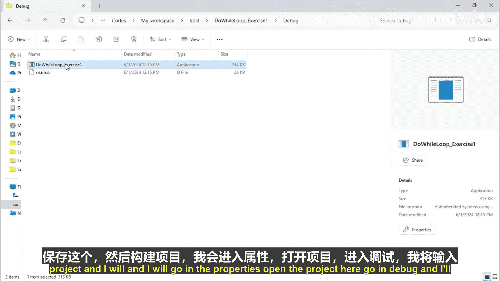
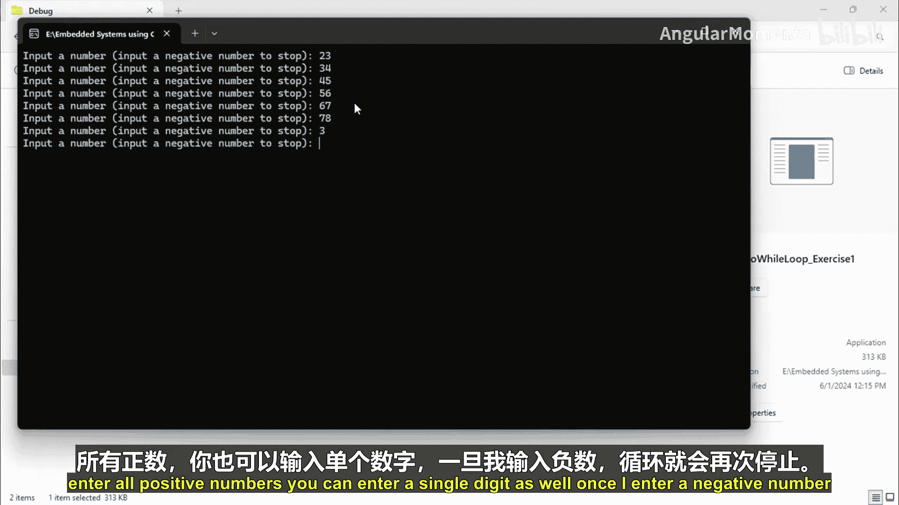
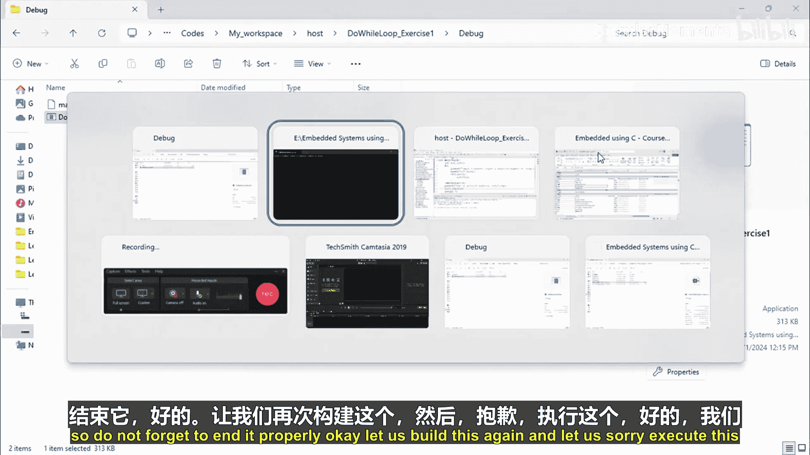
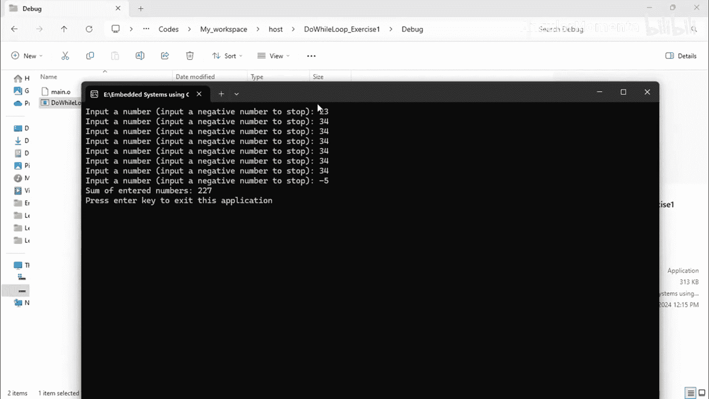
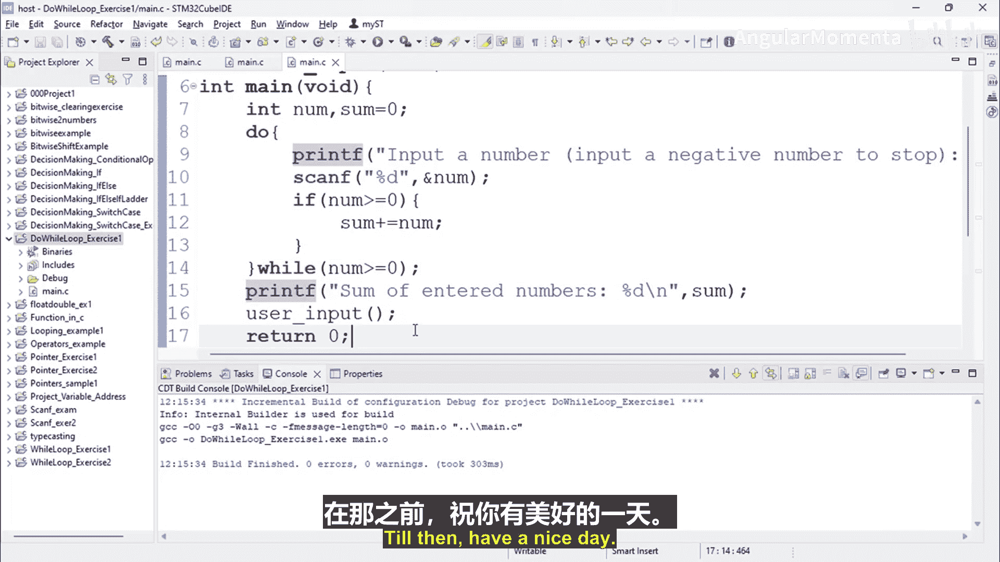

# 063：do-while 循环 🔄

在本节课中，我们将学习 `do-while` 循环。我们将通过一个具体的编程练习来理解其语法和工作原理，即编写一个程序，持续接收用户输入的数字，直到输入一个负数为止，然后计算并打印所有输入数字的总和。

---

上一节我们介绍了 `while` 循环，本节中我们来看看 `do-while` 循环。这两种循环的主要区别在于条件检查的时机。`do-while` 循环会先执行一次循环体，然后再检查条件是否满足。

以下是 `do-while` 循环的基本语法结构：

```c
do {
    // 循环体语句
} while (条件);
```

现在，让我们开始动手实践。我们将创建一个名为 `DoWhileLoopExercise1` 的新项目，并添加一个源文件。

首先，我们需要声明变量。我们将需要一个变量来存储用户输入的数字，以及一个变量来存储总和。

```c
int num;
int sum = 0;
```

接下来，我们编写 `do-while` 循环。循环的逻辑是：先提示用户输入一个数字，然后读取这个数字。如果这个数字是非负数（大于或等于0），就将其加到总和上。这个过程会一直重复，直到用户输入一个负数为止。

以下是循环部分的代码：

```c
do {
    printf("输入一个数字（输入负数以停止）: ");
    scanf("%d", &num);
    if (num >= 0) {
        sum += num; // 等价于 sum = sum + num
    }
} while (num >= 0);
```

循环结束后，我们需要打印出计算得到的总和。



```c
printf("所有输入数字的总和是: %d\n", sum);
```



最后，非常重要的一点是，不要忘记在 `main` 函数中调用我们编写的功能函数。一个常见的错误是编写了函数却忘记调用它。



让我们保存代码，构建项目，并运行它来测试功能。



程序运行后，我们可以输入一系列数字进行测试。例如，输入 `10`、`20`、`30`，最后输入 `-1`。程序应该会计算出总和 `60` 并正确输出。

通过这个练习，我们清晰地看到了 `do-while` 循环的执行流程：它**至少会执行一次**循环体，然后再判断条件以决定是否继续循环。这与先判断条件再决定是否执行循环体的 `while` 循环形成了对比。

---



本节课中我们一起学习了 `do-while` 循环的语法和应用。我们通过一个计算数字总和的练习，实践了如何用 `do-while` 循环处理需要至少执行一次的任务。记住其核心特点是**先执行，后判断**。