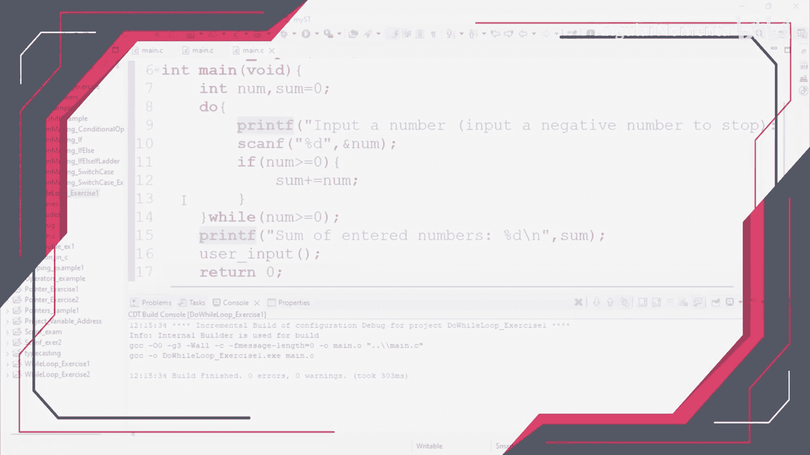
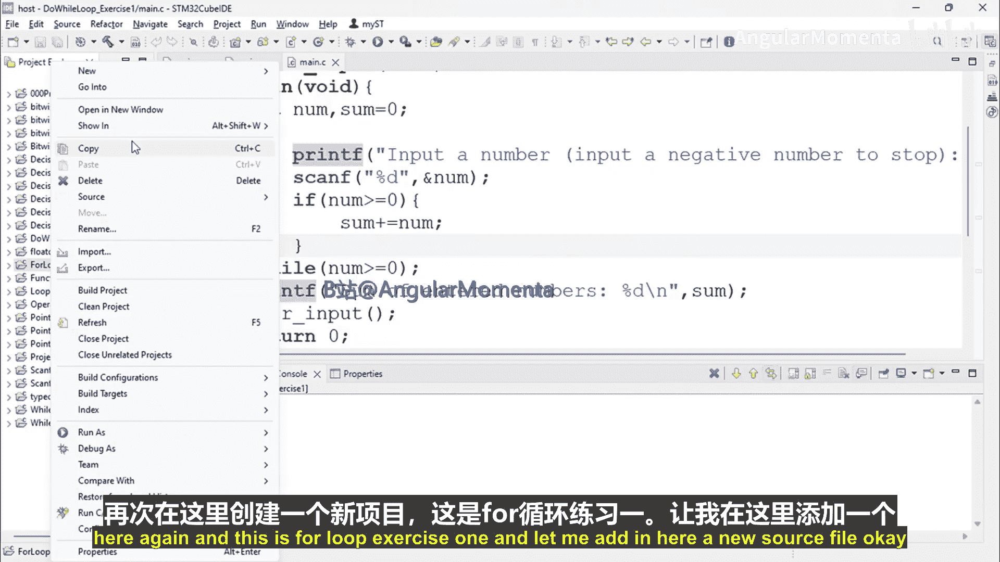
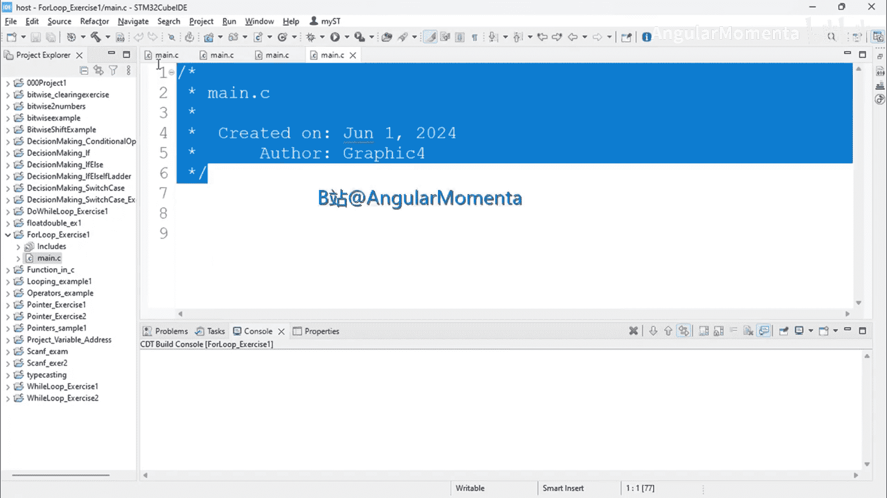
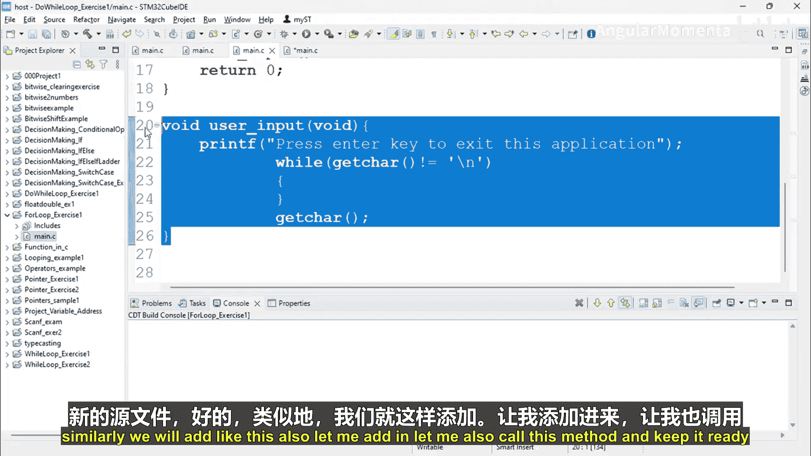
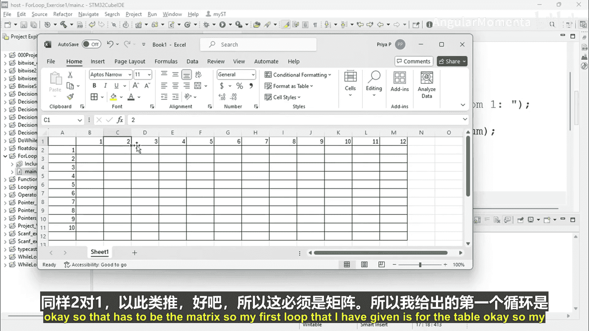
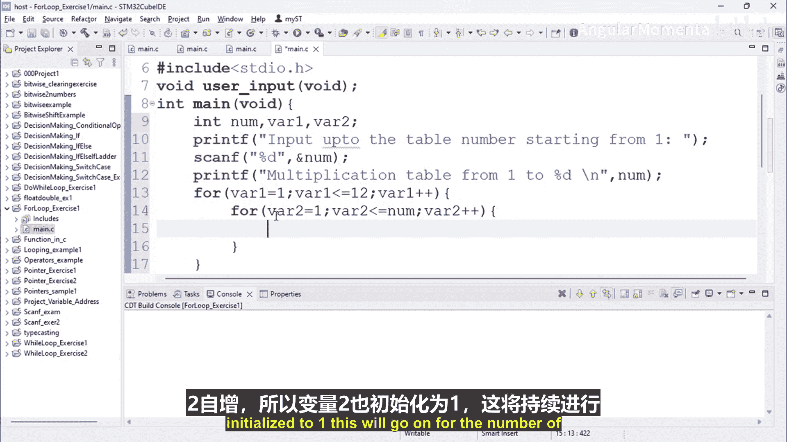

# 064：04_03_01_for循环练习 第1部分




在本节课中，我们将通过一个编程练习来巩固对 `for` 循环的理解。我们将编写一个程序，根据用户输入的数字，生成并打印从1到该数字的乘法表，每个数字的乘法表将计算到12倍。

## 项目创建与初始化



首先，我们需要创建一个新的项目。我们将项目命名为 `forLoopExercise1`。





接下来，在项目中添加一个新的源文件。

同样地，我们还需要配置项目设置，确保编译环境正确。

我们将编写一个主函数，并在其中调用我们的乘法表生成方法，以避免忘记执行。主函数最终返回0。

## 理解练习要求

现在，让我们明确本次练习的具体要求。

我们需要编写一个使用 `for` 循环的程序。该程序将打印一个乘法表，范围从1开始，直到用户输入的数字为止。每个数字的乘法表将计算到12倍。

例如，如果用户输入数字50，程序将生成并打印从1到50的乘法表，每个表都包含从1乘到12的结果。

## 程序设计与变量声明

为了实现这个功能，我们首先需要声明几个变量。

我们将创建一个变量来接收用户输入的数字。此外，我们还需要两个循环变量。

以下是变量声明的示例代码：
```c
int num, var1, var2;
```

首先，我们将提示用户输入一个数字，作为乘法表的结束值。

例如，我们可以提示：“请输入乘法表的结束数字（从1开始）：”。

然后，使用 `scanf` 语句将用户输入的值存储到变量 `num` 中。

接着，我们可以打印一条消息，告知用户将生成从1到 `num` 的乘法表。

## 使用嵌套循环生成乘法表

为了打印出矩阵形式的乘法表，我们需要使用嵌套的 `for` 循环。

第一个循环（外层循环）控制生成哪个数字的乘法表。由于表格需要从1开始，我们将循环变量 `var1` 初始化为1。循环条件是 `var1` 小于等于用户输入的数字 `num`。每次循环后，`var1` 递增。

但是请注意，根据要求，每个数字的乘法表需要计算到12倍。因此，在外层循环内部，我们还需要一个内层循环来计算每个 `var1` 的1到12倍。

内层循环的变量 `var2` 也从1开始，循环条件是 `var2` 小于等于12。每次循环后，`var2` 递增。

在内层循环的循环体内，我们可以计算并打印 `var1 * var2` 的结果。

## 预期输出格式

为了更直观地理解输出，可以想象一个Excel表格。

第一列是基数（从1到用户输入的数字，例如10）。第一行是乘数（从1到12）。表格中的每个单元格是对应基数与乘数的乘积。



程序的目标就是以清晰的格式打印出这样一个“矩阵”。

---



本节课中，我们一起学习了如何设计一个使用嵌套 `for` 循环的程序来生成乘法表。我们讨论了项目初始化、理解需求、变量声明以及嵌套循环的逻辑结构。在下一部分，我们将具体实现代码并查看运行结果。