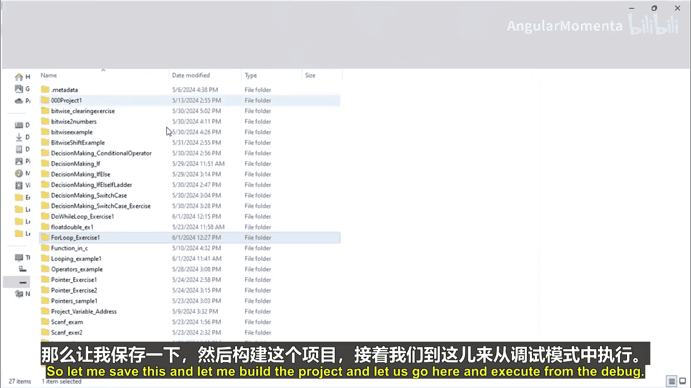
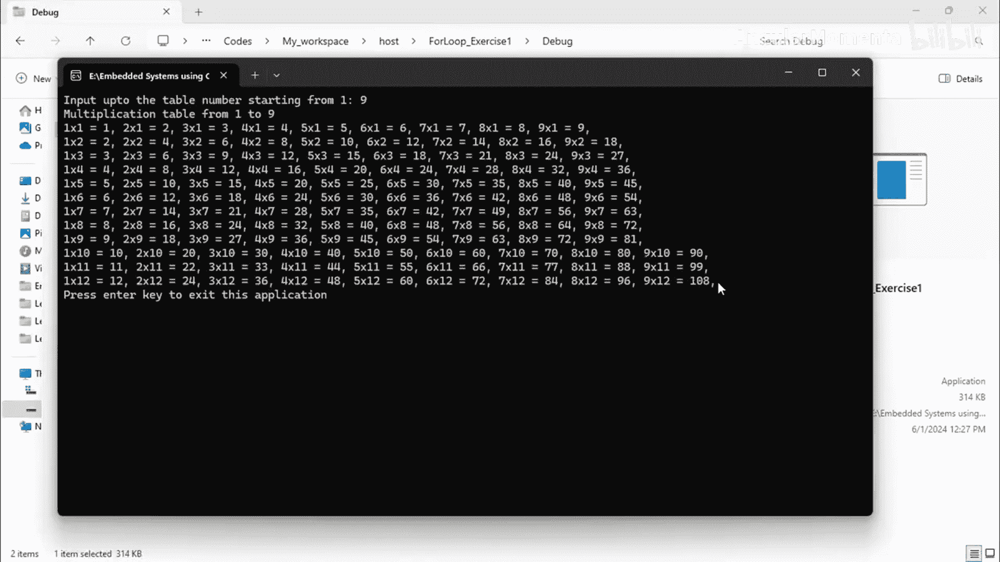
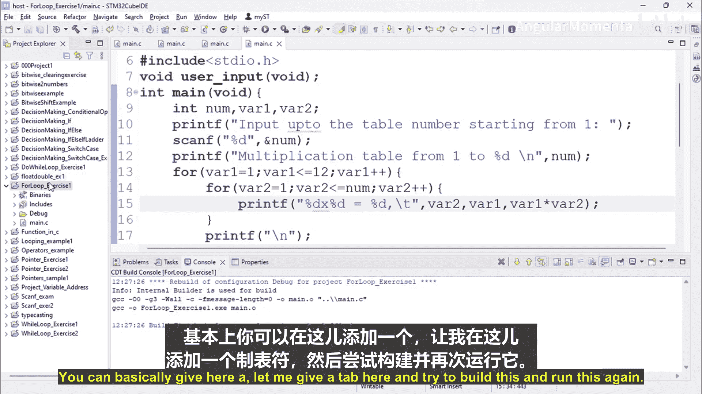
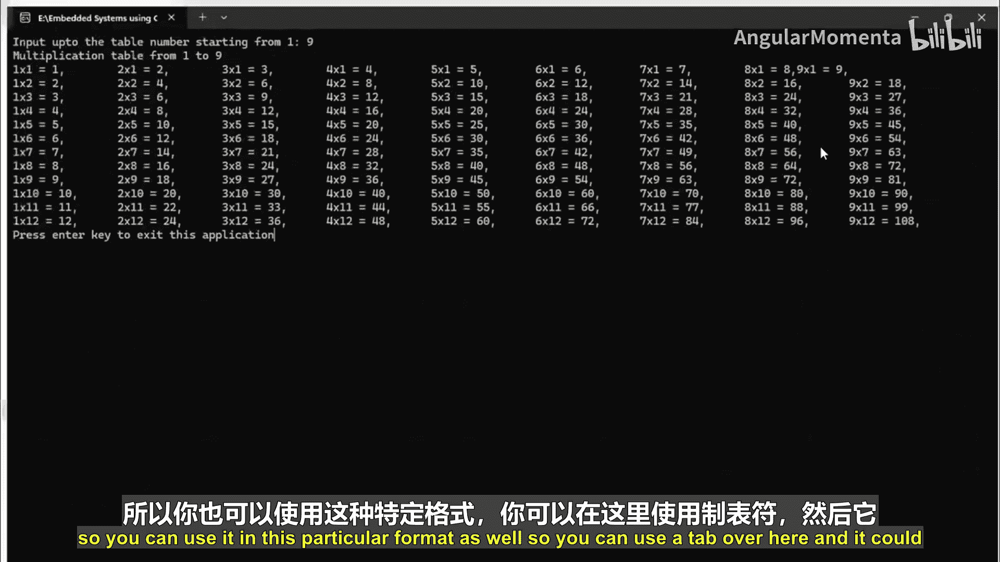
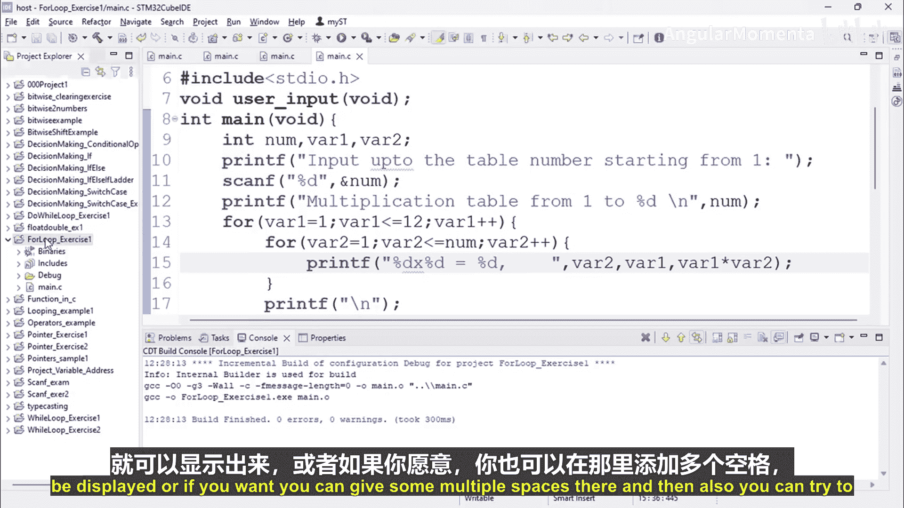
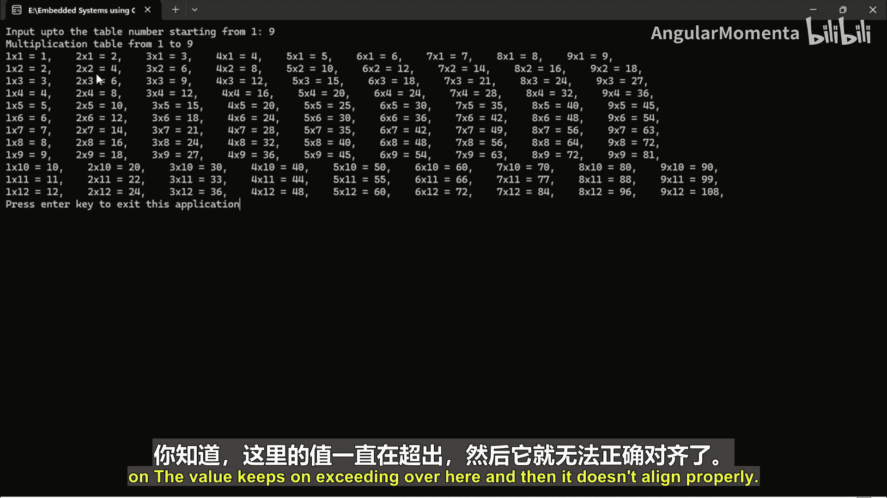
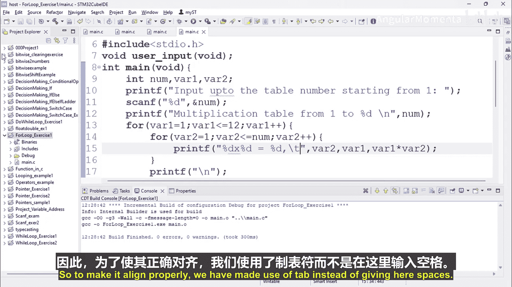
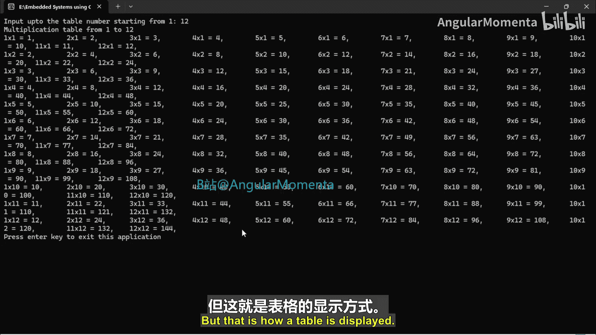
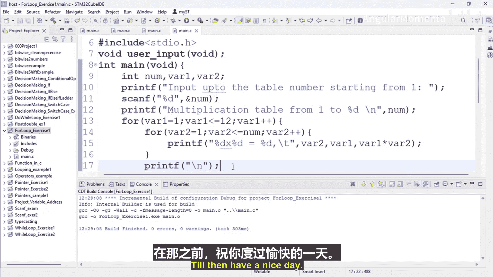

# 065：for循环练习第二部分


## 概述
在本节课程中，我们将继续学习`for`循环的实践应用。我们将通过编写一个程序来生成乘法表，并探讨如何格式化输出，使其在终端中整齐地显示。我们将使用C语言在嵌入式开发环境中实现这一功能。

---

## 代码实现与解析
上一节我们介绍了`for`循环的基本结构。本节中，我们来看看如何利用嵌套的`for`循环来打印一个乘法表。



以下是实现乘法表的核心代码逻辑：



```c
for (int var1 = 1; var1 <= limit; var1++) {
    for (int var2 = 1; var2 <= 12; var2++) {
        printf("%d x %d = %d\t", var1, var2, var1 * var2);
    }
    printf("\n");
}
```
*   **外层循环** (`var1`)：控制乘法表的行数，即从1乘到用户输入的`limit`值。
*   **内层循环** (`var2`)：控制每一行中的列数，这里固定为从1乘到12。
*   **`printf`函数**：用于格式化输出。`%d`是整数占位符，`\t`是制表符，用于对齐各列，`\n`用于在每行结束后换行。



## 输出格式化技巧
直接使用空格进行输出，在数字位数变化时容易导致列对齐混乱。为了使表格整齐，我们使用制表符`\t`来代替多个空格。



以下是两种输出方式的对比说明：
*   **使用空格**：当乘积结果的位数不同时，列无法对齐。
*   **使用制表符 (`\t`)**：能自动适应内容长度，保持各列基本对齐，使表格更美观。

你可以尝试将代码中的`\t`替换为多个空格，然后输入一个较大的数字（例如19），观察输出格式的变化，以理解制表符的作用。







## 程序运行示例
当我们运行程序并输入数字9时，终端将显示从1到9的乘法表。每一行显示一个数字（1到9）与1到12的乘积结果。

例如，第一行是 `1 x 1 = 1   1 x 2 = 2   ...   1 x 12 = 12`，然后是2的乘法行，依此类推，直到9。



## 总结
本节课中我们一起学习了`for`循环的一个经典应用案例——生成乘法表。我们实践了嵌套循环的使用，并掌握了利用制表符`\t`来格式化输出、提升显示效果的重要技巧。这个练习综合运用了`for`循环的初始化、条件检查和变量更新三个部分。



在下一个视频中，我们将探索另一个`for`循环的练习。