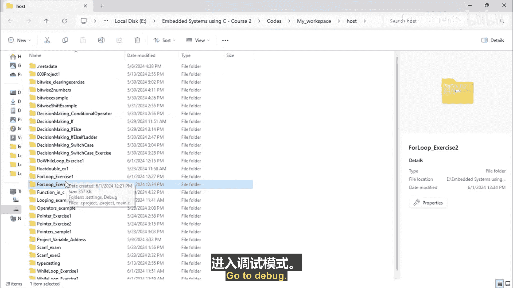
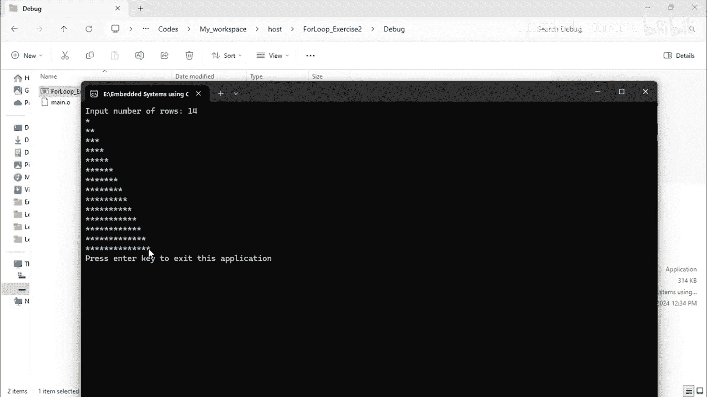
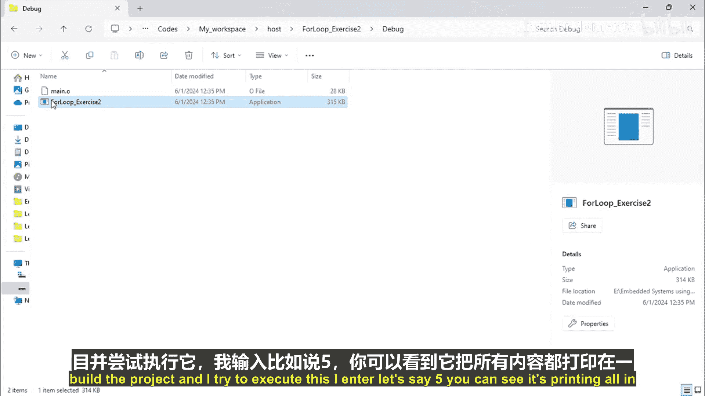
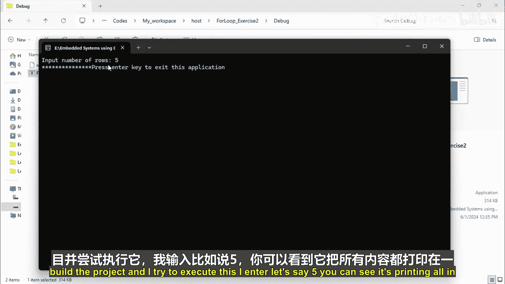
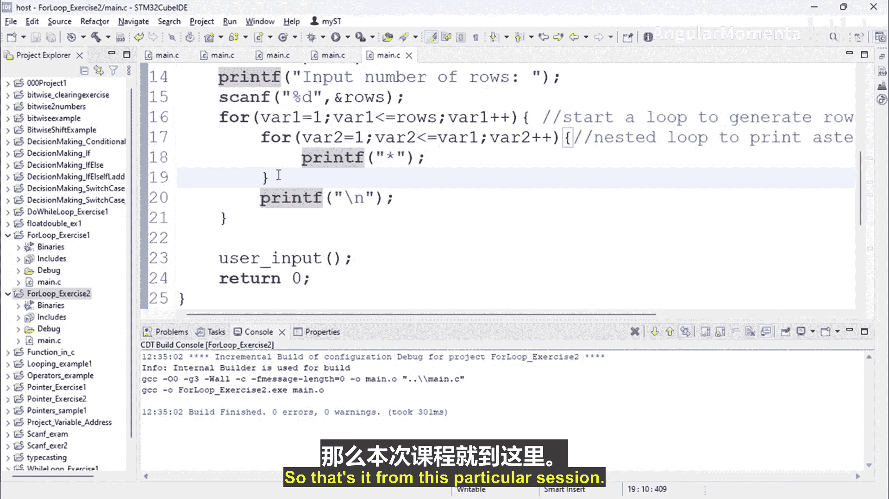

# 066：for循环练习2 ⭐

在本节课中，我们将学习如何使用C++编写一个程序，通过嵌套的`for`循环来打印一个由星号（`*`）组成的直角三角形图案。用户将能够输入图案的行数，程序会根据输入动态生成相应大小的图案。

上一节我们介绍了基本的`for`循环结构，本节中我们来看看如何利用嵌套循环来生成更复杂的输出模式。

## 项目创建与设置

首先，我们需要创建一个新的C++项目。项目名称为“for loop and score Exercise 2”。创建完成后，添加一个源文件，并将基础代码框架粘贴进去。

以下是项目的基础代码结构：

```cpp
#include <iostream>
using namespace std;

int main() {
    // 程序主体将在这里编写
    return 0;
}
```

## 程序逻辑设计

本程序的目标是打印一个直角三角形星号图案。程序的核心逻辑包含两个主要部分：获取用户输入和使用嵌套循环进行打印。

### 1. 获取用户输入

程序首先需要提示用户输入希望打印的星号行数，并将这个值存储在一个变量中。

以下是实现此功能的代码：

```cpp
int rows;
cout << "Input Number of rows: ";
cin >> rows;
```

### 2. 使用嵌套循环打印图案

接下来，我们使用嵌套的`for`循环来生成图案。外层循环控制行数，内层循环控制每行打印的星号数量。

以下是嵌套循环的代码结构：

```cpp
for (int row1 = 1; row1 <= rows; row1++) {
    for (int row2 = 1; row2 <= row1; row2++) {
        cout << "*";
    }
    cout << endl;
}
```

**代码解释：**
*   **外层循环 (`for (int row1 = 1; row1 <= rows; row1++)`)**: 变量 `row1` 从1开始，一直递增到用户输入的 `rows` 值。每次迭代代表处理新的一行。
*   **内层循环 (`for (int row2 = 1; row2 <= row1; row2++)`)**: 变量 `row2` 从1开始，一直递增到当前 `row1` 的值。这意味着第1行打印1个星号，第2行打印2个星号，依此类推。内层循环的每次迭代打印一个星号 (`cout << "*"`)。
*   **换行 (`cout << endl`)**: 在内层循环结束后，使用 `cout << endl` 输出一个换行符，将光标移动到下一行，以便开始打印新的一行。这一步至关重要，它确保了星号按行排列，而不是全部打印在同一行。

## 完整代码示例

将以上两部分组合起来，得到完整的程序代码如下：

```cpp
#include <iostream>
using namespace std;



int main() {
    int rows;
    cout << "Input Number of rows: ";
    cin >> rows;

    for (int row1 = 1; row1 <= rows; row1++) {
        for (int row2 = 1; row2 <= row1; row2++) {
            cout << "*";
        }
        cout << endl;
    }
    return 0;
}
```

## 程序运行与验证

构建并运行程序。当程序提示时，输入一个数字，例如 `5`。程序将输出一个5行的直角三角形星号图案。

**预期输出：**
```
*
**
***
****
*****
```

如果输入 `14`，则会生成一个14行的星号图案。

### 关键点验证：换行符的作用

为了理解 `cout << endl` 的重要性，可以尝试将其注释掉，然后重新编译运行程序。



```cpp
// cout << endl;
```

再次输入 `5`，观察输出。



**注释掉换行后的输出：**
```
***************
```

可以看到，所有的星号都打印在了同一行。这证明了 `cout << endl` 语句的作用是结束当前行，使后续输出从新的一行开始。外层循环控制行（`row`），内层循环控制列（`column`），换行操作是区分不同行的关键。

## 总结

本节课中我们一起学习了如何编写一个C++程序，利用嵌套的`for`循环根据用户输入打印直角三角形星号图案。我们掌握了以下核心要点：



1.  使用 `cin` 获取用户输入，并用变量存储。
2.  使用嵌套的 `for` 循环，其中外层循环控制总行数，内层循环控制每行的星号数量。
3.  理解并正确使用 `cout << endl` 在每行结束后进行换行，这是形成规整图案的必要步骤。



通过这个练习，你加深了对循环控制流，特别是嵌套循环逻辑的理解，这是进行复杂控制台输出和未来嵌入式编程中处理重复任务的基础。