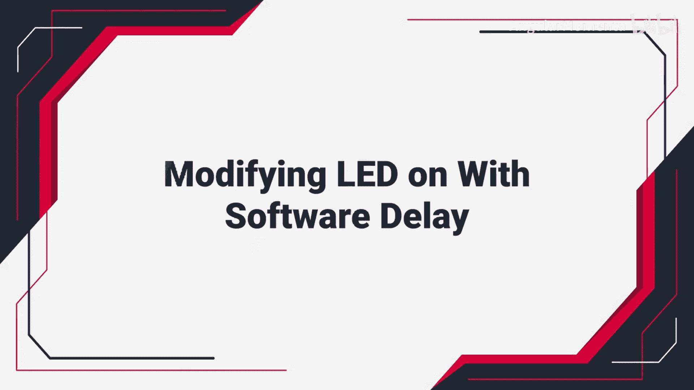
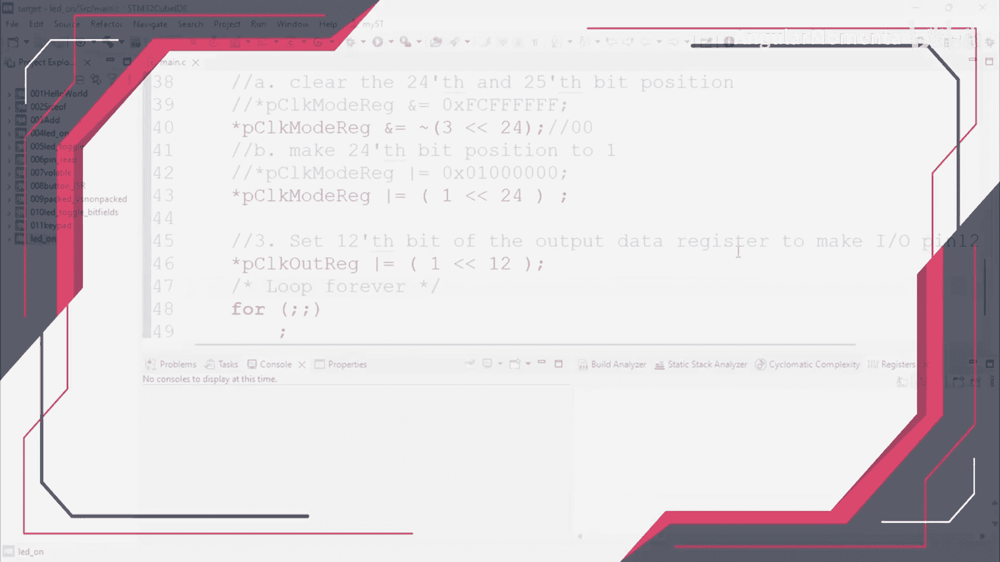
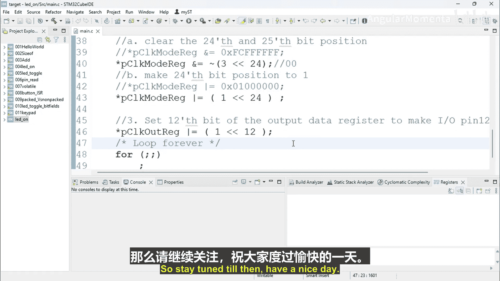

构建嵌入式系统：04_03_04：通过软件延时实现LED切换 🔄






在本节课程中，我们将学习如何修改一个简单的LED点亮程序，使其变为LED切换（闪烁）程序。核心方法是引入一个软件延时，在LED点亮和熄灭之间制造一个可观察的时间间隔。

上一节我们介绍了如何点亮一个LED。本节中，我们来看看如何让LED自动地、周期性地在亮与灭之间切换。

为了实现LED切换，我们需要在控制LED状态变化的指令之间插入一段延时。延时可以通过软件或硬件方式实现。软件延时是让处理器在一个循环中“空转”以消耗时间；硬件延时则利用定时器等外设来产生精确的时间间隔。对于本练习，我们将使用软件延时方法。

以下是软件延时的核心概念：通过编写一个不做任何实质性工作的循环，让处理器保持忙碌，从而消耗掉特定的时钟周期，达到延时的目的。这种方法虽然不精确，但对于创建人眼可观察的LED闪烁效果已经足够。

**代码示例：一个简单的延时循环**
```c
for(int i = 0; i < DELAY_VALUE; i++) {
    // 空循环，消耗时间
}
```

我们将创建一个新的项目，并基于之前的LED点亮程序进行修改。主要修改步骤是在点亮LED和熄灭LED的指令之间，各插入一段软件延时。循环结构可以使用 `while` 循环或 `for` 循环来实现。

以下是实现LED切换程序的基本步骤列表：
1.  **初始化LED引脚**：将控制LED的GPIO引脚配置为输出模式。
2.  **进入主循环**：使用一个无限循环（如 `while(1)`）来持续运行切换逻辑。
3.  **点亮LED并延时**：将LED引脚置为高电平（或低电平，取决于电路设计）以点亮LED，然后调用软件延时函数。
4.  **熄灭LED并延时**：将LED引脚置为相反电平以熄灭LED，然后再次调用相同的软件延时函数。
5.  **重复循环**：程序将不断重复步骤3和4，从而实现LED的持续闪烁。

请注意，软件延时的时间长度取决于 `DELAY_VALUE` 的大小和处理器的主频。你需要通过实验调整这个值，以获得满意的闪烁频率。



本节课中我们一起学习了如何利用软件延时，将一个静态的LED点亮程序改造为动态的LED切换（闪烁）程序。我们理解了软件延时的基本原理——通过空循环消耗CPU周期，并掌握了将其嵌入到主程序循环中的方法。在下一节中，我将展示这个练习的具体代码解决方案。