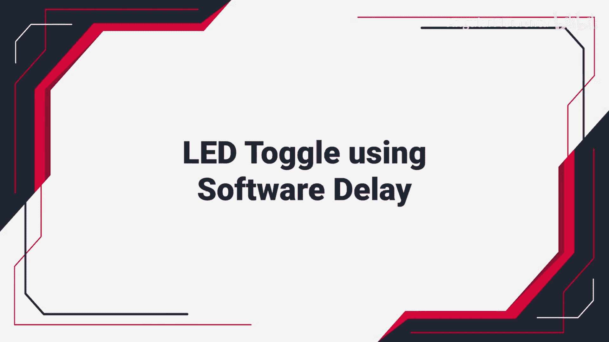
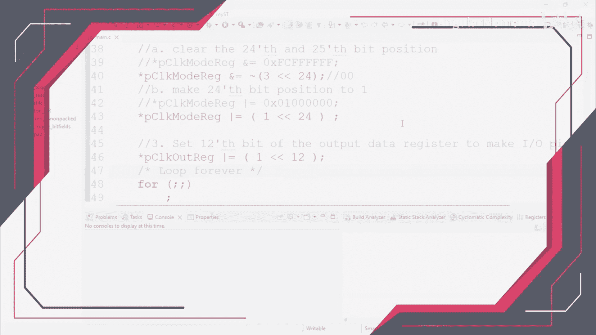
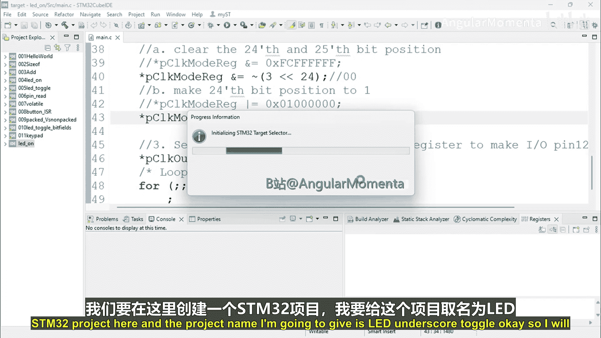
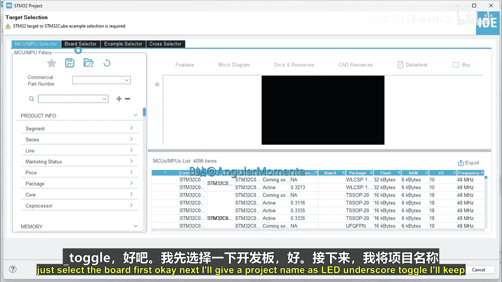
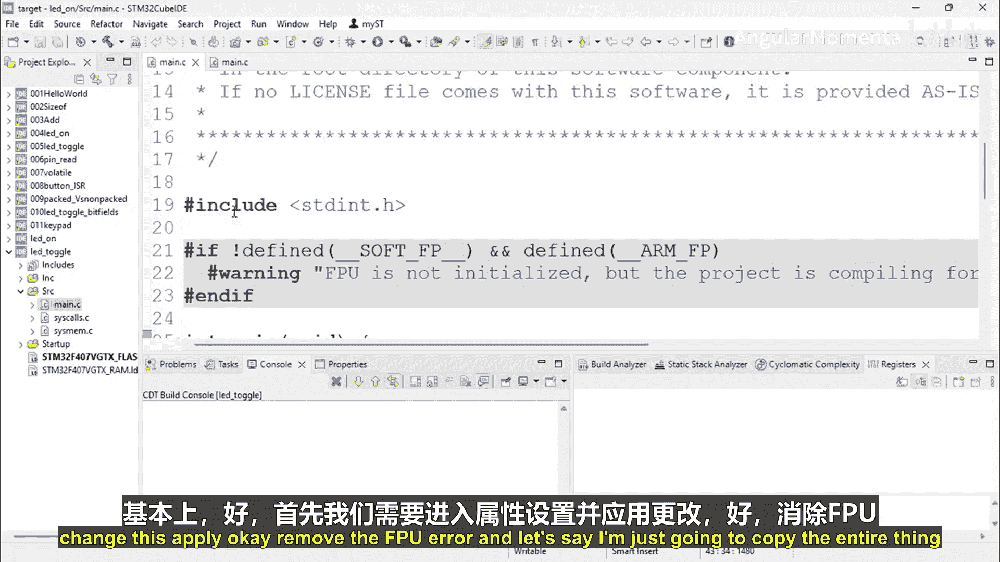
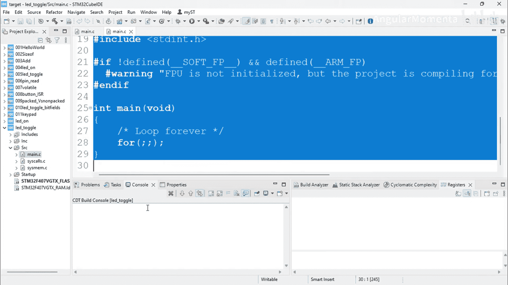
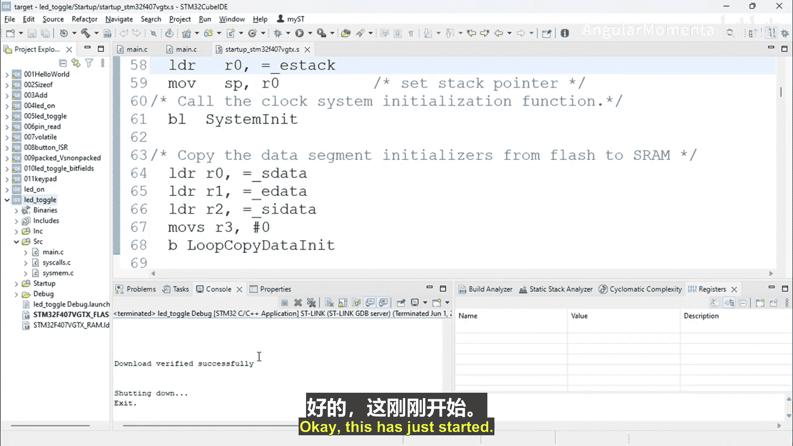

# 068：软件延迟控制的LED切换 第1部分 🚦💡






在本节课中，我们将学习如何在STM32微控制器上，通过编写软件延迟循环，实现LED的周期性闪烁。我们将创建一个新项目，配置GPIO引脚，并使用简单的`for`循环来产生延迟，从而控制LED的亮灭节奏。



---



## 创建STM32项目

首先，我们需要在开发环境中创建一个新的STM32项目。

1.  启动STM32CubeIDE或您使用的开发环境。
2.  选择“创建新项目”。
3.  在项目配置向导中，根据您使用的具体STM32开发板型号进行选择。
4.  将项目命名为 **LED_toggle**。
5.  完成项目创建向导，这可能需要一些时间。





项目创建完成后，我们将进入主代码编辑界面。

---

## 配置项目属性与复制基础代码

为了确保项目正确编译并避免常见错误（如FPU相关错误），我们需要检查项目属性。

上一节我们创建了项目，本节中我们来看看如何配置并准备基础代码。

1.  在项目资源管理器中，右键点击项目名称，选择“属性”。
2.  在属性窗口中，确保编译器和链接器设置正确，特别是与硬件浮点单元相关的选项。
3.  应用更改并关闭属性窗口。

接下来，为了节省时间并减少错误，我们将从一个已有的、功能正确的基础项目中复制代码框架。请将以下GPIO初始化的核心代码复制到您项目的主源文件（通常是`main.c`）中。

```c
// 初始化GPIO引脚（例如，将PA5配置为输出模式以驱动LED）
GPIO_InitTypeDef GPIO_InitStruct = {0};
__HAL_RCC_GPIOA_CLK_ENABLE();
GPIO_InitStruct.Pin = GPIO_PIN_5;
GPIO_InitStruct.Mode = GPIO_MODE_OUTPUT_PP;
GPIO_InitStruct.Pull = GPIO_NOPULL;
GPIO_InitStruct.Speed = GPIO_SPEED_FREQ_LOW;
HAL_GPIO_Init(GPIOA, &GPIO_InitStruct);
```

---

## 实现软件延迟与LED控制逻辑

现在，我们有了一个可以控制LED的GPIO引脚。接下来，我们将编写主循环代码，实现LED的闪烁。关键在于使用一个`for`循环来产生人为可观察的延迟。

以下是实现无限循环中LED切换的步骤：

1.  **开启LED**：首先，我们设置引脚输出高电平来点亮LED。
    ```c
    HAL_GPIO_WritePin(GPIOA, GPIO_PIN_5, GPIO_PIN_SET); // 点亮LED
    ```

2.  **引入延迟**：随后，我们通过一个执行空操作的`for`循环来让处理器“等待”一段时间，从而产生延迟。
    ```c
    for(uint32_t i = 0; i < 10000; i++); // 软件延迟循环
    ```
    *注意：循环次数`10000`是一个初始值，实际所需的延迟时间需要通过试验来调整。*

3.  **关闭LED**：延迟结束后，我们将引脚输出设置为低电平来关闭LED。
    ```c
    HAL_GPIO_WritePin(GPIOA, GPIO_PIN_5, GPIO_PIN_RESET); // 关闭LED
    ```

4.  **再次延迟并形成循环**：在关闭LED后，再次使用相同的延迟循环，然后将所有这些操作放入一个`while(1)`无限循环中，使LED能够持续闪烁。
    ```c
    while (1)
    {
        // 点亮LED -> 延迟 -> 关闭LED -> 延迟
        HAL_GPIO_WritePin(GPIOA, GPIO_PIN_5, GPIO_PIN_SET);
        for(uint32_t i = 0; i < 10000; i++);
        HAL_GPIO_WritePin(GPIOA, GPIO_PIN_5, GPIO_PIN_RESET);
        for(uint32_t i = 0; i < 10000; i++);
    }
    ```

---

## 编译、下载与调试

代码编写完成后，即可进行编译。

1.  点击IDE中的“构建”或“编译”按钮。如果代码无误，控制台将显示“构建成功”。
2.  使用ST-Link或其他调试器将编译好的程序下载到STM32开发板。
3.  为了深入理解程序执行，可以进入调试模式。在调试视图中，您可以单步执行代码，并在反汇编窗口观察每条C语句对应的机器指令是如何被执行的。

---



本节课中我们一起学习了如何通过纯软件方式控制硬件。我们创建了一个STM32项目，配置了GPIO输出，并利用`for`循环制造延迟，最终实现了一个LED闪烁的应用程序。这是理解嵌入式系统中时序控制的基础。在下一部分，我们将探索如何优化延迟精度以及使用硬件定时器来替代软件循环。