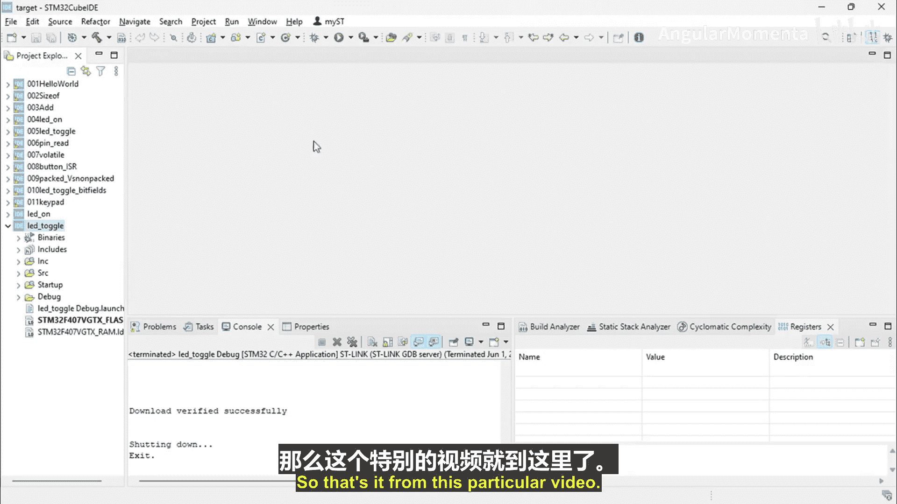

# 069：软件延时控制的LED开关 第二部分 🔄


在本节中，我们将继续学习如何使用软件延时来控制LED的开关。我们将通过调试器观察延时循环的执行，并学习如何调整延时参数来改变LED的闪烁频率。

上一节我们介绍了如何编写一个简单的延时函数来控制LED。本节中，我们来看看如何在调试环境中观察和分析这个延时循环的实际执行过程。

## 观察延时循环 🔍

以下是使用调试器（Disassembler）窗口观察程序执行流程的步骤。

1.  启动调试会话，进入主循环。
2.  在反汇编窗口中，使用“单步跳过”（Step Over）功能执行程序。
3.  观察程序计数器在延时循环代码段中的停留，以确认延时正在发生。

## 调整延时参数 ⚙️

初始设置的循环次数较少，难以观察到明显的延时效果。为了更清晰地观察，我们需要增加循环次数。

*   **修改代码**：将延时循环中的计数值从较小的数字（例如1000）增加到更大的数字（例如30000）。
*   **核心代码**：
    ```c
    for(int i = 0; i < 30000; i++); // 软件延时循环
    ```
*   **重新编译**：保存修改后的代码，并重新构建（Build）整个项目。

## 验证延时效果 ✅

重新启动调试过程，并再次观察反汇编窗口。

1.  运行程序至主循环。
2.  使用“单步跳过”进入延时循环部分。
3.  此时可以清晰地看到，程序计数器会在循环对应的汇编指令处停留较长时间，这表明延时正在按预期工作。
4.  通过增加循环次数，延时效果变得非常容易识别。程序会消耗若干个时钟周期来完成循环，然后才继续执行后续的LED切换操作。

通过这种方式，我们完成了LED闪烁的练习，并学会了如何利用简单的软件循环实现延时，以及如何在调试环境中验证其执行。



本节课中我们一起学习了如何调整和验证软件延时函数。通过增加循环次数并在调试器中观察执行流程，我们确认了延时机制的有效性，从而能够更精确地控制LED的闪烁行为。