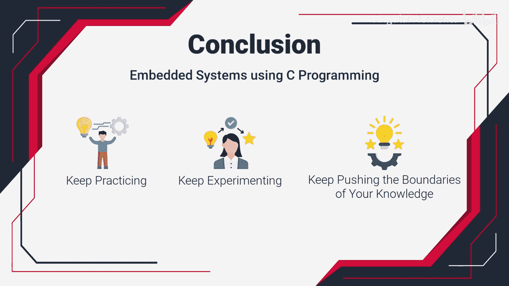

构建嵌入式系统：课程总结：回顾与展望

在本节课中，我们将对《构建嵌入式系统：ARM Cortex (STM32) 基础》这门课程进行全面的回顾与总结，梳理所学核心知识，并展望未来的学习方向。

---

回顾整个课程，你已深入掌握了使用C语言进行嵌入式系统开发的基础。从基本数据类型到高级硬件控制，你构建了坚实的编程知识体系。

以下是你在本课程中掌握的核心技能概览：

*   **基础概念**：理解了C语言的基本数据类型、变量和用户输入处理。
*   **流程控制**：掌握了使用条件语句（如`if-else`）进行决策，以及利用循环结构（如`for`、`while`）重复执行代码。
*   **高效运算**：学会了运用位运算符等工具进行高效的数据操作与代码执行。
*   **内存管理**：深入理解了指针的机制，获得了内存管理的关键洞察。
*   **硬件交互**：磨练了通过嵌入式C编程直接控制硬件外设的技能。

---

上一节我们回顾了所学的主要技能模块，本节中我们来看看这些知识如何构成你未来发展的基石。

你所构建的C语言编程基础，为多个领域的发展铺平了道路。无论你未来致力于软件开发、嵌入式系统工程，还是任何需要编程技能的领域，本课程所传授的知识都将成为你坚实的起点。

---

本节课中我们一起学习了C语言嵌入式编程的核心知识体系。你的旅程并未结束，这只是一个坚实的开始。展望未来，请持续练习、不断尝试、勇于探索知识的边界。

感谢你参与这段学习旅程，我们祝愿你在未来的探索中取得最佳成就。

本课程到此全部结束，衷心感谢你的学习。