# 004：编写日常任务脚本 📝

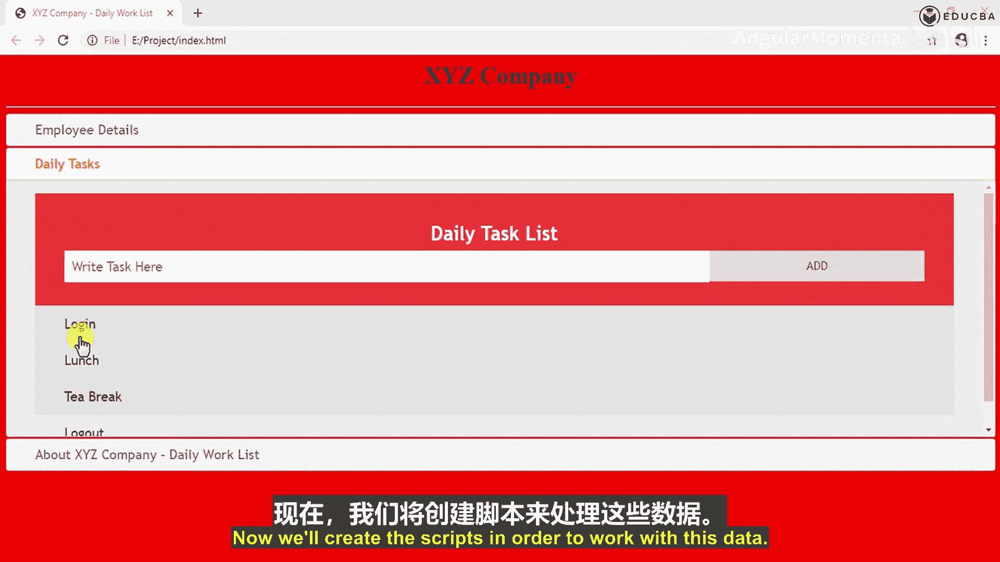

在本节课中，我们将为之前创建的日常任务列表编写脚本，实现添加新任务、标记完成和删除任务的功能。

## 概述

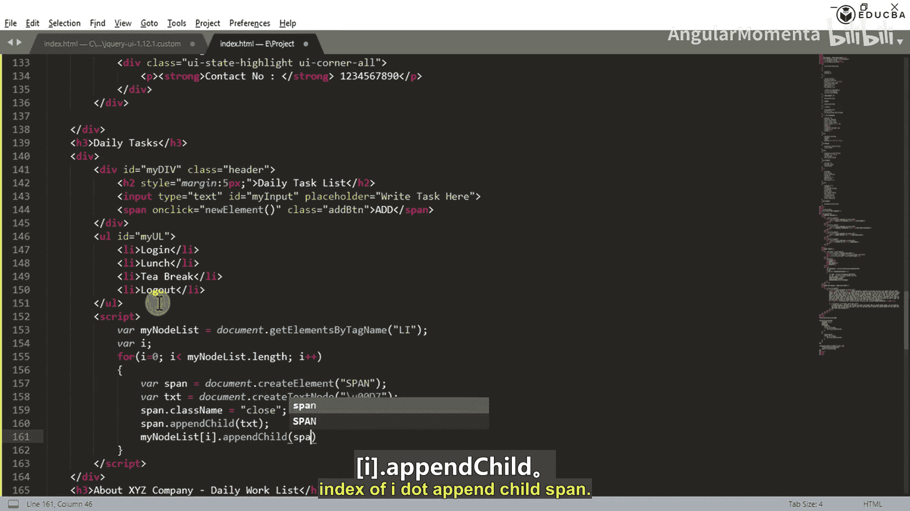

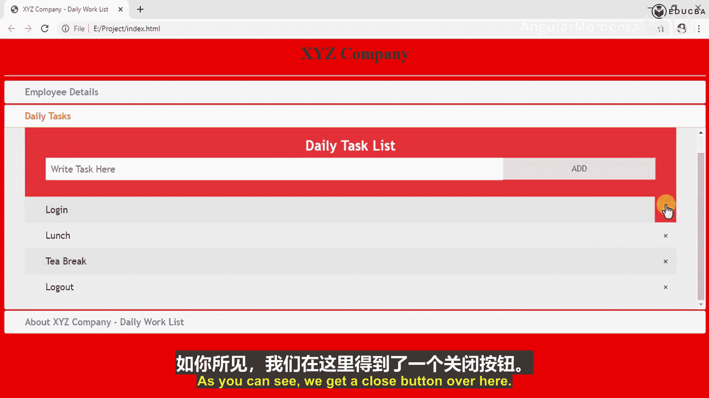

上一节我们已经创建了日常任务列表的HTML结构。本节中，我们将通过JavaScript脚本为列表添加交互功能，包括为每个任务项添加关闭按钮、实现点击删除和标记完成的效果，以及通过输入框添加新任务。

## 为列表项添加关闭按钮

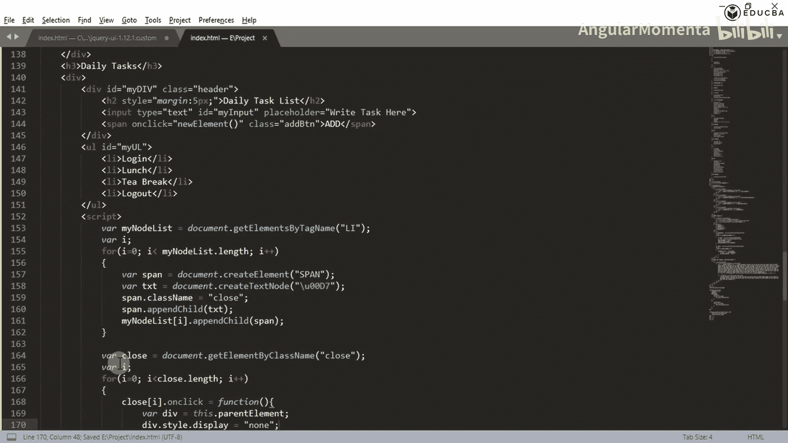

首先，我们需要为每个已存在的列表项动态创建一个关闭按钮。

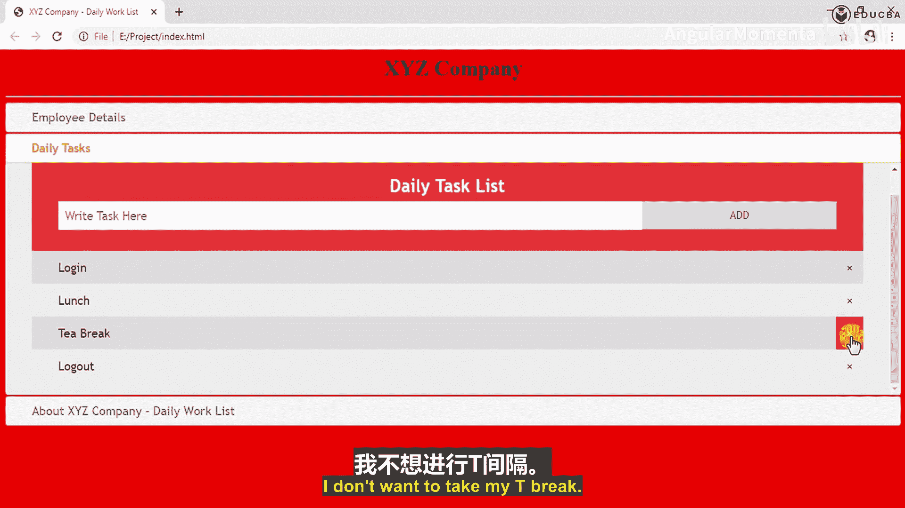

以下是实现步骤：

1.  获取页面中所有的列表项（`<li>`元素）。
2.  遍历这些列表项。
3.  为每个列表项创建一个`<span>`元素作为关闭按钮。
4.  为这个`<span>`元素添加文本内容（如“×”）和特定的类名（如“close”）。
5.  将这个关闭按钮追加到对应的列表项中。

实现代码如下：
```javascript
var myNodeList = document.getElementsByTagName("LI");
var i;
for (i = 0; i < myNodeList.length; i++) {
  var span = document.createElement("SPAN");
  var txt = document.createTextNode("\u00D7");
  span.className = "close";
  span.appendChild(txt);
  myNodeList[i].appendChild(span);
}
```
执行这段代码后，每个任务项的右侧都会出现一个关闭按钮。

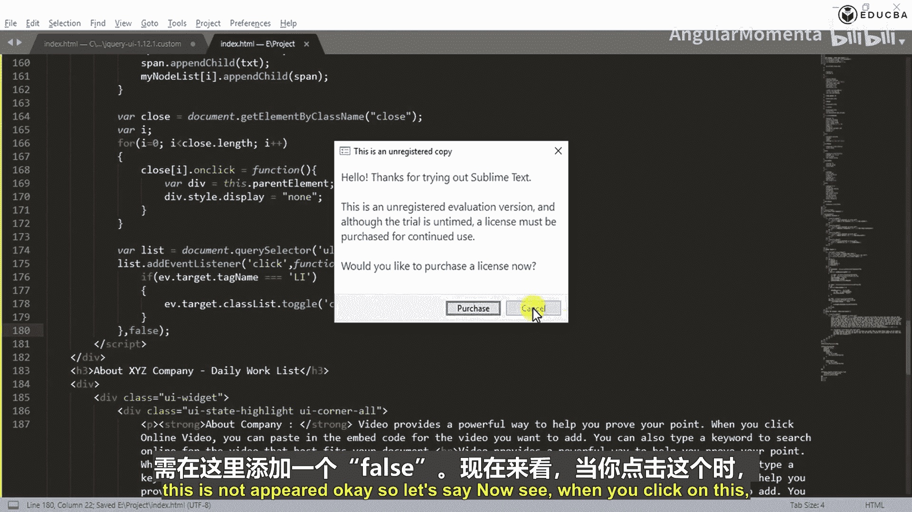

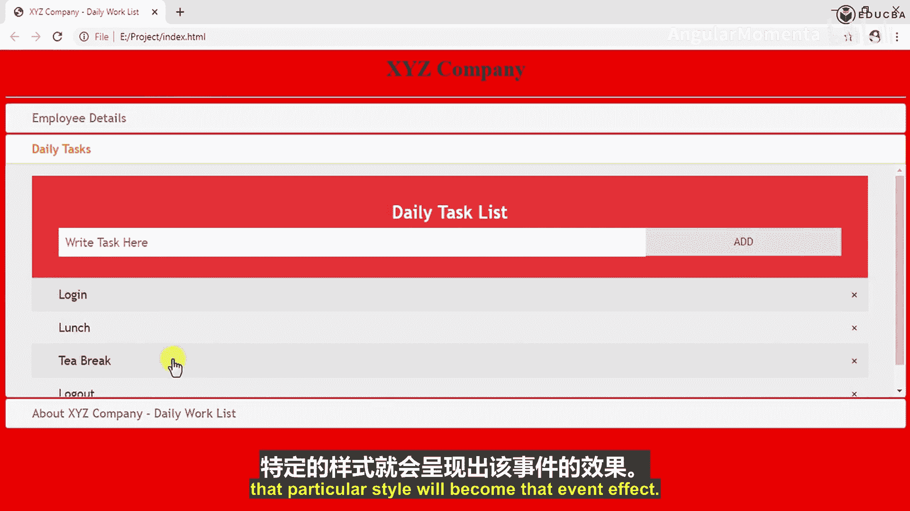

## 实现关闭按钮的点击删除功能

现在，我们需要让关闭按钮在被点击时，能够隐藏或删除其所在的整个列表项。

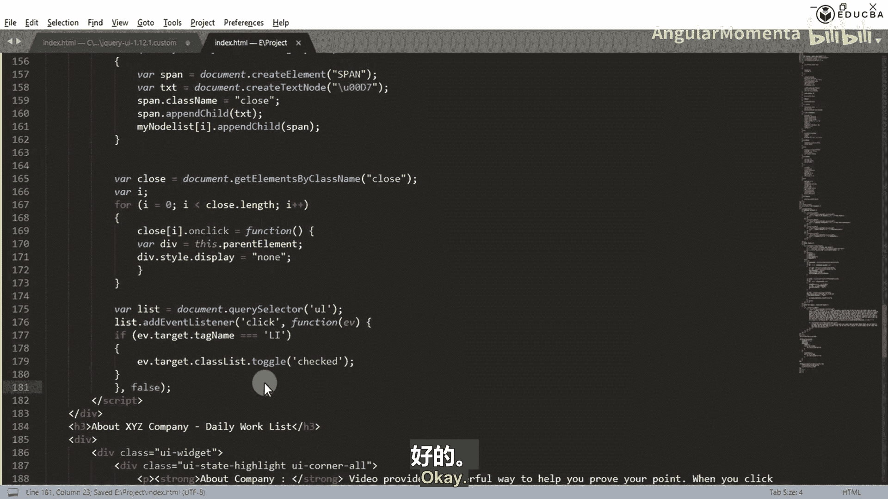

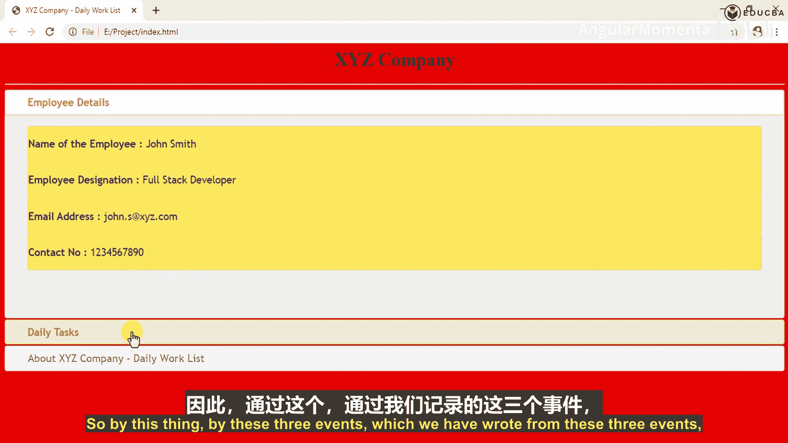

以下是实现步骤：

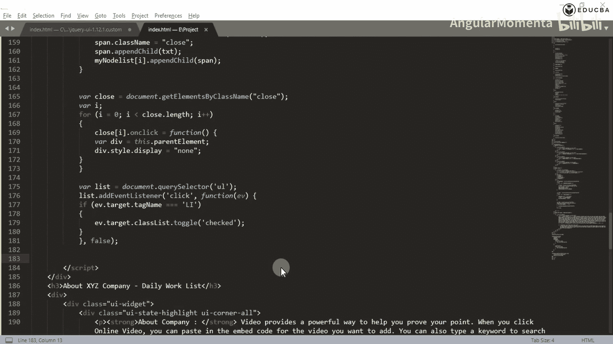

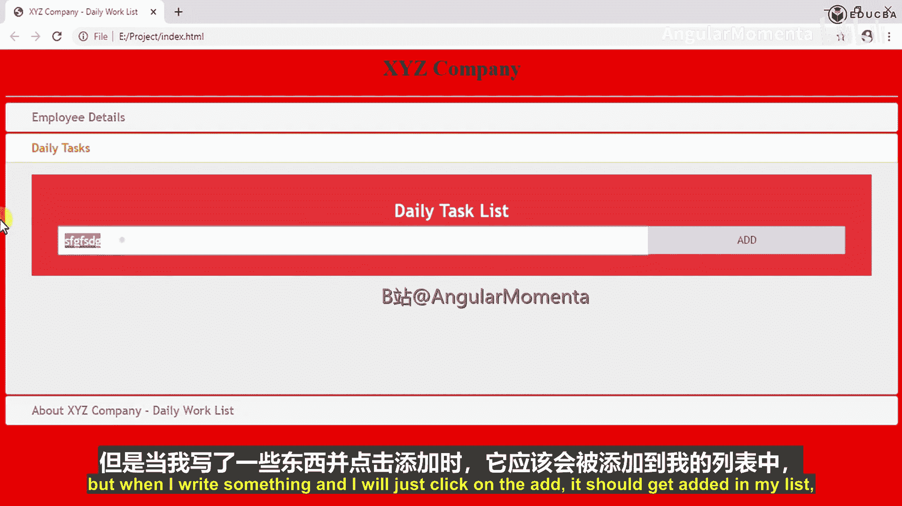

1.  获取所有类名为“close”的关闭按钮元素。
2.  遍历这些按钮。
3.  为每个按钮添加一个点击事件监听器。
4.  在事件处理函数中，找到被点击按钮的父元素（即列表项`<li>`），并将其显示样式设置为“none”，从而隐藏它。

实现代码如下：
```javascript
var close = document.getElementsByClassName("close");
var i;
for (i = 0; i < close.length; i++) {
  close[i].onclick = function() {
    var div = this.parentElement;
    div.style.display = "none";
  }
}
```
现在，点击任意一个任务的关闭按钮，该任务就会从列表中消失。

## 实现点击标记任务完成

为了让用户能够标记任务已完成，我们实现一个功能：点击列表项时，为其切换一个“checked”类，从而通过CSS改变其外观（例如添加删除线）。

以下是实现步骤：

1.  获取整个任务列表（`<ul>`）元素。
2.  为其添加一个点击事件监听器。
3.  在事件处理函数中，检查被点击的元素是否是列表项（`<li>`）。
4.  如果是，则使用`classList.toggle()`方法为这个列表项添加或移除“checked”类。

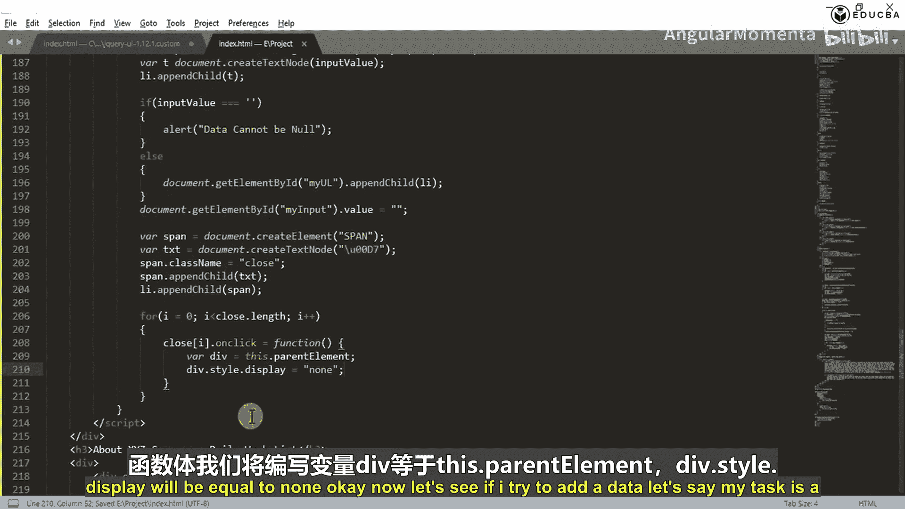

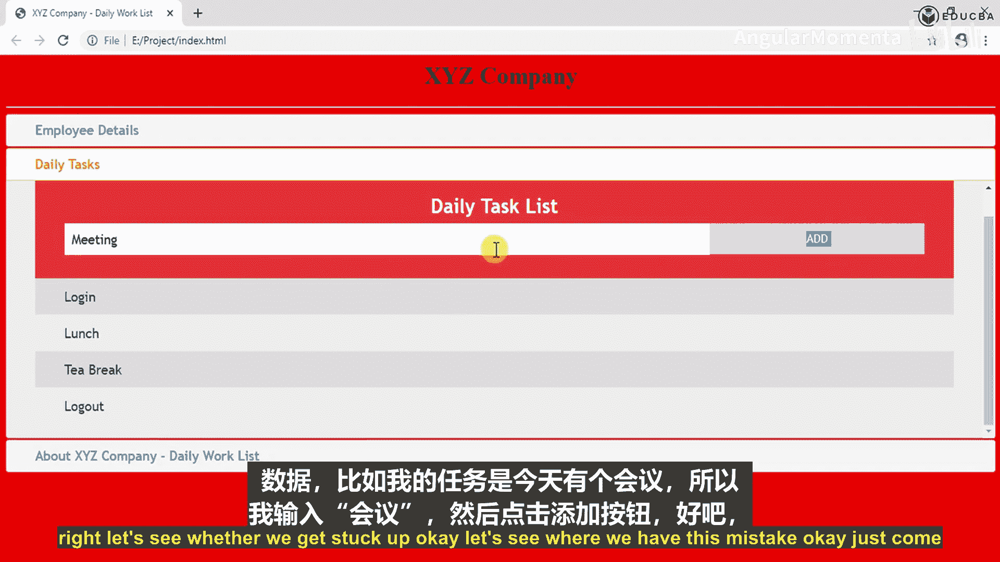

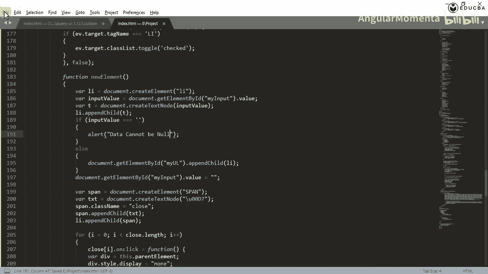

实现代码如下：
```javascript
var list = document.querySelector('ul');
list.addEventListener('click', function(ev) {
  if (ev.target.tagName === 'LI') {
    ev.target.classList.toggle('checked');
  }
}, false);
```
现在，点击任意一个任务，它就会被标记为完成样式，再次点击则取消标记。

## 实现添加新任务功能

最后，我们需要实现通过输入框和“Add”按钮来添加新任务。

以下是实现步骤：

1.  创建一个名为`newElement`的函数，该函数将由“Add”按钮的`onclick`事件触发。
2.  在函数内部，创建一个新的列表项（`<li>`）元素。
3.  获取输入框中的值。
4.  创建一个文本节点，内容为输入框的值，并将其追加到新建的列表项中。
5.  进行输入验证：如果输入值为空，则弹出警告。
6.  如果输入有效，则将新建的列表项追加到任务列表（`<ul>`）中。
7.  清空输入框。
8.  最后，不要忘记为这个新建的列表项也动态添加上关闭按钮，并为其绑定点击删除事件。

实现代码如下：
```javascript
function newElement() {
  var li = document.createElement("li");
  var inputValue = document.getElementById("myInput").value;
  var t = document.createTextNode(inputValue);
  li.appendChild(t);
  if (inputValue === '') {
    alert("Data cannot be null");
  } else {
    document.getElementById("myUL").appendChild(li);
  }
  document.getElementById("myInput").value = "";

  var span = document.createElement("SPAN");
  var txt = document.createTextNode("\u00D7");
  span.className = "close";
  span.appendChild(txt);
  li.appendChild(span);

  for (i = 0; i < close.length; i++) {
    close[i].onclick = function() {
      var div = this.parentElement;
      div.style.display = "none";
    }
  }
}
```
现在，在输入框中键入新任务（例如“Meeting with ABC”），点击“Add”按钮，新任务就会出现在列表底部，并且自带关闭按钮功能。

## 项目总结与jQuery UI优势

本节课中我们一起学习了如何为静态任务列表添加完整的交互逻辑。我们实现了三个核心功能：
1.  **动态添加关闭按钮**：为每个任务项创建删除入口。
2.  **交互响应**：使关闭按钮能删除任务，点击任务能标记完成。
3.  **数据新增**：通过表单输入和添加新任务。

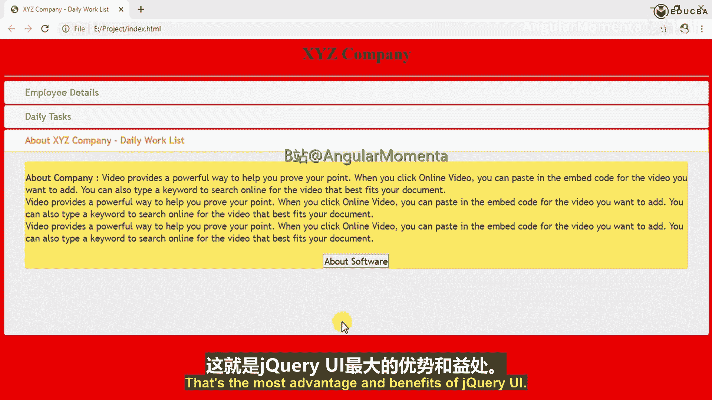

通过这个练习可以看到，jQuery UI 的一大优势在于它提供了丰富的预制样式和交互组件。我们无需从头编写大量CSS来美化按钮、列表或对话框，只需引入jQuery UI的库文件并正确使用其定义的类名，即可获得一套风格统一、视觉效果良好的界面。这相比纯jQuery或原生JavaScript开发，能显著提升开发效率，尤其适合快速构建原型或对UI一致性要求较高的项目。